# 【考研黑书向】Part One 程序结构和执行之<u>程序的机器级表示 Machine-Level Programming</u>

## IA-32指令系统

### 指令系统概述

#### 计算机硬件的基本组成


- 工作方式：**存储程序**
    - 数据和指令实现存放在存储器中，形式上没有差别
    - 每条指令和每个数据都有地址。指令按序存放，指令由OP、ADDR字段组成
        - 指令中需给出的信息：
            - 操作性质(操作码)
            - 源操作数1 或/和 源操作数2(立即数、寄存器编号、**存储地址**)
            - 目的操作数地址(寄存器编号、**存储地址**)
            - 存储地址的描述与**操作数的数据结构**有关
    - 程序由指令组成，程序启动后，计算机自动取出指令执行，程序起始地址在PC中
    - 指令执行过程中，指令和数据被从存储器取到CPU，存放在CPU内的寄存器中，指令在IR(指令寄存器)中，数据在GPR(通用寄存器)中

#### 计算机中数据存储

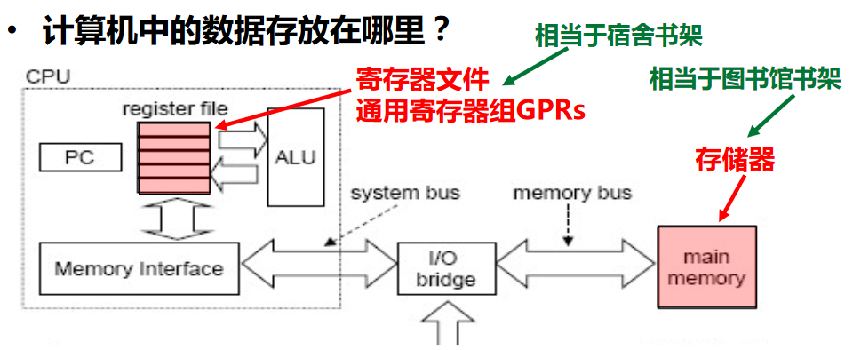

#### 指令

| 名称 | 描述 | 类比 |
| --- | --- | --- |
| 机器指令 | 处于硬件和软件的交界面 | 一个菜谱指定的一个完整做菜过程 |
| 微指令 | 微程序级命令，属于硬件范畴 | 洗、切、煮、炒等做菜“微过程” |
| 伪指令 | 由若干机器指令组成的指令序列，属于软件范畴 | 由多个菜谱合成一个”大菜“的过程 |
| 汇编指令 | 机器指令的汇编表示形式，即符号表示 | |

- 机器指令和汇编指令一一对应，它们都与具体机器结构有关，都属于**机器级指令**

#### 指令集体系结构ISA：Instruction Set Architecture

- ISA是一种规约（Specification），它规定了如何使用硬件
    - 可执行的指令的集合，包括**指令格式**、**操作种类**以及每种操作对应的操作数的相应规定；
    - 指令可以接受的**操作数的类型**；
    - 操作数所能存放的寄存器组的结构，包括每个**寄存器的名称、编号、长度和用途**；
    - 操作数所能存放的**存储空间的大小和编址方式**；
    - 操作数在存储空间存放时按照**大端还是小端方式存放**；
    - 指令获取操作数的方式，即**寻址方式**；
    - 指令执行过程的控制方式，包括**程序计数器、条件码定义**等。
- ISA在计算机系统中是必不可少的一个**抽象层**，没有它则软件无法使用计算机硬件，一台计算机不能称为“通用计算机”
- ISA和计算机组成（微结构）之间的关系
    - 不同ISA规定的指令集不同，如，IA-32、MIPS、ARM等
    - 计算机组成必须能够**实现**ISA规定的功能，如提供GPR、标志、运算电路等
    - **同一种**ISA可以有**不同的**计算机组成，如乘法指令可用ALU或乘法器实现 

#### IA-32

- 体系结构
        
    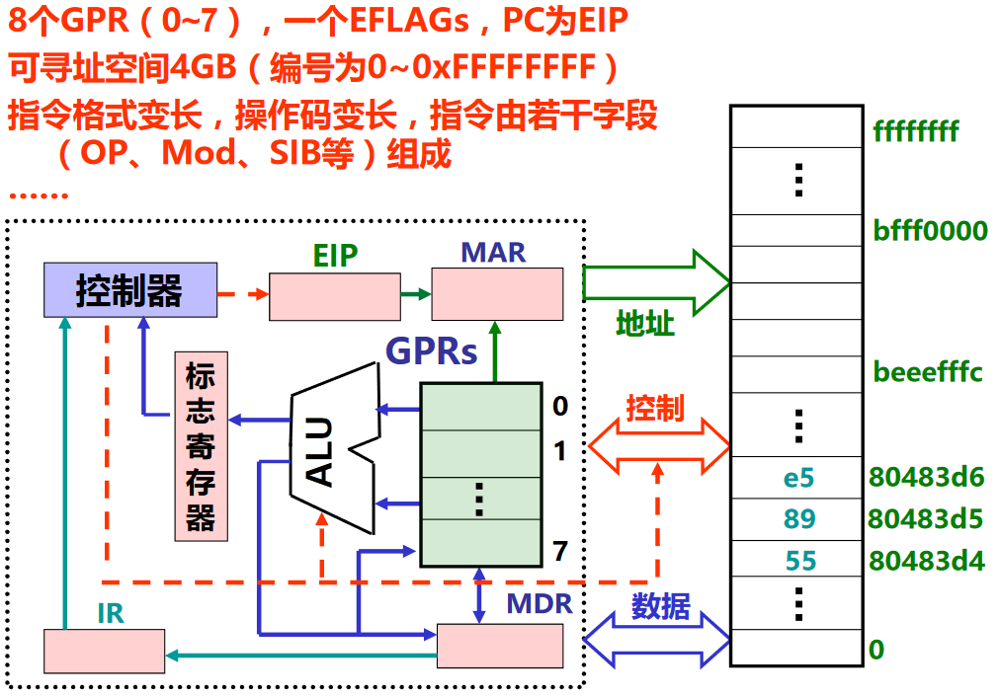

- 支持的数据类型及格式
    
    - **b**：8位，byte
    - **w**：16位，word
    - **l**：32位，double word
    - long double实际长度为80位，但分配96位=12B（按4B对齐）

    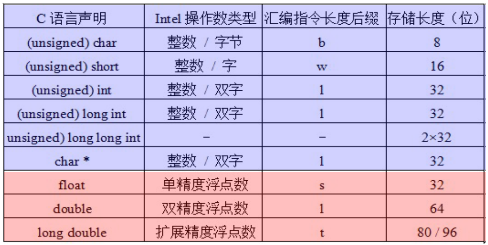

- IA-32寄存器组织
    
    - 寄存器扩展的方式
    - 首先有8个8位的寄存器：AL、BL...、DH
    - 然后有8个16位的寄存器：AX、BX...、DI
    - 然后扩展到32位机器的时候，有了8个32位的寄存器，前面的E代表32位：EAX、EBX...、EDI

        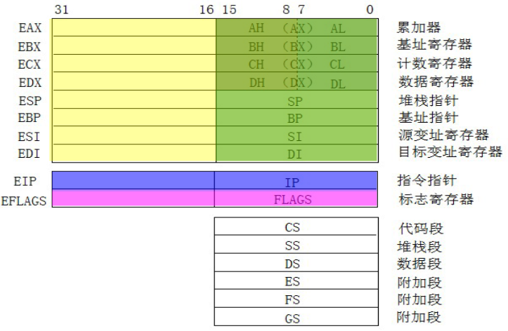

        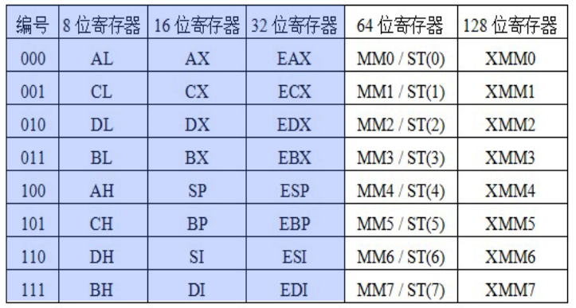

    - 反映了体系结构发展的轨迹，字长不断扩充，指令保持兼容
    - ST(0)\~ST(7)是80位，MM0\~MM7使用其低64位

- IA-32的标志寄存器
    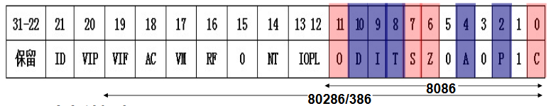
    
    - 6个条件标志
        - OF、SF、ZF、CF各是什么标志（条件码）
        - AF：辅助进位标志（BCD码运算时才有意义）
        - PF：奇偶标志
    - 3个控制标志
        - DF（Direction Flag）：方向标志（自动变址方向是增还是减）
        - IF（Interrupt Flag）：中断允许标志 （仅对外部可屏蔽中断有用）
        - TF（Trap Flag）：陷阱标志（是否是单步跟踪状态）

- IA-32的<u>寻址方式</u>(如何根据指令所定信息得到操作数或操作数地址)
    
    - 操作数所在的位置
        
        - 指令中：立即寻址
        - 寄存器中：寄存器寻址
        - 存储单元中（属于存储器操作数，按字节编址）：其他寻址方式

    - 存储器操作数的寻址方式与微处理器的工作模式有关
        
        - 实地址模式（基本用不到）
            
            - 为与8086/8088兼容而设，加电或复位时
            - 寻址空间为1MB，20位地址：(CS)<<4+(IP) 

        - 保护模式（需要掌握）
            
            - 加电后进入，采用虚拟存储管理，多任务情况下隔离、保护
            - 80286以上微处理器的工作模式
            - 寻址空间为$2^{32}$B，32位线性地址分段（段基址+段内偏移量）
            
            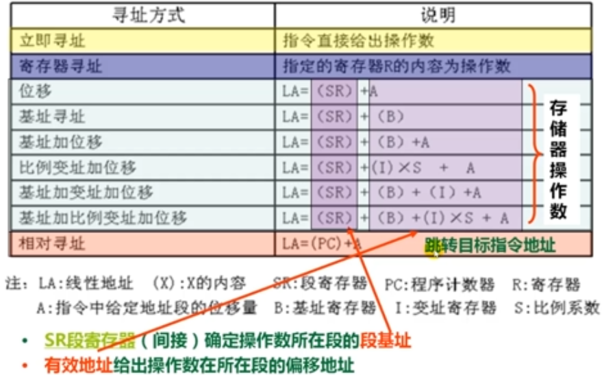

- IA-32机器指令格式
  
    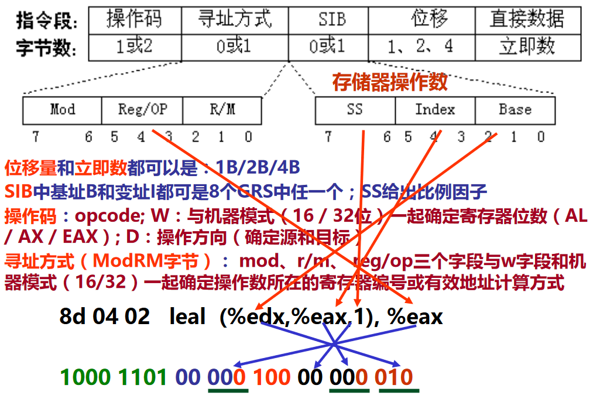

## IA-32指令类型

### 传送指令

- 通用数据传送指令
- 地址传送指令
      
      - lea：加载有效地址load effective address
      - 如`leal (%edx,%eax),%eax`的功能为`R[eax]⬅R[edx]+R[eax]`，意思是把寄存器的内容取出来，把进行加法运算后的和，作为数据装入到eax中，执行前若R[edx]=i，R[eax]=j，则指令执行后R[eax]=i+j，此处的R表示寄存器register
          - (%edx,%eax)，edx的内容，相当于是基址值，加上eax的内容，相当于是变址值，基址+变址，两个寄存器的内容加起来是有效地址

- 输入输出指令
- 标志传送指令

---

【例一】“入栈”(pushw %ax)的解释过程

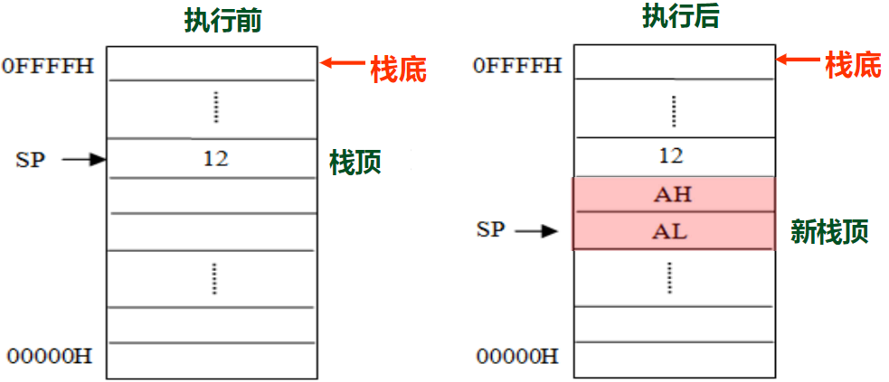

- 将通用寄存器的内容送到栈顶位置所指的数据
- w是16位，ax是16位寄存器
- 按4B对齐，所以一个横格为32位，即2个ax
- 小端方式，所以AL在栈顶，LSB在低地址
- 栈由高地址向低地址增长
- 过程为：
    
    ```
    # 取栈顶指针sp寄存器中的值
    # 将栈顶指针向下移一个ax的距离(2个字节)，即-2
    # 让sp指向新的栈顶
    R[sp]⬅R[sp]-2
    # 把ax中的值压栈，意思是将ax的值 = 以栈顶指针sp的值为内存地址的那块单元的所存的值
    # 即在新的栈顶处把ax的内容放入
    # M表示内存 memory
    M[R[sp]]⬅R[ax]
    ```

【例二】“出栈”(popw %ax)

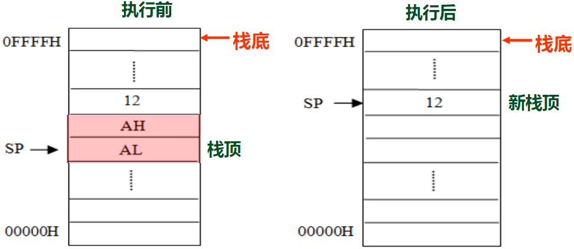

- 将栈顶位置所指的数据送到通用寄存器
- 过程为：
    
    ```
    # 原栈顶处指向的两个字节送入ax
    R[ax]⬅M[R[sp]]
    # 让sp指向新的栈顶
    R[sp]⬅R[sp]+2
    ```

【例三】传送指令举例

将以下Intel格式指令转换为AT&T格式指令，并说明功能。

```asm
push   ebp 
mov    ebp, esp
mov    edx, DWORD PTR [ebp+8]
mov    bl, 255
mov    ax, WORD PTR [ebp+edx*4+8]
mov    WORD PTR [ebp+20],dx
lea    eax, [ecx+edx*4+8]
```

> push==l==  %ebp <u>R[esp]⬅R[esp]-4;M[R[esp]]⬅R[ebp]</u>
> 
> mov==l==   %esp,%ebp <u>R[ebp]⬅R[esp]</u>
> 
> movl  8(%ebp),%edx <u>R[edx]⬅M[R[ebp]+8]</u>
> 
> movb  $255,%bl <u>R[bl]⬅255</u>
> 
> movw  8(%ebp,%edx,4),%ax <u>R[ax]⬅M[R[ebp]+R[edx]*4+8]</u>
> 
> movw  %dx,20(%ebp) <u>M[R[ebp]+20]⬅R[dx]</u>
> 
> lea==l==   8(%ecx,%edx,4),%eax <u>R[eax]⬅R[ecx]+R[edx]*4+8</u>

- 如何判断第1，2，7句是l，因为题目中都是e，所以是**双字**
- 总结规律：
      - mov指令需要在算出有效地址后加上M，而lea直接是有效地址
      - push的第二条相当于mov指令1

【例四】add函数

```c
#include<stdio.h>
int add(int i,int j){
    int x = i + j;
    return x;
}
```

:star:表示传送指令；加粗表示操作数；横线表示用RTL描述的传送指令的功能

> 80483d4<**add**>:
> 
> 80483d4: **55**        push   %ebp :star: <u>R[sp]⬅R[sp]-2;M[R[sp]]⬅R[ebp]</u>
> 
> 80483d5: **89** e5     mov    %esp, %ebp :star: <u>R[ebp]⬅R[esp]</u>
> 
> 80483d7: **83** ec 10  sub    $0x10, %esp
> 
> 80483da: **8b** 45 0c  mov    0xc(%ebp), %eax :star: <u>R[eax]⬅M[R[ebp]+12]</u>
> 
> 80483dd: **8b** 55 08  mov    0x8(%ebp), %edx :star: <u>R[edx]⬅M[R[ebp]+8]</u>
> 
> 80483e0: **8d** 04 02  lea    (%edx,%eax,1), %eax :star: <u>R[eax]⬅R[edx]+R[eax]*1</u>
> 
> 80483e3: **89** 45 fc  mov    %eax, -0x4(%ebp) :star: <u>M[R[ebp]-4]⬅R[eax]</u>
> 
> 80483e6: **8b** 45 fc  mov    -0x4(%ebp), %eax :star: <u>R[eax]⬅M[R[ebp]-4]</u>
> 
> 80483e9: **c9**        leave  
> 
> 80483ea: **c3**        ret

程序的执行过程

- 周而复始：根据EIP取指令；指令译码；取操作数；指令执行；回写结果；修改EIP的值
- add函数从80483d4开始，EIP⬅0x80483d4
  
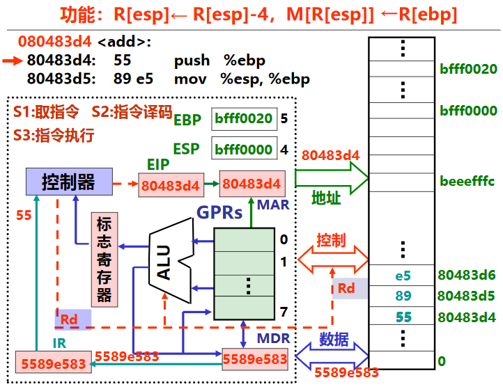

1. 取指令
   
      - 取指令的过程是把指令地址送到地址线和存储器的过程
      - EIP中最初存的是函数开始地址80483d4，将该值传输给<u>MAR</u>(存储地址寄存器，MAR为下一次的读写数据指定位置)，再送到<u>地址线</u>上
      - 此时控制器发出**Rd**读命令，送到控制线上，告诉存储器要读地址线上所给的单元的内容
      - 存储器接收到读命令和地址后，开始进行读操作，选中该地址，读出4个字节5589e583，把地址上的内容传输到数据线上
      - 数据传输到MDR(存储数据寄存器，MDR存储从内存交换的数据)，然后传给指令寄存器IR

2. 指令译码
   
      - 指令寄存器中的高位，即op字段，会送到控制器，在控制器中进行译码
      - 55译码后，计算机知道该指令的功能，即为`R[esp]⬅R[esp]-4;M[R[esp]]⬅R[ebp]`
      - 译码的结果产生了很多控制信号，控制信号控制机器实现功能

3. 指令执行

      - `R[esp]⬅R[esp]-4`：ESP的初始内容是`bfff0000`，将ESP-4后的内容变为`beeefffc`(ESP的最初内容实际上是被送入ALU中，在ALU中实现-4，结果再送回ESP中)
        
        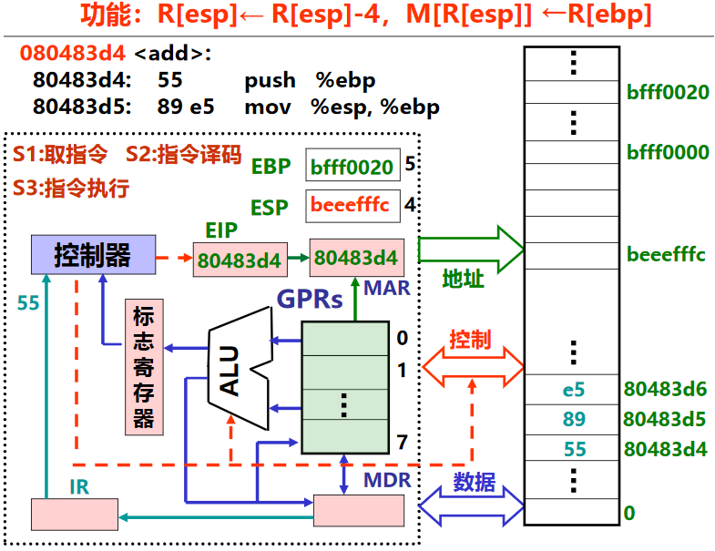

      - `M[R[esp]]⬅R[ebp]`：根据esp的内容去存储器访问，将ebp的内容写入对应位置
          
          - 将地址先送入MAR，然后再送入地址线，同时控制器发出Wr写信号放到控制线上，并且要把写的数据即EBP的内容放到MDR中，然后送到数据线上

            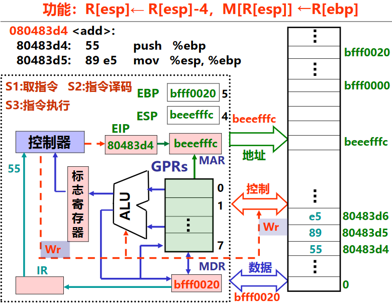

          - 存储器最终接收到的消息是：接受写的控制信号，把数据线上的`bfff0020`值写入地址`beeefffc`处

            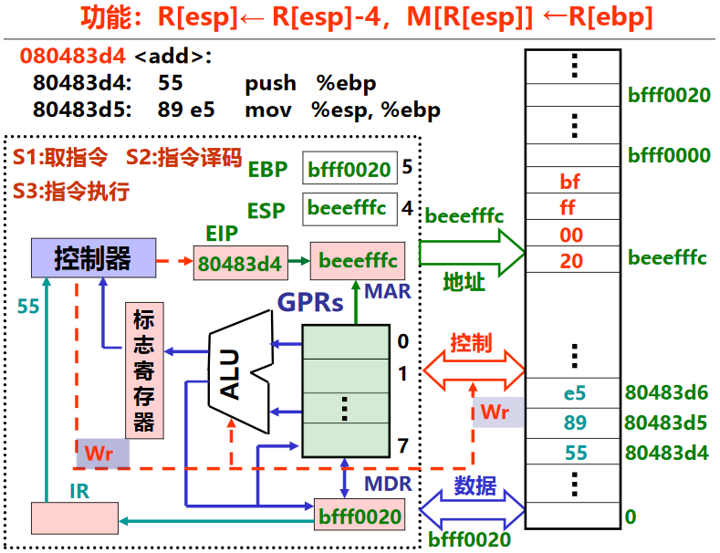

      - 至此push指令执行完，对EIP(IA32中的PC：程序计数器)增量，即在EIP中加上指令的长度，由于push指令(55)只有一个字节，所以EIP由`80483d4`变化为`80483d5`，即下一条指令的地址，开始执行下一条指令
      - 传送指令如果是在寄存器和寄存器之间的传送，则只需要在寄存器之间传输；如果涉及到访问内存，则需要总线进行传输

## C语言语句的机器级表示

可执行文件的存储器映像

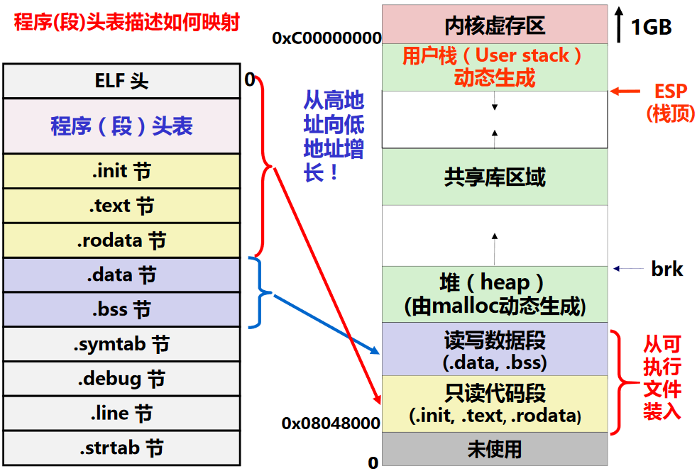

### 过程(函数)调用的机器级表示

**过程调用的执行步骤**

P为调用者，Q为被调用者

P的过程：
    
1. P将入口参数(实参)放到Q能访问到的地方
2. **CALL指令**：P保存返回地址，然后将控制转移到Q

Q的过程：

3. 准备阶段：Q保存P的现场，并为自己的**非静态局部变量**分配空间
4. 处理阶段：执行Q的过程体(函数体)
5. 结束阶段：Q恢复P的现场，释放局部变量空间
6. 结束阶段RET指令：Q取出返回地址，将控制转移到P

现场：通用寄存器的内容。因为所有过程共享一套通用寄存器
- 调用者保存寄存器：EAX、EDX、ECX。即当过程P调用过程Q时，Q可以直接使用这三个寄存器，不用将他们的值保存到栈中。如果P在从Q返回后还要用这三个寄存器，则P应在转到Q之前先保存，并在从Q返回后先恢复它们的值再使用。为了减少准备和结束阶段的开销，应先使用这三个寄存器
- 被调用者保存寄存器：EBX、ESI、EDI。即Q必须先将它们的值保存到栈中再使用它们，并在返回P之前恢复它们的值
- EBP和ESP分别是帧指针寄存器和栈指针寄存器，分别用来指向当前栈帧的底部和顶部

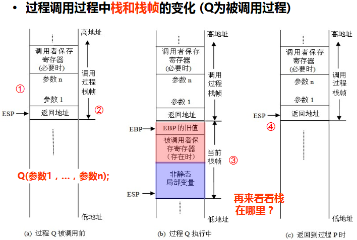

【例子】

```c
int add(int x,int y){
    return x+y;
}
int caller(){
    int t1 = 125;
    int t2 = 80;
    int sum = add(t1,t2);
    return sum;
}
```

> pushl  %ebp :ghost: 准备阶段
> 
> movl   %esp,%ebp :ghost: 准备阶段
> 
> subl   $24,%esp :ghost: 准备阶段
> 
> movl   $125,-12(%ebp) :alien: 分配局部变量
> 
> movl   $80,-8(%ebp) :alien: 分配局部变量
> 
> movl   -8(%ebp),%eax :robot: 准备入口参数
> 
> movl   %eax,4(%esp) :robot: 准备入口参数
> 
> movl   -12(%ebp),%eax :robot: 准备入口参数
> 
> movl   %eax,(%esp) :robot: 准备入口参数
> 
> call   add
> 
> movl   %eax,-4(%ebp) :space_invader: 准备返回参数
> 
> movl   -4(%ebp),%eax :space_invader: 准备返回参数
> 
> leave  :japanese_ogre: 结束阶段 `movl %ebp,%esp; popl %ebp`
> 
> ret    :japanese_ogre: 结束阶段

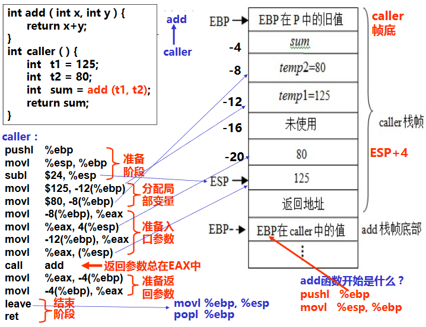

详细解析:

1. 在调用者caller的准备阶段，将原有的栈底ebp(即调用caller的函数的栈帧栈底)的值入栈；然后将现在的栈顶esp给ebp，即ebp成为新的栈帧的栈底；esp-24，即栈顶指针往低地址移动24个字节，定位到新的栈顶，至此caller的栈帧形成
2. `int t1=125;int t2=80对应movl $125,-12(%ebp);movl $80,-8(%ebp)`是在分配局部变量。将ebp-12位置处的内容置为125，即t1的位置；将ebp-8位置处的内容置为80，即t2的位置。<u>为什么要反着存</u>
3. 因为add函数需要两个参数，所以要在调用add前，将add所需要的参数放在add能够访问的位置。参数压栈的顺序是从右往左，所以第一步是将t2压栈，`movl -8(%ebp),%eax`，即把ebp-8处即t2处的值赋给eax，然后`movl %eax,4(%esp)`是将eax的值赋给esp+4(esp往高地址)所在位置的值；第二步将t1压栈，`movl -12(%ebp),%eax`，即把ebp-12处即t1处的值赋给eax，然后`movl %eax,(%esp)`是将eax的值赋给esp所在位置的值
4. call add即caller先保存返回地址，即call add下一条指令的地址，然后再调用add函数，将控制权移交给add
5. add函数开始时，先要`pushl %ebp;movl %esp,%ebp`，即保存caller栈帧的指向栈底的ebp指针的值，然后将现在的esp的值赋给ebp，ebp即为新栈帧的栈底，即add函数的栈底
6. add函数执行结束，返回caller函数。add函数的返回参数总储存在eax中
7. caller函数要获得add函数返回的结果，需要将eax中存的值赋值给ebp-4，即图中的sum
8. 由于caller函数也需要将sum结果返回给上一个调用它的函数，所以caller函数中把sum的值传给了eax寄存器
9. caller函数执行leave指令，即把ebp的值给esp，即退栈，esp往高地址移动，caller的栈帧“消失”，esp是作为调用caller的函数的栈帧栈顶；然后再把栈顶的原来压栈的调用caller的函数的EBP值出栈，EBP为调用caller的函数的栈帧的栈底，调用caller函数的栈帧恢复
10. ret表示caller函数调用结束，回归到调用caller函数继续执行

**总结：一个C过程的大致结构如下：**

- 准备阶段

    - 形成帧底：push指令 和 mov指令
    - 生成栈帧（如果需要的话）：sub指令 或 and指令
    - 保存现场（如果有被调用者保存寄存器） ：mov指令
 
- 过程(函数)体

    - 分配局部变量空间，并赋值
    - 具体处理逻辑，如果遇到函数调用时
  
        - 准备参数：将实参送栈帧入口参数处
        - CALL指令：保存返回地址并转被调用函数

    - 在EAX中准备返回参数
 
- 结束阶段

    - 退栈：leave指令 或 pop指令
    - 取返回地址返回：ret指令

**入口参数的位置**

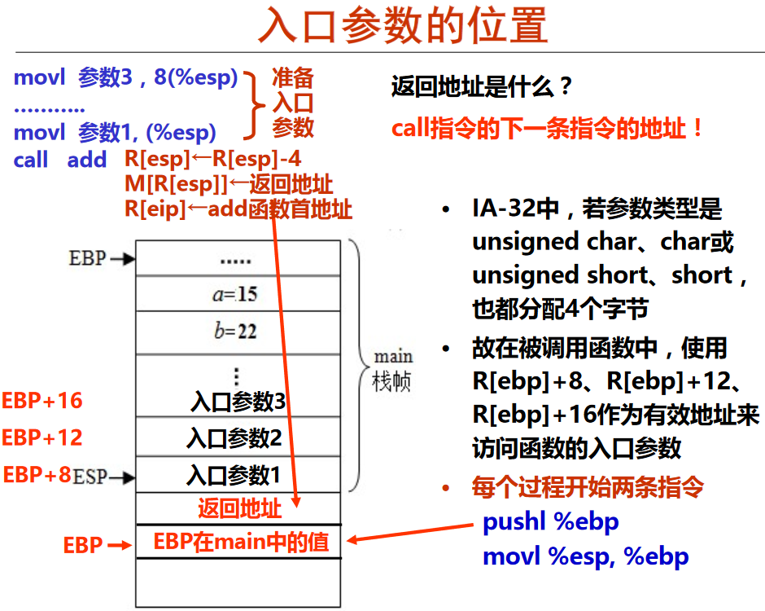

**按地址传递参数和按值传递参数**

```c
// 程序一
// 按地址传递参数
#include <stdio.h>
int main(){
    int a=15, b=22;
    printf("a=%d\tb=%d\n", a, b);
    swap(&a, &b);
    printf("a=%d\tb=%d\n", a, b);
}
void swap(int *x, int *y ){
    int t=*x;
    *x=*y;
    *y=t;
}

// 程序二
// 按值传递参数
#include <stdio.h>
int main(){
    int a=15, b=22;
    printf("a=%d\tb=%d\n", a, b);
    swap(a, b);
    printf("a=%d\tb=%d\n", a, b);
}
void swap (int x, int y ){
    int t=x;
    x=y;
    y=t;
}
```

按地址传递参数

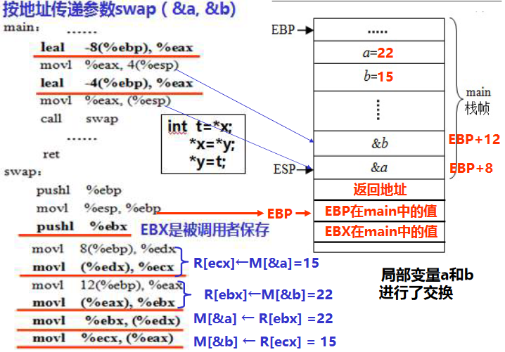

按值传递参数

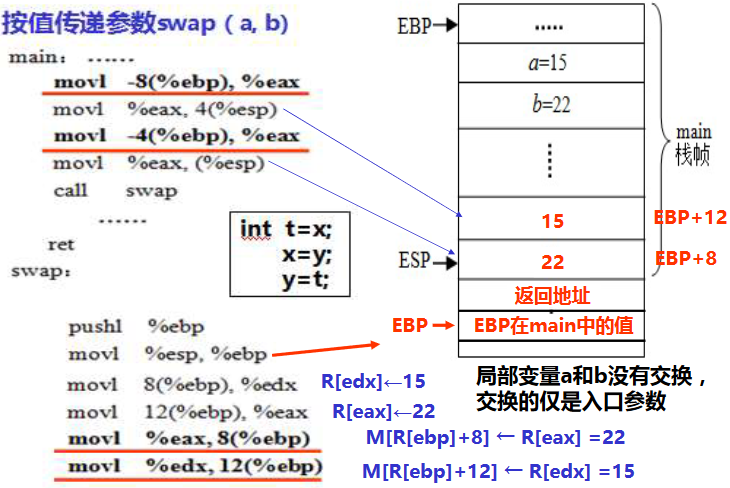

**递归过程 - 好难理解哇呜呜呜**

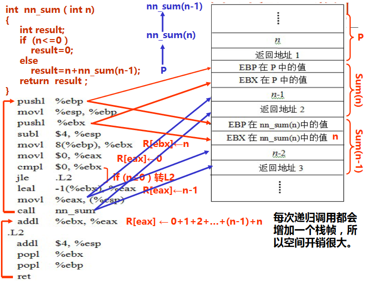

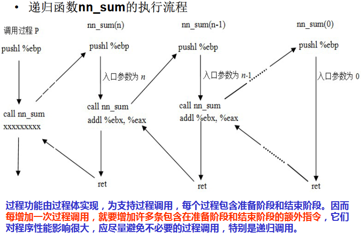

【例二】

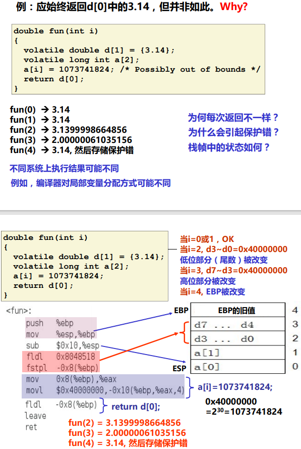

### 选择和循环语句的机器级表示


## a. 机器的结构与运行，指令系统的寻址方式

## b. 基本数据类型与操作的机器级表示

## c. 基本程序结构的机器级表示

## d. 缓冲器溢出原理与漏洞攻防


## 3.处理器体系结构

### a. ISA的组成与设计

### b. 顺序结构CPU实现与微操作

### c. 流水线CPU基本原理与相关技术

## 4.优化存储性能

### a. 面向编译器的程序优化方法

### b. 面向流水线CPU、超标量CPU、向量CPU的程序优化方法

## 5.存储器层次结构

### a. 存储器层次结构与局部性原理

### b. 高速缓存技术与基于存储器的程序优化技术