# 【考研黑书向】Part One 程序结构和执行

## 【写在前面】

### 问题

- [ ] 信息表示和处理 位、整数 巧用无符号数：向下计数，看不懂 
- [ ] 信息表示和处理 位、整数 大小端举例，0xfffffea0的值的计算
- [ ] 五段式指令流水线

计算机最基本部件

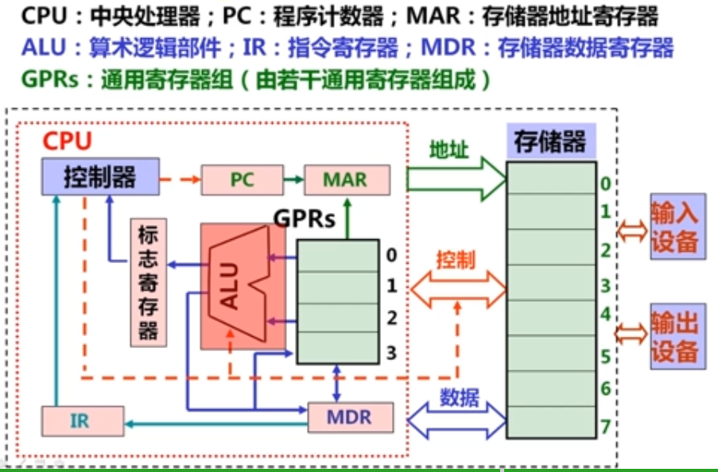

### 参考

- [计算机系统基础(一)：程序的表示、转换与链接 袁春风](https://www.icourse163.org/course/NJU-1001625001)

  - 第一周 计算机系统概述

    - 计算机层次结构
  - 第二周 数据的表示和存储
    - 数制和编码
    - 定点数的编码表示
    - C语言中的整数【部分未总结】
    - 浮点数的编码表示
    - 非数值数据的编码表示 【未总结】
    - 数据宽度和存储容量的单位【未总结】
    - 数据存储时的字节排列【未总结】
  - 第三周 运算电路基础

- CSAPP课本

---

### 网课问题

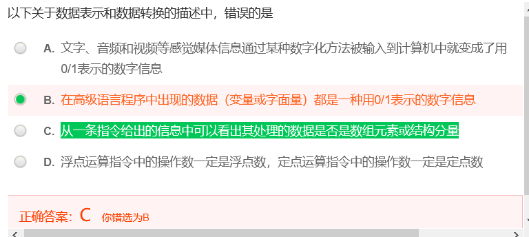

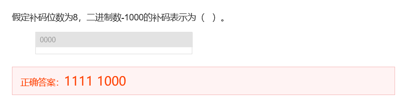

- 考察将原来的4位表示扩充为8位表示
    - 法1：先将原来的4位扩充为8位的原码表示为：10001000，然后再将原码转换为补码-取反加一得：11111000
    - 法2：直接按符号位(该题中符号位为1)扩充左边的其余4位，得：11111000

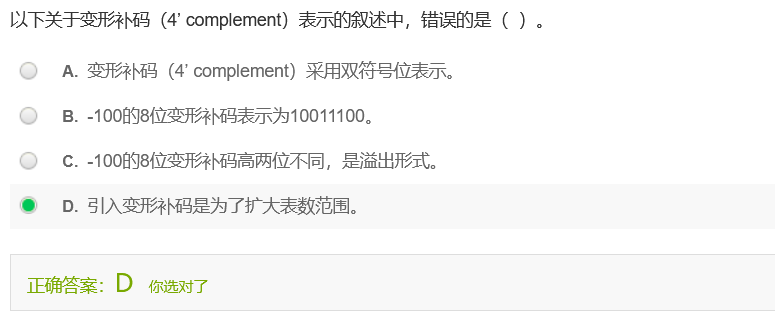

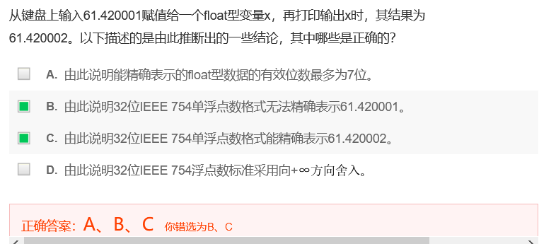

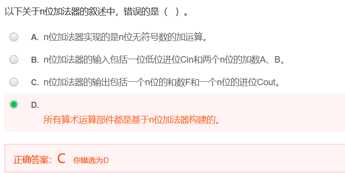

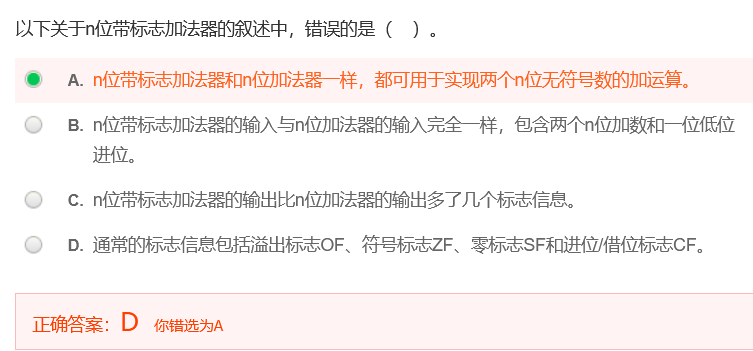


- 意思时浮点数不会出现溢出问题，了解浮点数相乘的过程

---

## 1.信息的表示和处理

### a. 信息的编码与存储

#### a-1 数制

1. “转换”的概念在数据表示中的反映

    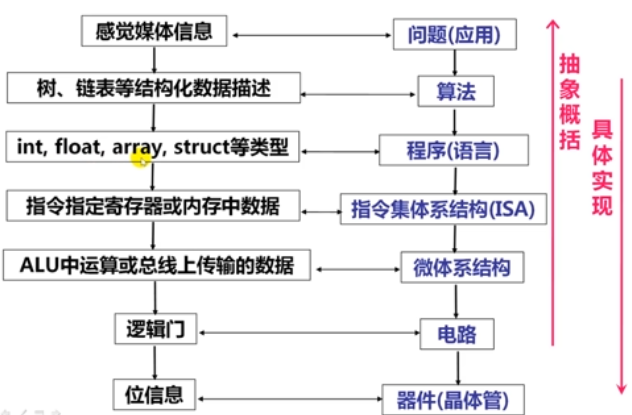

2. 机器级数据
    - 数值数据
        - 整数(定点数，定点运算指令) - 无符号整数、有符号整数
        - 实数(浮点数，浮点运算指令) - 浮点数
        - 表示的三要素：
            - 进位计数制
            - 定/浮点表示(解决小数点问题)
    - 定点数的编码(解决正负号问题) - 如何用二进制编码：原码、补码、移码、反码(很少用)
    - 非数值数据
        - 逻辑数，包括位串
        - 西文字符和汉字
    
3. 数值数据中的小数点的表示
    - 约定小数点的位置
        - 定点数Fixed Point Number：小数点位置约定在固定位置的数
            - 形式过于僵硬，决定了固定位数的整数和小数部分，不利于同时表达特别大的数或者特别小的数
        - 浮点数Floating Point Number：小数点位置约定为可浮动的数
            - 是一种**数字表示方式**，类似于科学计数法
            - 定点小数用来表示浮点数的尾数部分
            - 定点整数用来表示(带符号/无符号)整数
            - **在计算机内部，任何实数都可以用两个定点数(定点小数-指定有效数字+定点整数-指定小数点的位置)来表示**

4. 二进制
    - MSB / LSB
    - 用二进制编码的原因
        - 物理器件
        - 编码、计数、运算规则简单
        - 逻辑运算
5. 十六进制
    - 引入八进制和十六进制的原因：(1)是二进制的简便表示，便于阅读和书写，显示时可缩短长度；(2)他们之间对应简单，转换容易
6. 进制转换
    - 10进制转k进制 (先将十进制数转化为二进制数，再将二进制转化为16或8进制)
        - 整数：除法-除基取余法，上右下左(最上面的余数位于右边/低位，最下面的余数位于左边/高位)
        - 小数：乘法-乘基取整法，上左下右
            - 现实中的精确值可能无法用0和1值表示
        - :star:常识需谨记
            - 整数部分的转换：1、2、4、8、16、32、64、128、256、512、1024、2048、4096、8192、16384、32768、65536
            - 小数部分的转换：0.5、0.25、0.125、0.0625 
    - k进制转10进制
        - 按权展开

#### a-2 【非数值数据】非数值数据的编码表示

1. 逻辑数据的编码表示
2. 西文字符的编码表示
    - 常用编码为7位ASCII码
    - 数字、字母、空格、回车、换行
3. 汉字及国际字符的编码表示
    - 编码形式
        - 输入码
        - 内码
        - 字模点阵或轮廓描述
    - GB2312-80字符集
4. 多媒体信息的表示
    - 多媒体信息用一个复杂的数据结构来描述，其中的基本数据或者是数值数据，或者是用0/1编码的非数值数据

#### a-3 数据宽度和存储容量的单位

数据的基本宽度

1. 位 / 比特bit
2. 字节

#### a-4 数据存储时的字节排列

- 变量的地址是其**最小地址**，即若int型变量x的存放地址是100，则表示x存放在100#~103#
- `有多个字节的字(word)，其各个字节在内存中的存放的顺序`
    
    1. 大端序/大尾序 Big Endian：LSB的字节地址最高，MIPS / Sun / PPC Mac / Internet
    2. 小端序/小尾序 Little Endian：LSB的字节地址最低，Intel 80x86 / 运行Android 的ARM 处理器 /  iOS / Windows
    3. 双端序 Bi-Endian

---

#### a-5 运算电路基础【不在考点内 且 工大ppt未讲】

  <details>
    <summary>数字逻辑电路基础 + 从C表达式到逻辑电路 + C语言中的各类运算</summary>


##### 数字逻辑电路基础

位级运算：布尔代数


##### 从C表达式(高级语言)到逻辑电路


##### C语言中的各类运算

- 位级运算
- 移位计算
- 逻辑运算
- 异或
- 位扩展和位截断

  </details>

### b. 【数值数据】整数的表示与运算

#### b-1 定点数的编码-机器数、原码、反码、补码、移码的区别以及联系

**机器数**:star2:

  > 1. 概念：用0和1编码的计算机内部的0/1序列
  > 2. :star:真值：真正的值，即现实中带正负号的数
  > 3. 数在计算机中的表示形式 / 机器能识别的形式
  > 4. **带符号**：最高位0表示非负数，1表示负数
  > 5. 例子：假设机器字长为8位，则1表示为[00000001]，-1表示为[10000001]，其中00000001和10000001是机器数

**原码 Sign and Magnitude**

  > 1. 就是机器数
  > 2. 符号(最高位)+绝对值
  >
  > 整数采用**补码**表示，浮点数的尾数用**原码定点小数**表示

**反码**

  > 1. 表示
  >
  >     - 正数的反码是其本身
  >     - 负数的反码是符号位不变，其他位取反
  > 
  > 2. 例子
  >
  >     假设机器字长为8位，则[+1]=[00000001]原=[00000001]反；[-1]=[10000001]原=[11111110]反

**补码**

  > 模运算 \( [X]补 = 2^n + X ( -2^n \leq X < 2^n, mod 2^n) \) 
  >
  > 1. 表示
  >
  >     - 正数的补码是其本身
  >     - 负数的补码在反码的基础上+1 
  >         - 负数的补码 = 将其<u>对应正数的补码</u>**各位取反、末位加一**
  >         - 负数的补码 = 其对应的正数的补码，从右向左遇到的第一个1的前面各位取反
  >         - 其实也是`负数A[补]=模-绝对值(A)`
  >         - 对于某一确定的模，某数减去小于模的另一数，总可以用该数加上另一数负数的补码来代替 - **加法代替减法**
  >
  > 2. 例子
  >
  >     假设机器字长为8位，则[+1]=[00000001]=[00000001]原=[00000001]反=[00000001]补；[-1]=[10000001]原=[11111110]反=[11111111]补
  >
  > 3. 求特殊数的补码
  >
  >     假定机器数有n位
  >
  >     - \( [-2^{(n-1)}]补 = 2^n - 2^{(n-1)} = 10...0(n-1个0) (mod 2^n) \)
  >     - \( [-1]补 = 2^n - 0...01 = 11...1(n个1) (mod 2^n) \)
  >     - \( [+0]补 = [-0]补 = 00...0(n个0) \)

出现时期：原码 < 反码 < 补码

**有了原码为什么还出现了反码？**

- 计算机辨别和处理符号位困难，不利于硬件设计

- 使用原码加减运算方式不统一(特别当a<b时，实现a-b比较困难)，且需要额外对符号位进行处理(同号数相减和异号数相加时需要判断绝对值大小和最终符号)

    - 计算机只需要实现加法，把减一个数变为加上这个数的负数：1-1=1+(-1)，即让符号位参与运算

    - 按照正常的加法规则，原码的方式无法实现正数和负数的加法，一套用于正数+正数，一套用于正数+负数，则需要为加法运算**做两种电路**

    - 原码实现1+(-1)的过程会出现错误

      ```
      1+(-1)=[00000001]原+[10000001]原=[10000010]原，值为-2
      ```

- 用反码计算减法：

    - 反码实现1+(-1)的过程，结果正确

      ```
      1+(-1)=[00000001]反+[11111110]反=[11111111]反=[10000000]原=-0(超过的部分截断，反码需要化成原码才能知道具体的值)
      2+(-1)=[00000010]反+[11111110]反=[00000000]反=[00000000]原=0(用补码可以解决)
      ```

    - 解决了原码的部分加法问题，有些使用反码的加法也不成立，反码只是为了过渡引出补码(是一个发现问题解决问题的过程)

**为什么会出现补码？**

- 补码运算系统是模运算系统，解决了原码带来的加法问题，可以将加法运算规则扩展到整个整数集，从而**用一套电路就可以实现全部整数的加法**

    - 补码实现1+(-1)和2+(-1)的问题

      ```
      1+(-1)=[00000001]补+[11111111]补=[00000000]补=[00000000]原=0(超过的部分截断，补码需要化成原码才能知道具体的值)
      2+(-1)=[00000010]补+[11111111]反=[00000001]补=[00000001]原=1(补码求原码：采用逆推法，先把补码变为反码，然后在把反码变为原码 / 或者对结果求补)
      ```

    - 补码的运算：

        - 符号位与数值部分一起参加运算
        - 舍去超出字长的进位
        - 用补码运算，结果也为补码
        - 在转换为真值(真正的值，带符号)时，若符号位为0，数位不变；若符号位为1，应将结果求补才是其真值 

- 解决了+0和-0及其编码的问题(不利于程序员编程)，0带符号是没有任何意义的， 而且用`[0000 0000]原`和`[1000 0000]原`两个编码表示

    - 假设机器字长为8位，补码中：用`[00000000]补`表示0，用`[10000000]补`表示-128

      ```
      (-1)+(-127)=[10000001]原+[11111111]原=[11111111]补+[10000001]补=[10000000]补=-128
      ```
  
      - 在该条件下，原、反码的范围是-127~127(因为第一位是符号位)，所以-128并没有原码和反码的表示
  
- 使用补码，取值范围扩大到[-128,127]，因为0只需要一个编码，所以多出来一个编码表示-128(比原码多表示一个最小负数)

变形补码(4's complement)的表示

> 变形(4's)补码：双符号，用于存放可能溢出的中间结果


**移码 Excess(biased) notion**

> 1. 将每一个数值加上一个偏置常数(Excess / bias)
> 2. 当编码位数为n时，bias取 $2^{(n-1)}$或 $2^{(n-1)}-1$(如IEEE 754)
>     - 当bias为 $2^{(n-1)}$时，移码和补码仅第一位不同
> 3. 移码用来表示浮点数的指数(阶码)，原因是便于浮点数加减运算时的对阶操作(比较大小-需要将阶统一)
>     - 假设一个阶为负数，一个阶为正数，通过移码将两者控制在正数范围进行比较更方便

  <details>
      <summary>参考资料</summary>

- http://www.ruanyifeng.com/blog/2009/08/twos_complement.html
- https://blog.csdn.net/ch717828/article/details/103315407 - 概念解析
- https://blog.csdn.net/zl10086111/article/details/80907428 - 用钟表类比反码和补码为什么成立的原理
- :rainbow:理解上面那一段已经能基本解决我的问题，以下参考作为储备，太困了，逃ε=ε=ε=┏(゜ロ゜;)┛
- https://www.zhihu.com/question/20159860 - 原码、反码、补码的产生、应用以及优缺点有哪些？
- https://www.zhihu.com/question/352057791/answer/882175484
- https://www.jianshu.com/p/ffc97c4d2306

  </details>

---

#### b-2 带符号整数/无符号整数

无符号整数Unsigned integer

- 机器中字的位排序2种
- 没有符号位
- 能表示的最大值大于位数相同的带符号整数的最大值
- C语言：在数后面加一个u或者U，unsigned int/short/long

带符号整数Signed integer

- MSB表示数符

- 三种定点编码方式
    - 原码：定点小数，用来表示浮点数的尾数
    - 移码：定点整数，用来表示浮点数的阶(指数)
    - 补码：50年代以来，所有的计算机都用补码来表示带符号整数
- C语言：int/short/long；同时有无符号数和带符号数，强制将带符号整数转换为无符号整数

C语言中C90和C99的区别

---

#### b-3 整数的加减运算

- 指针、地址等通常被说明为无符号整数，因而在进行指针或地址运算时，需要进行无符号整数的加减运算
- 运算电路称为：整数加减运算部件，基于**带标志加法器**实现
- 计算机中的加法器，只有n位，所以是一种$n^2$运算系统

##### 补码加减运算器

- 补码加减运算公式
  
    > $[A+B]补 = [A]补 + [B]补 (mod 2^n)$
    > $[A-B]补 = [A]补 + [-B]补 (mod 2^n)$

    - 加减法运算统一采用加法
    - 实现减法主要在于求 \( [-B]补 = \overline{B} + 1 \)
    - 符号位(最高有效位MSB)和数值位一起参与运算
    - 直接用Adder实现两个数的加运算
          - 采用模运算系统：将运算结果高位丢弃，保留低n位，相当于取模$2^n$

- 所有运算电路的核心

    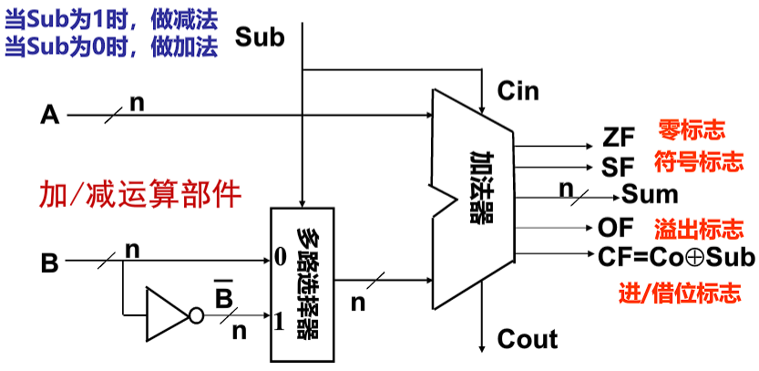

    - 计算机中所有运算都基于加法器实现
    - 加法器不知道所运算的是无符号数还是带符号数，只认01序列
    - 加法器不判定对错，总是取低n位作为结果sum，并生成条件标志(Flag)信息 [ 条件标志位 / 条件码CC ]
          - **ZF**：零标志，若sum位0，则1，否则0
          - **OF**：溢出标志，若A与B’同号但与sum不同号，则1，否则0
          - **CF**：做加运算时，CF表示进位；做减运算时，CF表示借位。若在加法中有进位，则Cout=1而Sub=0；若在减法中有借位，则Cout=0而Sub=1
          - **SF**：符号标志，sum的符号
          - 生成并保存条件标志是为了在**分支指令(条件转移指令)**中被用作是否转移执行的条件
          - 条件标志在运算电路中产生，被记录到专门的寄存器中，通常称为**程序/状态字寄存器或标志寄存器**，每个标志对应标志寄存器中的一个标志位，如IA-32中的EFLAGS寄存器

- n位带标志加法器
  
    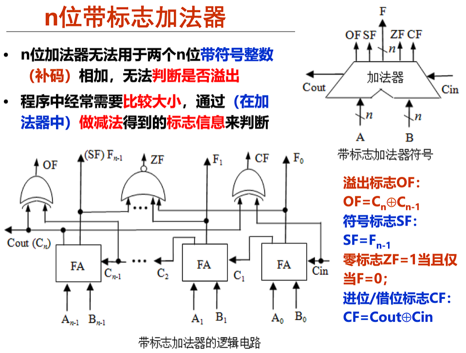

    - 为什么无法判断溢出？
    - 为什么cin是sub？

- 整数加法举例
  
    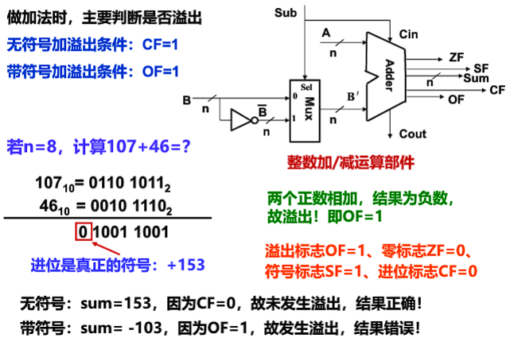

    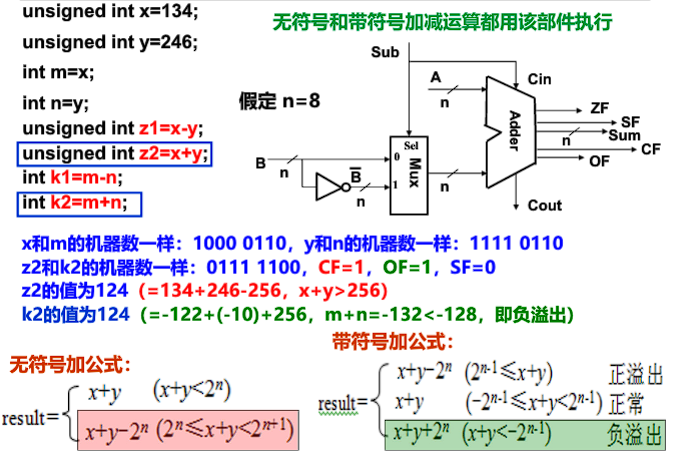

- 整数减法举例

    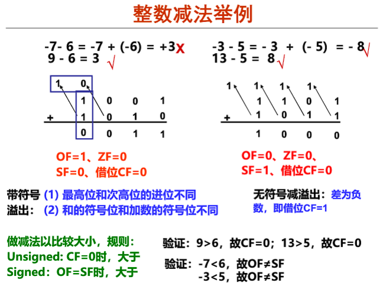

    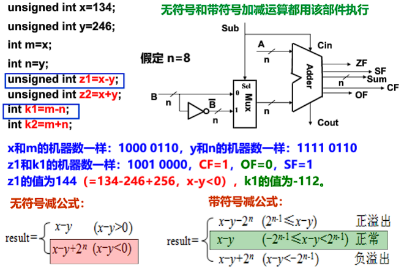


- 无符号整数加法溢出判断程序
    - 发生溢出时，一定满足`result<x && result<y`，否则若 $x+y-2^n ≥ x，则y≥2^n$，不可能 
    
    ```c++
    int uadd_ok(unsigned x, unsigned y){
      unsigned sum = x + y;
      return sum >= x;
    }
    ```
  
- 带符号整数加法溢出判断程序
  
    ```c++
    int tadd_ok(int x,int y)
    {
      int sum = x + y;
      int neg_over = x < 0 && y < 0 && sum >= 0;
      int pos_over = x >= 0 && y >= 0 && sum < 0;
      return !neg_over && !pos_over;
    }
    ```

- 无符号减的溢出判断函数
- 带符号减的溢出判断函数
  
    ```c++
    /* WARNING: This code is buggy.　*/
    int tsub_ok(int x,int y){
      return tadd+ok(x,-y);
    }

    // 当x=0，y=0x80000000时，该函数判断失误
    // 因为 y = -2^(31)
    // 0 - [-2^(31) ] = 2 ^ (31) 满足正溢出的条件
    // 但是如果x和y作为参数传入tadd_ok函数中时
    // y经过取－之后 仍然为 -2^(31)
    // 所以 x 和 -y相加的时候，是两个异号数相加，不会判断为溢出
    ```

    - 如何改进呢？

#### b-4 整数乘法运算

1. 整数乘法运算
    - 高级语言中两个n位整数相乘得到的结果通常也是一个n位整数(取低n位)
        - 以下是自己总结的用二进制方法计算乘法也不知道对不对
        - 无符号乘法：正常十进制乘法，当超长则截断
        - 带符号乘法
            - 超长，截断
            - 不够长，需进行符号扩展，符号通过一开始给的两个数值进行判断
    - 高级语言中，程序员判断返回值z是正确的语句`!x || z / x == y`
        
        ```c++
        int mul(int x,int y){
          int z = x*y;
          return z;
        }
        ```

    - 在编译器层面，当 \( -2{n-1} \leq x*y \le 2{n-1} (不溢出) \) 乘积是正确判断方式为
        - 无符号：乘积的高n位为全0，则不溢出
        - 有符号：乘积的高n位为全0或全1并等于低n位的最高位 / 即乘积的高n+1位为全0或全1
    - 硬件**不判断**溢出(乘法指令不生成溢出标志)，仅保留2n位乘积，供软件使用和判断是否溢出
    - 指令：分**无符号**数乘指令、**带符号**整数乘指令
        - 在无符号乘和带符号乘中，尽管位级表示相同，但是2n位的乘积是不同的，所以要区分(不同于加法)

          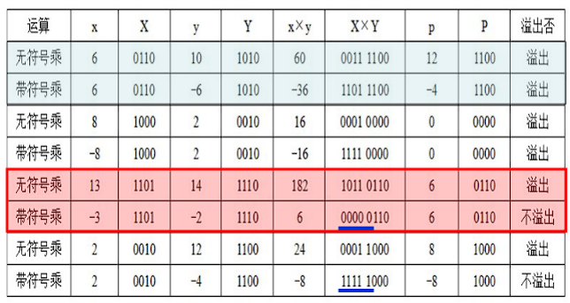

    - 整数乘法溢出漏洞
     
        ```c++
        /*复制数组到堆中，count为数组元素个数*/
        int copy_array(int *array, int count){
          int i;
          /*在堆区申请一块内存*/
          int  *myarray = (int *)malloc(count*sizeof(int));
          if(myarray == NULL) return -1;
          for(i = 0; i< count; i++)
            myarray[i] = array[i];
          return count;
        }

        // 当参数count很大时，count*sizeof(int)会溢出
        // count = 2^(30) + 1时，count*sizeof(int) = [ 2^(30) + 1]* 2^2 mod 2^(32) = [ 2^(32) + 4] mod 2^(32)
        // 导致程序仅仅只给函数分配了4个字节的内存
        // 当数组复制的时候，堆heap中的大量数据被破坏
        // 攻击者可构造特殊参数来触发整数溢出，
        // 以一段预设信息覆盖一个已分配的堆缓冲区，
        // 造成远程服务器崩溃或者改变内存数据并执行任意代码
        ```

2. 变量与常数之间的乘运算
   
    乘法运算比移位和加法等运算所用时间长，编译器在处理变量与常数相乘时，往往以移位、加法、减法的组合运算来代替乘法运算。如x*20 = (x << 4) + (x << 2)，因为20 = 16 + 4 = 2^4 + 2^2。在乘积溢出时，利用移位和加减运算组合的方式得到的结果和采用直接相乘的结果是一样的

#### b-5 整数除法运算

1. 整数的除运算
  
    对于带符号整数，n位整数除以n位整数
    - $-2^{n-1} / (-1) = 2^{n-1}$会发生溢出，因为假设在32位的情况下，最大能表示的整数是$2^{31}-1$
    - 其余情况不会发生溢出，因为商的绝对值不可能比被除数的绝对值大
    - 因为整数除法的商也是整数，所以在不能整除的时候通常按照朝0方向舍入
        - 正数商取比自身小的最接近整数(Floor，地板)
        - 负数商取比自身大的最接近整数(Ceiling，天板)
    - 整除0的结果无法用一个机器数表示，所以当除数为0时，会发生**异常**，调用操作系统中的异常处理程序处理
    - 未发生除法溢出 / 浮点异常

        ```c++
        // CASE 1
        int a = 0x80000000;
        int b = a / -1;
        printf("%d\n",b);

        // 运行结果为-2147483648
        // 因为除以-1被优化成取负指令
        // 相当于把0x80000000取负后的机器码仍然是 1000+28个0
        // 负数即为 -2^(31)
        // 故未发生除法溢出

        // CASE 2
        int a = 0x80000000;
        int b = -1;
        int c = a / b;
        printf("%d\n",c);

        // 运行结果为“Floating point exception”，即CPU检测到了异常
        ```

2. 变量与常数之间的除运算
   
    由于计算机中除法运算比较复杂，而且不能用流水线方式实现，且需要比乘法指令还要长的时钟周期。所以编译器在处理<u>一个变量与一个2的幂次形式的整数相除</u>时，常采用**右移运算**(无符号：逻辑右移；带符号：算术右移)来实现 

  <details>
  <summary>算术左、右移和逻辑左、右移</summary>

  1. 算术左移<<：依次左移一位，尾部补0，最高的符号位保持不变

  2. 算术右移>>：依次右移一位，尾部丢失，符号位右移后，原位置上**补符号位**，即正数补0，负数补1

  > 算术运算
  >
  > 1. 左移：无论有/无符号数，都可以用逻辑左移实现乘以$2^k$
  > 2. 右移：
  >     - **无符号数：逻辑右移**，除以$2^k$（除法+向0舍入）
  >     - **有符号数：算术右移**
  >         - 正整数:除以 $2^k$ (除法 + 向0舍入) 
  >         - 负整数:除以 $2^k$ (除法 + 若不纠偏则是远离0舍入)，所以最后还要使用偏置(+1<<k-1,即加上$2^k-1$)来修正

  1. 逻辑左移：最高位丢失，最低位补0

  2. 逻辑右移>>>：最高位补0，最低位丢失

  </details>

  - 能整除直接右移
  - 不能整除时，则右移移出的位中有非0，采用**朝零舍入**(截断)
      - **无符号数**、**带符号正整数** - 地板：移除的低位直接**舍弃**
      - **带符号负整数** - 天板：加偏移量$2^k -1$，然后再右移k位，低位截断(k：右移位数)

          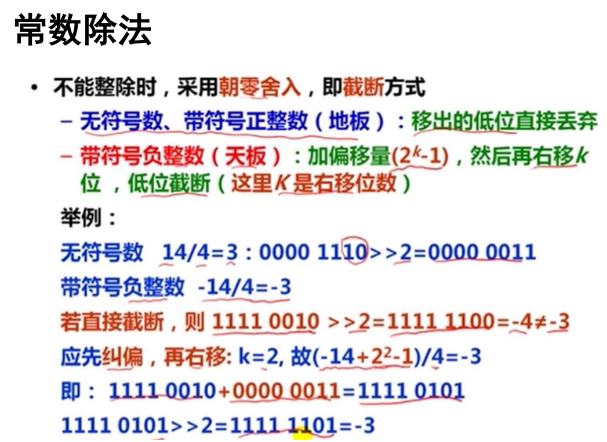
        
          - 实践是检验真理的唯一标准
          
              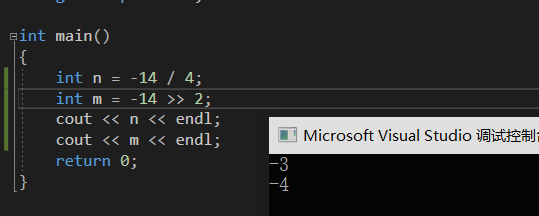

          - 原理解析

              如果仅仅是算术右移>>，则得到$\lfloor x / 2^k \rfloor$，所以是远离0的舍入方向，为了使得是向0方向的舍入，则按$\lceil (x+2^k-1)/2^k \rceil$计算，即 \( (x + (1 << k ) -1) >> k \)

              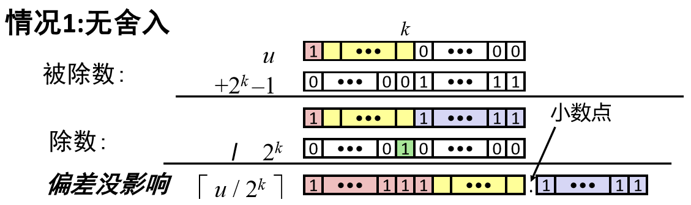

              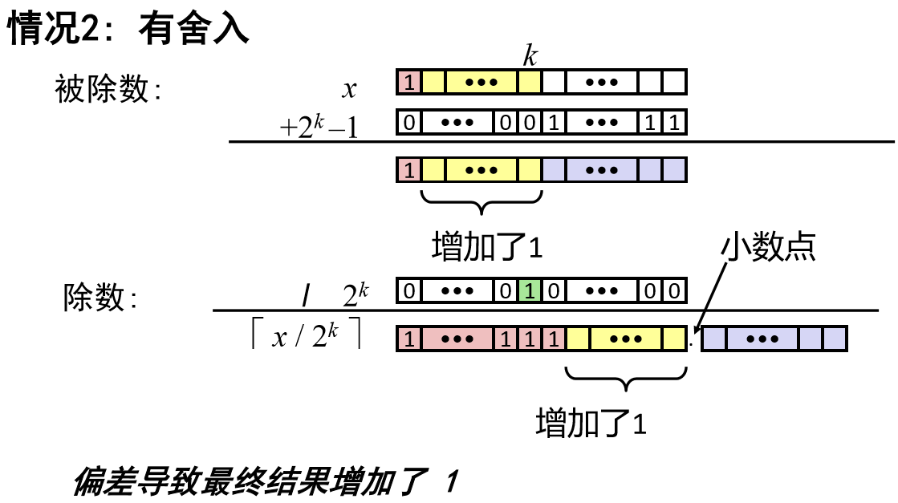

  - 举例：假设x为一个int型变量，请给出一个用来计算x/32的值的函数div32。要求不能使用除法、乘法、模运算、比较运算、循环语句和条件语句，可以使用右移、加法以及任何按位运算

      - 除以32，相当于右移5位
          - 正数直接右移
          - 负数需要加偏移量31
          - 设偏移量为b，则x为正时，b=0；x为负时，b=31，即(x>=0 ? x : (x+31))>>5

          ```c++
          int div32(int x){
            /*根据x的符号得到偏移量b*/
            /* 00000000 & 00011111 | 11111111(右移补符号位) & 00011111 */
            int b = (x>>31) & 0x1F;
            return (x+b) >> 5;
          }
          ```

#### 转换、扩展、截断

#### 整数运算：加、非、乘、移位


---

### c. 【数值数据】浮点数的表示与运算

- 为什么需要浮点数？浮点数是如何浮动的？
  
    - 定点数的范围存在缺陷，比如数很小的时候，大部分位都是0，则不能充分运用存储单元
    - 小数的存储和计算需要考虑小数点的位置和对齐问题
    
    > how a point floats? 
    > How much memory allocation needs an average point number?
    > For the fixed point number, the computer allocates a fixed amount for fractional part, as for currency where you know how much precision you need, and the other fixed amount of bits for the integral part.
    > If you have **small numbers** you need more space for the fractional part of the number, and for **big numbers** you want less for the fractional and more for the integral part. Here comes the floating point ability to float on the needs. 
    > A floating-point number sees the both parts as one number, which is put in one chunk of bits, named mantissa, and the rest of bits are for sign and for the exponent. The exponent tells where the floating-point is in this number

  <details>
  <summary>参考资料</summary>

- [阮一峰-浮点数的二进制表示](http://www.ruanyifeng.com/blog/2010/06/ieee_floating-point_representation.html)
- what is a floating point number
    - https://www.zhihu.com/question/19848808
    - https://www.quora.com/What-is-a-floating-point-numberhttps://www.webopedia.com/TERM/F/floating_point_number.html
    - https://stevenpcurtis.medium.com/what-is-a-floating-point-number-6991f2f85a28 - 针对初学者理解
    - https://www.webopedia.com/TERM/F/floating_point_number.html

  </details>

---

#### c-1 浮点数的编码表示

- 实数类型：单精度浮点(C语言:32位)、双精度浮点(C语言:64位)、扩展精度浮点(C语言:80/96位)

    

- 类比科学计数法(Scientific Notation)

    - Normalized 规格化形式 - 唯一
    - Unnormalized 非规格化 - 不唯一

- 二进制实数

    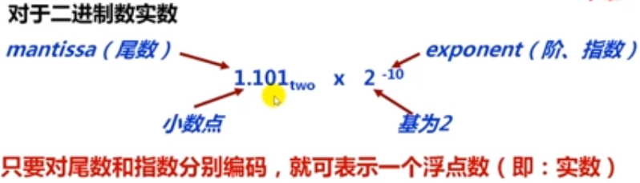

- 32位浮点数格式的规格化数的表示

    -  +/-0.1xxx * $2^E$，但通常规定规格化数的小数点前为1，+/-1.xxx * $R^{Exponent}$，R是基(可以是2/4/8/16，约定信息，无需显式表示)

        

    - 第0位数符S

    - 第1~8位为8位移码表示阶码E(假设一般的偏置常数为128=2^7)

    - 第9~31位为24位二进制原码小数表示的尾数M
      
        - 原码具有**对称性**
        - 因为规格化尾数的小数点后**第一位总是1**，故规定第一位默认的1不明显表示出来(节省存储空间)，这样可用23个数位表示24位尾数
      
    - 最大正数：$0.11...1 × 2^{11...1} = [ 1-2^{-24} ] × 2 ^ {127}$
        - 小数点后面的第一个1不表示
        - 8个1，即11111111 = 255 = 127 + 128(偏置常数) 【e = E + Bias / E = e - Bias】，所以不加偏置常数能表示的最大数为127
      
    - 最小正数：$0.10...0 × 2^{00...0} = [ 1 / 2 ] × 2 ^ {-128}$

        - 8个0，即00000000 = 0 = 128 + (-128)

    - 因为原码对称，故其表示范围关于原点对称

        

        - 机器0：尾数为0或落在下溢区中的数(被舍入)
        - 浮点数范围比定点数大，但数的个数没变多(因为32位的编码，编码个数只能是2的32次方，和整数)，故数之间更稀疏且不均匀

- IEEE 754标准 Single Precision(单精度)  $v = (-1)^s × M × 2^E$

    

    - **Sign bit**：1表示negative；0表示positive

    - **Exponent(阶码)**
      
        - <u>阶码</u>表示阶的编码，<u>阶或指数</u>表示阶码的值
        - `E = Exp - Bias` E是最初的指数的值，Bias是偏置常数，Exp是阶
        - SP**规格化**阶码范围为00000001(-126 = 1-127) ~ 11111110(127 = 254 - 127) 
            - 全0和全1用来表示特殊值
        - bias为127(single $2^7-1$)，1023(double $2^10-1$)
        - 为什么bias选择127？
            - 若用128，则阶码范围为 00000001(-127)~11111110(126)，则表示小数部分多了一位，但是表示整数部分少了一位，所以少了很多可表示的范围，因为小数的一位变化范围比整数的一位变化范围少，如精度由0.1 -> 0.01，多表示了0.01~0.1之间的小数，但是如果精度由1 -> 10，则不仅可以表示由1~10之间的小数，而且还能表示之间的小数 (:smile:个人想法，也许表述不精，意会意思)
      
    - **Significand(部分尾数)**

        - 规格化尾数最高位总是1，所以隐含表示，省1位：1 + 23bits(single)，1 + 52bits(double)
        - frac = 0...0 (M = 1.0)时，为最小值；frac = 1...1(M = 2.0 - ε)时，为最大值
        - SP: $(-1)^S × (1 + Significand) × 2^{Exponent - 127}$
        - DP: $(-1)^S × (1 + Significand) × 2^{Exponent - 1023}$

  - 特殊数的表示

      |           值           |                       机器数表示                        |          exponent           |    significand    |         sign         | 相关操作                                                     |
      | :--------------------: | :-----------------------------------------------------: | :-------------------------: | :---------------: | :------------------: | ------------------------------------------------------------ |
      |           0            | +0: 0 00000000 0~0(23bits) / -0: 1 00000000 0~0(23bits) |          all zeros          |     all zeros     | both cases +/- valid |                                                              |
      |        +∞ / -∞         | +∞: 0 11111111 0~0(23bits) / -∞: 1 11111111 0~0(23bits) |  all ones(11111111B = 255)  |     all zeros     |                      | 5.0   / 0 = +∞; -5.0 / 0 = -∞; 5 +  (+∞) = +∞; (+∞) + (+∞) = +∞; 5 -(+∞) = -∞; (-∞) - (+∞) = -∞ |
      | 非数 NaN(Not a Number) |                                                         |             255             |      nonzero      |                      | sqrt(-4.0)=NaN; 0/0=NaN; op(NaN,x)=NaN; +∞+(-∞)=NaN; +∞-(+∞)=NaN; ∞/∞=NaN |
      |   非规格化数 Denorms   |                                                         |              0              |      nonzero      |                      |                                                              |
      |     规格化数 Norms     |                                                         | 1-254(exp≠0...0且exp≠1...1) | 任意小数点前隐含1 |                      |                                                              |

      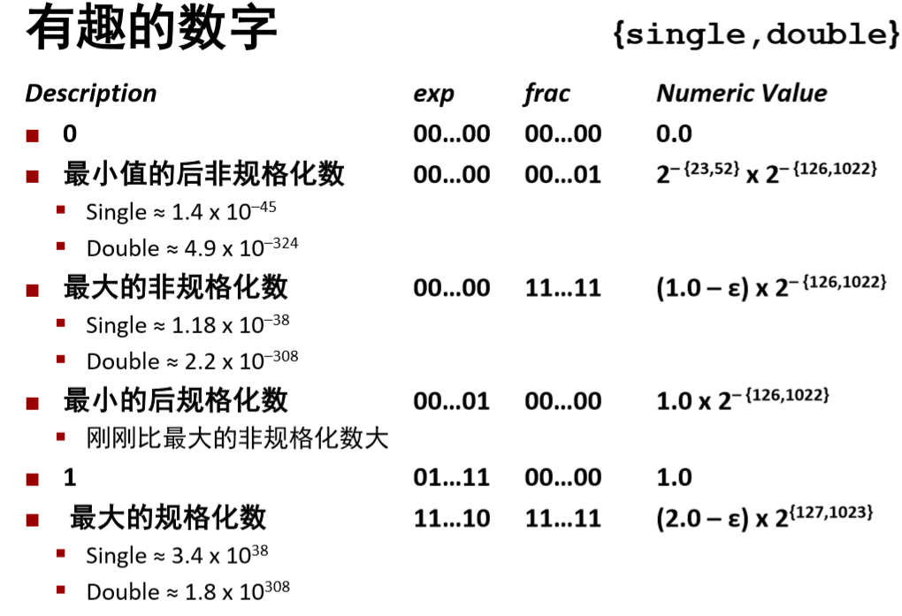

      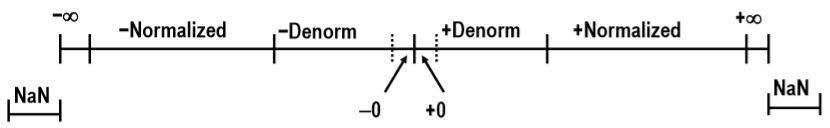

      - 浮点数除0的结果是 +/-∞，而不是溢出异常(整数除0为异常)，因为这样可以利用+/-∞作比较，例如 X/0 > Y **可作为有效比较？？？ 为什么可以作为有效比较**

      - NaNs可以帮助调试程序和判断原因，而不会让程序出现异常而无法执行和得不到结果，也无法查找原因

      - 非规格化数(Denorms)的表示

          - 条件是exp = 0...0 
          - 阶码值：<u>E = 1 - Bias(instead of E = 0 - Bias)</u> 
              - 相当于指数恒为-126了(在单精度中)
              - 原因：使得最大非规格化数和最小规格化数之间可以平滑转换，补偿非规格化数的尾数没有隐含的开头的1
        
          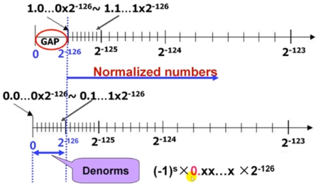
          
          - 假设正数，则规格化数能表示的最小正数为$2^{-126} = 1.0...0 × 2^{-126}$，0 00000001 0~0(23bits)
          - $[2^{-126},2^{-125}]$的区间长度为$2^{-126}$，而$[2^{-125},2^{-126}]$的区间长度为$2^{-125}$，是前者的区间长度的两倍，因为每个区间都可以表示$2^{23}$个数，所以数的间距也是前者数的间距的两倍 -> 浮点数往数轴正方向上数的间距越大，越稀疏，越离原点近的数，精度越好

- 机器数转换为真值

    

- 真值转换为机器数

    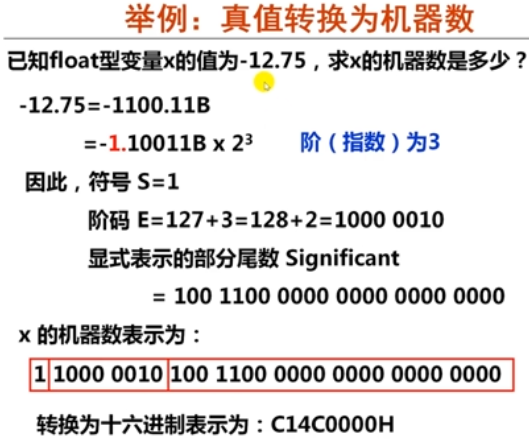

- 浮点数精度：当输入数据是一个不可表示数时，机器将其转换为最邻近的可表示数

---

#### c-2 浮点数的运算

基本思想：
1. 计算精确结果
2. 变换到指定格式
      - 可能溢出：阶码(Exponent)太大
      - 小数部分可能需要舍入

设两个规格化浮点数分别为：$A = Ma*2^{Ea},B =Mb*2^{Eb}$

- $A \pm B = (Ma \pm Mb*2^{-(Ea-Eb)})*2^{Ea},假设Ea \geq Eb$
- $A*B = (Ma * Mb)*2^{Ea+Eb}$
- $A / B = (Ma / Mb)*2^{Ea-Eb}$

上述运算结果可能出现以下几种情况:

- 阶码上溢：一个正指数超过了最大允许值=〉+∞/-∞/溢出
    - SP最大指数为127
- 阶码下溢：一个负指数超过了最小允许值=〉+0/-0
    - SP最小指数为-126
- 尾数溢出：最高有效位有进位=〉右规
    - 尾数溢出，结果不一定溢出
    - 1.5+1.5=？
- 非规格化尾数：数值部分高位为0 =〉左规
    - 1.5-1.0=？
- 右规或对阶时，右段有效位丢失=〉尾数舍入
    - 运算过程中添加保护位
    - IEEE建议实现时为每种异常情况提供一个**自陷允许位**。若某异常对应的位为1，则发生相应异常时，就调用一个特定的异常处理程序执行

IEEE 754 标准规定的五种异常情况：

- 无效运算（无意义）
    - 运算时有一个数是非有限数，如：加/ 减∞、0 x ∞、∞/∞等
    - 结果无效，如：源操作数是NaN、0/0、x REM 0、∞REM y 等
- 除以0（即：无穷大）
- 数太大（阶上溢）: 对于SP，指阶码E >1111 1110 （指数大于127）
- 数太小（阶下溢）: 对于SP，指阶码E < 0000 0001（指数小于-126）
- 结果不精确（舍入时引起），例如1/3、1/10等不能精确表示成浮点数

上述情况硬件可以捕捉到，因此这些异常可设定让硬件处理，也可设定让软件处理。让硬件处理时，称为**硬件陷阱**

```c++
#include<stdio.h>

int main(){
  // case 1
  int a = 1, b = 0;
  printf("division by zero: %d\n", a/b);

  // 整数除0会发生异常

  // case 2
  double x = 1.0, y = -1.0,z = 0.0;
  printf("division by zero: %f %f\n", x/z , y/z);

  // 结果为 1.#INFOO -1.#INFOO
  // 浮点数除0不会出现异常
  // 因为在浮点运算中，一个有限数除以0，结果为正无穷大(负无穷大)
  
  return 0;
} 
```
 
##### 浮点数加/减运算

基本要点：

(假定：$Xm$、$Ym$分别是$X$和$Y$的尾数，$Xe$和$Ye$分别是$X$和$Y$的阶码)

1. 求阶差：$\Delta e = Xe-Ye$ (若$Ye > Xe$，则结果的阶码为$Ye$)
2. 对阶：将$Xm$右移$\Delta e$位，尾数变为$Xm*2^{Xe-Ye}$(保留右移部分**附加位**)
      - 目的是使两数**阶码相等**
      - 小阶向大阶看齐，阶小的那个数的尾数右移，右移位数等于两个阶码差的绝对值
      - IEEE 754尾数右移时，要将隐含的“1”移到小数部分，高位补0，移出的低位保留到特定的`“附加位”`上
3. 尾数相减：$Xm*2^{Xe-Ye} \pm Ym$
4. 规格化

      - 当尾数高位位0，需**左规**：尾数左移一次，阶码减1，直到MSB为1 :s 每次阶码减1后要判断阶码是否下溢(比最小可表示的阶码还要小)
      - 当尾数最高位有进位，需**右规**：尾数右移一次，阶码加1，直到MSB为1 :s 每次阶码加1后要判断阶码是否上溢(比最大可表示的阶码还要大)
          - IEEE 754 加减运算右规时最多只需一次，因为即使是两个最大的尾数相加(一开始的规范形式即为1.xxx)，得到的和最多为11.xxx，即尾数的整数部分最多有两位，即不会达到4。结果保留一个隐含的“1”后，最多只有一位被右移到小数部分
      - 阶码溢出异常处理：阶码上溢，则结果溢出；阶码下溢，则结果为0

5. 如果尾数比规定位数长(有附加位)，则需考虑舍入(有多种舍入方式)
6. 若**运算结果尾数**是0，说明结果也应该为0，则需要将阶码也置为0

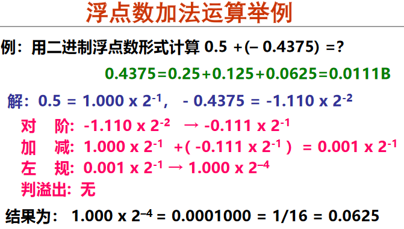

##### 浮点乘法

$(-1)^{s1}*M1*2^{E1} × (-1)^{s2}*M2*2^{E2}$，精确结果$(-1)^s*M*2^E$如下：
- 符号s：依据s1和s2
- 尾数M：$M1×M2$
- 阶码E：$E1+E2$

修正

- 如M ≥ 2，将M右移(1位)，E加1
- 如 E 超出范围，则溢出
- 将 M 舍入，以符合小数部分的精度要求 

实现

- 主要问题：实现尾数(Significand)的乘

##### 浮点数舍入

**附加位(Extra Bits)**

- IEEE754规定: 中间结果须在右边加2个附加位（guard & round）
    - Guard (保护位)：在significand右边的位
    - Round (舍入位)：在保护位右边的位
- 作用：用以保护对阶时**右移的位**或运算的**中间结果**，如果不在后面加附加位，则这些精度之外的数就会被无情舍去，可能会产生影响
- 处理：①左规时被移到significand中; ②作为舍入的依据

**Rounding Digits(舍入位)**

- IEEE有四种舍入方式
  
  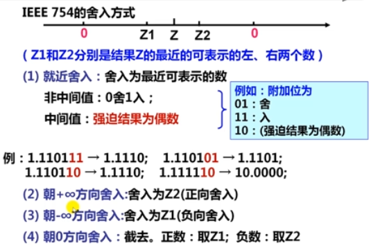

  - 就近舍入
      - 向偶数舍入的意思是：当恰好在两个可能的数值正中间时如10，舍入后使得**最低有效位**的数码为偶数
          - “偶数”：最低有效位值为0
          - “中间值”：舍入位置右侧的位都是0，即形如：$×××100..._{2}$
      - Z1和Z2为10，且Z1和Z2前的一位数为0，则无需进位
      - Z1和Z2为10，且Z1和Z2前的一位数为1，则需往前进一位
  - 就近舍入的方式得到的平均误差最小

##### 浮点数比较

```c++
#include<stdio.h>

int main() { 
  float a; double b; 
  a = 123456.789e4;
  b = 123456.789e4;
  printf("%f/n%f/n",a,b); 

  // 运行结果如下：
  // 1234567936.000000
  // 1234567890.000000
  // float可精确表示**7个**十进制有效位数????，
  // 后面的数位是舍入后的结果，舍入后的值可能会更大，也可能会更小
}
```

- 单精度浮点数float型的表示范围多大? 最大的数据: $+1.11…1×2^{127}$，约$+3.4×10^{38}$
- 双精度浮点数double型约$+1.8×10^{308}$
- C语言中的浮点数类型：float / double，分别对应IEEE 754单精度浮点数格式和双精度浮点数格式
- 从int转换为float时，不会发生溢出，但可能有数据被舍入
- 从int或float转换为double时，因为double的有效位数更多，故能保留精确值
- 从double转换为float和int时，可能发生溢出，此外，由于有效位数变少，故可能被舍入
- 从float 或double转换为int时，因为int没有小数部分，所以数据可能会向0方向被截断

| 原类型 | 结果类型 | 可能发生溢出 | 可能发生舍入 | 原因 |
| --- | --- | --- | --- | --- |
| int | float | × | √ | float的表示范围比int的表示范围大？，所以不会发生溢出。因为int是由1位符号位和31位数据部分组成，而float最多只有24位(1位隐含和23位尾数)，所以31位转化为24位时会发生舍入 |
| int / float | double | × | × | double的有效位数53位更多，故能保留精确值 |
| double | int / float | √ | √ | double表示范围更大，转换为表示范围小的数据类型则会发生溢出。由于有效位数变少，故可能被舍入 |
| float / double | int | ? | ? | int没有小数部分，所以数据可能会向0方向被截断 |

```c++
// Assume neither d nor f is NaN
int x;
float f;
double d;

x == (int)(float) x // no 24位尾数
x == (int)(double) x // yes 53位尾数
f == (float)(double) f 
// yes 增加精度
d == (float) d 
// no 损失精度
f == -(-f)
// yes 仅仅改变符号位
2/3 == 2/3.0 
// no
d < 0.0 ⇒ ((d*2) < 0.0)
// yes
d > f ⇒ -f > -d // yes
d * d >= 0.0 // yes
x*x>=0 // no
(d+f)-d == f // no 当d很大，f很小的时候，f会被吃掉，因为对阶的时候f的精度会损失
```

- 浮点数加法结合律不正确
  
    因为 \( x = – 1.5 × 10^{38}, y = 1.5 × 10^{38}, z = 1.0 \)
    
    则 \( (x+y)+z = (–1.5 × 10^{38} + 1.5 × 10^{38} )+1.0 = 1.0 \)
    
    不等于 \( x + (y + z) = –1.5 × 10^{38} + (1.5 × 10^{38}+1.0) = 0.0 \)

- 浮点数和实数运算不同：结合性、分配性有冲突


- 不能遇到小数就用浮点数表示，有些情况下(如需要将一个整数变量乘以一个确定的小数常量)，可先用一个确定的定点整数常量与整数变量相乘，然后再通过移位运算来确定小数点
    - 有没有什么例子，光看文字看不懂哇
    - 我的理解：浮点数的运算比较麻烦，相比之下整数相乘运算简单，所以在可以用定点整数运算的时候可以优先选择定点整数的运算，然后再考虑转为浮点数格式

---

## 2.程序的机器级表示 Machine-Level Programming

### a. 机器的结构与运行，指令系统的寻址方式


## 3.处理器体系结构

## 4.优化存储性能

## 5.存储器层次结构
