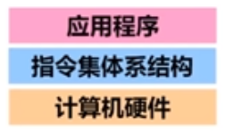
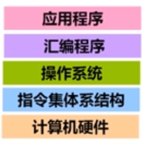

# 【考研黑书向】Part Zero 计算机系统的基本概念

## 1.计算机系统的层次结构

### 计算机系统抽象层的转换

- 整个计算机系统分为**软件系统**和**硬件系统**
- **功能转换**：上层是下层的**抽象**，下层是上层的**实现**，**底层为上层提供支撑环境**
- 交界处为指令集体系结构ISA，实际上是作为软硬件交互的接口，即对硬件的抽象，这种抽象提供的功能为软件所用
    - ISA是计算机组成的抽象
    - ISA具体介绍
- 程序执行的结果取决于：
    - 算法、程序的编写
    - 语言处理系统
    - 操作系统
    - ISA
    - 微体系结构
    - 以及其他底层的东西等
- 重点在高级语言以下各抽象层
    - C语言程序设计层
        - 数据的机器级表示、运算
        - 语句和过程调用的机器级表示
    - 操作系统、编译和链接的部分内容
    - 指令集体系结构(ISA)和汇编层 :star:
        - 指令系统、机器代码、汇编语言
    - 微体系结构及硬件层
        - CPU的通用结构
        - 层次结构存储系统

---

### 计算机系统层次

语言发展不断“抽象”，创造出不同的计算机系统的层次

|                             最早                             |                             发展                             |                             现代                             |
| :----------------------------------------------------------: | :----------------------------------------------------------: | :----------------------------------------------------------: |
|                   计算机用**机器语言**编程                   |                  计算机使用**汇编语言**编程                  |                 现代计算机用**高级语言**编程                 |
| 机器语言：第一代程序设计语言(First generation programming language, 1GL)，即用0和1编写程序 | 汇编语言：第二代程序设计语言(Second generation programming language, 2GL)，是一种**符号表示** | 1. 第三代程序设计语言(3GL)为过程式语言，编码时需要描述实现过程(“如何做”)；2. 第四代程序设计语言(4GL)为非过程式语言，编码时只需说明“做什么”，不需要描述具体的算法实现过程 |
| 用机器语言0和1编写的程序可以 直接运行在机器上，指令集体系结构是将计算机的硬件抽象成指令集，每条指令对应应用程序中的指令，通过这些指令我们可以使用计算机硬件 | 我们用汇编语言编写的程序必须由**汇编程序**转换为机器指令，才能在机器上执行执行；用汇编语言来编写程序，必须要有和机器交互的界面，由**操作系统**提供和封装 | 高级语言必须转换成机器指令构成的机器语言才能在计算机上执行，转化功能由语言系统中的**语言处理系统**完成；语言处理系统包括：各种语言处理程序(编译、汇编、链接)和运行时系统(库函数、调试、优化等)；操作系统包括人机交互界面和提供服务功能的内核例程 |
|      |       |       |

---

### 计算机系统的不同用户

## 2.程序生成与运行的基本原理与工作过程

## 3.计算机系统的分析评价方法
