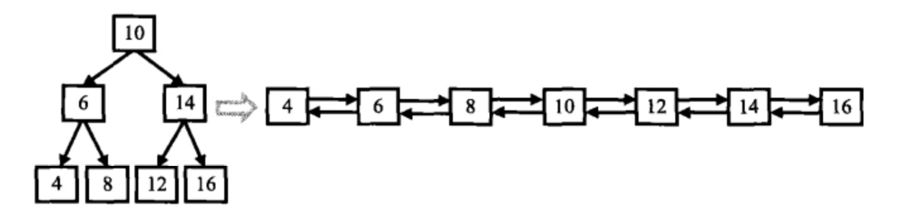

## 二叉树

> 二叉搜索树：左子总小，右子总大
> 堆：最大堆根节点最大，最小堆根节点最小
> 红黑树：结点分红黑，根节点到叶节点最长路径不超过最短路径的两倍


### 1 二叉树的的定义

```c++
typedef struct BiTNode
{
  char   data;               // 存放结点的数据元素。
  struct BiTNode *lchild;    // 指向左子结点地址的指针。
  struct BiTNode *rchild;    // 指向右子结点地址的指针。
}BiTNode,*BiTree;
```

### 2 二叉树的递归创建

```c++
void CreateBiTree(BiTree* &Node)
{
    char data;
    cin>>data;
    if(data)
    {
        Node = new BiTNode;
        Node->data = data;
        Node->lchild = NULL;
        Node->rchild = NULL;
        create(Node->lchild);
        create(Node->rchild);
    }
    else
    {
        Node = NULL;
    }
}
```


### 3 二叉树的遍历
```
如下结构的二叉树。
             1
          /     \
         2       3
        / \     /
       4   5   6
      / \ / \
     7  8 9  0
```

非递归方式进行前中序遍历的思路如下（压左出右）：
> 1.从根节点开始，沿树的左节点依次入栈，直到左节点为空
> 2.栈顶元素出栈
> 3.如果出栈元素有右节点，把右节点当成一棵子树回到步骤 1 ，否则回到步骤 2
> 4.如果栈为空，则遍历完成

==其中前序遍历在结点入栈前访问，中序遍历在结点出栈后访问==

#### 3.1 先序遍历

先序遍历顺序为： 根 -> 左 -> 右

即 1，2，4，7，8，5，9，0，3，6

递归方法：
```c++
void PreOrder(BiTree TT)
{
  if (TT == NULL) return;
  visit(TT);               // 访问子树TT的根结点。
  PreOrder(TT->lchild);    // 遍历左子树。
  PreOrder(TT->rchild);    // 遍历右子树。
}
```

循环方法：
```c++
void PreOrder1(BiTree TT)
{
    stack<BiTree> s;
    BiTree now = TT;
    while(now != NULL || !s.empty())
    {
        if(now != NULL)
        {
            visit(now);
            s.push(now);
            now = now->lchild;
        } 
        else
        {
            now = s.top();
            s.pop();
            now = now->rchild;
        }
    }
```

递归遍历为深度优先搜索，应用例子：

##### 3.1.1 判断 b 树是否为 a 树的子树

```c++
bool HasSubtree(TreeNode* pRoot1, TreeNode* pRoot2) {
        bool result = false;
        if(pRoot1 && pRoot2)
        {
            if(pRoot1->val == pRoot2->val)
            {
                if(DoesTree1HaveTree2(pRoot1, pRoot2))
                {
                    result = true;
                }
            }
            if(!result)
            {
                result = HasSubtree(pRoot1->left, pRoot2);
            }
            if(!result)
            {
                result = HasSubtree(pRoot1->right, pRoot2);
            }
        }
        return result;
    }
    
bool DoesTree1HaveTree2(TreeNode *root1,TreeNode *root2)
{
        if(root2 == NULL)
        {
            return true;
        }
        if(root1 == NULL)
        {
            return false;
        }
        if(root1->val != root2->val)
        {
            return false;
        }
        return DoesTree1HaveTree2(root1->left, root2->left) && DoesTree1HaveTree2(root1->right,root2->right);
}
```


#### 3.2 中序遍历

中序遍历顺序为： 左 -> 右 -> 根

即 7，4，8，2，9，5，0，1，6，3

递归方法：
```c++
void InOrder(BiTree TT)
{
  if (TT == NULL) return;
  InOrder(TT->lchild);     // 遍历左子树。
  visit(TT);               // 访问子树TT的根结点。
  InOrder(TT->rchild);     // 遍历右子树。
}
```

循环方法：
```c++
void InOrder1(BiTree TT)
{
    stack<BiTree> s;
    BiTree now = TT;
    while(now != NULL || !s.empty())
    {
        if(now != NULL)
        {
            s.push(now);
            now = now->lchild;
        } 
        else
        {
            now = s.top();
            s.pop();
            visit(now);
            now = now->rchild;
        }
    }
}
```

##### 思维风暴：通过前序遍历和中序遍历重建二叉树

input:
> [1,2,3,4,5,6,7],[3,2,4,1,6,5,7]

outputs:
> {1,2,5,3,4,6,7}

思路：
> 前序首为根，中序寻根分左右，左右子树再递归

code:
```c++
TreeNode* reConstructBinaryTree(vector<int> pre,vector<int> vin) {
        TreeNode *root = (TreeNode*)malloc(sizeof(TreeNode));
        root->val = pre[0];  // 前序为根
        root->left = NULL;
        root->right = NULL;
        if(pre.size() == 1 && vin.size() == 1)
        {
            return root;
        }
        int inroot = 0;
        while(vin[inroot] != pre[0])
        {
            inroot++;  // 中序序列找根
        }
        if(inroot > 0) // 左子树存在
        {
            vector<int> lpre(pre.begin() + 1, pre.begin() + inroot + 1);
            vector<int> lvin(vin.begin(), vin.begin() + inroot);
            root->left = reConstructBinaryTree(lpre, lvin);
        }
        if(inroot < vin.size() - 1)  // 右子树存在
        {
            vector<int> rpre(pre.begin() + inroot + 1, pre.end());
            vector<int> rvin(vin.begin() + inroot + 1, vin.end());
            root->right = reConstructBinaryTree(rpre, rvin);
        }
        return root;
    }
```

##### 3.2.1 二叉搜索树和双向链表的转换

>输入一棵二叉搜索树，将该二叉搜索树转换成一个排序的双向链表。要求不能创建任何新的结点，只能调整树中结点指针的指向



```c++
TreeNode* Convert(TreeNode* pRootOfTree) {
        stack<TreeNode*> s;
        TreeNode *p = pRootOfTree,*pre = NULL,*ans = NULL;
        while(!s.empty() || p)
        {
            if(p != NULL)
            {
                s.push(p);
                p = p->left;
            }
            else
            {
                p = s.top();
                s.pop();
                if(pre)
                {
                    pre->right = p;
                }
                else
                {
                    ans = p;
                }
                p->left = pre;
                pre = p;
                p = p->right;
            }
        }
        return ans;
    }
```

#### 3.3 后序遍历

后序遍历顺序为： 左 -> 右 -> 根

即 7，8，4，9，0，5，2，6，3，1

递归方法：
```c++
void PostOrder(BiTree TT)
{
  if (TT == NULL) return;
  PostOrder(TT->lchild);     // 遍历左子树。
  PostOrder(TT->rchild);     // 遍历右子树。
  visit(TT);                 // 访问子树TT的根结点。
}
```

循环方法：
```c++
void PostOrder1(BiTree TT)
{
    stack<BiTree> s;
    BiTree now = TT,vis = NULL;  // 最近访问过的结点
    while(now != NULL || !s.empty())
    {
        if(now != NULL)  //从根节点开始沿左依次入栈直到空
        {
            s.push(now);
            now = now->lchild;
        }
        else  // 转向右
        {
            now = s.top();  // 读取栈顶元素不出栈

            // 如果右子树存在且没被访问过
            if(now->rchild != NULL && now->rchild != vis)
            {
                now = now->rchild;  // 转向右
                s.push(now);  // 右子树的根节点入栈
                now = now->lchild;  // 再转向右子树的左节点
            }
            else
            {
                now = s.top();  
                s.pop();  // 将节点弹出
                visit(now);  // 访问节点
                vis = now;  // 记下最近访问过的节点
                now = NULL;  // 节点访问完成后，重置继续读取栈顶元素
            }
        }
    }
}
```

##### 思维风暴：判断一个序列是不是二叉搜索树的后序序列

```c++
bool VerifySquenceOfBST(vector<int> sequence) {
        if(sequence.empty())
        {
            return false;
        }
        int len = sequence.size();
        int root = sequence[len - 1], index = len - 1;
        for(int i = 0; i < len - 1; i++)
        {
            if(sequence[i] > root)
            {
                index = i;
                break;
            }
        }
        for(int i = index + 1;i < len - 1; i++)
        {
            if(sequence[i] < root)
            {
                return false;
            }
        }
        bool l = true;
        if(index > 0)
        {
            vector<int> left(sequence.begin(),sequence.begin() + index);
            l = VerifySquenceOfBST(left);
        }
        bool r = true;
        if(index < len - 1)
        {
            vector<int> right(sequence.begin() + index,sequence.end() - 1);
            r = VerifySquenceOfBST(right);
        }  
        return l && r;
    }
```

后序遍历常用于针对于对子树的搜索和统计关系

##### 3.3.1 判断是否为平衡二叉树（左右两个子树高度差不大于 1 ）

```c++
class Solution {
public:
    int cnt = 0;
    bool ans = true;
    int Count(TreeNode* pRoot)
    {
        if(pRoot == NULL)
            return 0;
        int l = Count(pRoot->left);
        int r = Count(pRoot->right);
        if(abs(l - r) > 1)
        {
            ans = false;
        }
        return l > r ? l + 1 : r + 1;
    }
    bool IsBalanced_Solution(TreeNode* pRoot) {
         Count(pRoot);
         return ans;
    }
};
```

#### 3.4 层次遍历

层次遍历即为广度优先搜索(BFS):

```c++
void LevelOrder(BiTree TT)
{
    queue<BiTree> q;
    BiTree now = TT;
    q.push(now);
    while(!q.empty())
    {
        now = q.front();
        q.pop();
        visit(now);
        if(now->lchild != NULL)
        {
            q.push(now->lchild);
        }
        if(now->rchild != NULL)
        {
            q.push(now->rchild);
        }
    }
}
```


