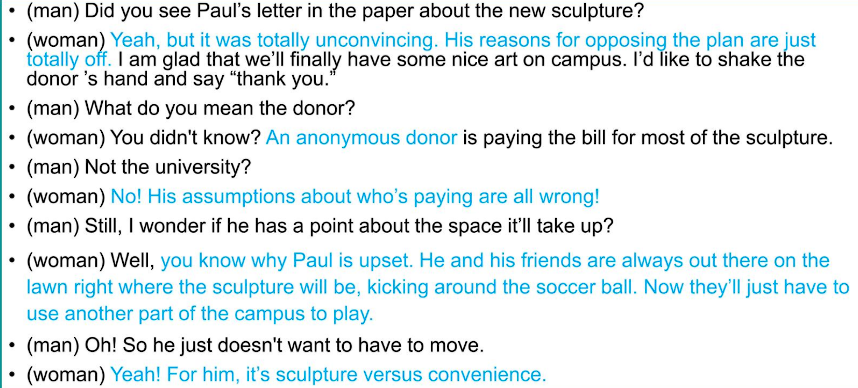

# Task 1

- 音调太平，语速

- 进入主题太慢，开头换表达

  > i will at my home；the discussion face to face； face math problem；

- 例证：

  - 枚举法
  - 数字
  - 解释

- 满分：4 - 22~23

- 习惯：高效率

  - 时间
  - 速度
  
- 语调问题

  - 感情没有流畅表达
  - 很容易让人听不出重点

- 连接词多加

---

supervise

emotional support

## Education

1. Do you agree or disagree with the following statement? Having a good manner is important. Use specific reasons and examples to support your answer

   > In my eyes,  having a good manner is indeed important. 
   >
   > It will help us become a polite person. Being impolite and rude to others can leave a bad impression and ruin a  good relationship. Take my brother for example, he liked to talk with food in his mouth and make noises during the dinner at school, and some students felt embarrased to eat with him. They think they were not treated respectfully so they gradually didn't want to play with him. Since then my brother realized the importance of good manners and corrected his mistakes.

2. Do you think it's necessary for children's growth for them to live far away from home and stay with relatives or friends for short periods of time?

   > I think it's necessary.
   >
   > Firstly, it will improve their ability to adapt to a new environment. In a new place, without their parents taking care of them, kids have to do things by themselves. They will have to be polite and well-behaved, and avoid making trouble and causing mass to their relatives or friends.
   >
   > Plus, Sometimes parents overprotect their children, but it's time to give them freedom and space to do the things they like. Maybe they will be happier and less stressful far away from home and from their parents' surpervision.

## Work

## Scocial activities

1. some people prefer to travel to new places; others prefer to travel to places that they have been before. Which do you prefer and why?

   > I prefer to travel to new places due to the following reasons. 
   >
   > First of all, we can see different scenaries in different places.  New sites can always bring us many surprises. In the opposite, we just can see the familiar things when going to the places that we have been before, and we never have the excitement. They are not as attrative as the first time we saw them. 
   >
   > Secondly, traveling to a new place can broaden our horizon and gain knowledge and skills. We can experience various cultures, hear different stories and learn local history. If we only go to the same place as before, we can just know one culture. But we can accumulate more from many new places. This helps us open our mind. 

## Success

## Technology

1. some people like to smartphone or other navigational device to guide their road while traveling, some prefer to ask around, which do you like to do?

   > I would like to guide my traveling road by using the navigational applications in the smartphone.
   >
   > Firstly, it is efficient for that I may ask for serveral people who may not be familiar with the place and even lead me to the wrong road. Because the applications can locate my current position using GPS, search the latest maps and information on the Internet and calculate the best and most accurate route.
   >
   > Furthermore, it's time-saving. I just have to type the destination into the applications and then in a few second I can get several pathes instread of negotiating with others.

## School

1. do you think it is a good idea to let students keep pets in dorms?

   > I don't agree with this idea and from my point of view (I think) the school should ban student from keeping pets in the dormitories. 
   >
   > First of all, a pet like dog will sometimes bark loudly. It's very annoying and may disturb others' rest and study. 
   >
   > Secondly, some students are really fear of these animals, and a furious pet may scare or hurt them. Last but not the least, it will take much time for the owner to clean the pet, which will influence his or her study.

2. what are the advantages and/or disadvantages of having fast foods in restaurants on the street?

   > I reckon that for those white-collar workers, it's a time saving and convenient method to eat out in the restaurants near their workplace, they just have to go down stairs and quickly have their meals instead of  commuting between companies and home. 
   >
   > However, eating in the restaurants often costs lots of money. Furthermore, if excessively intaken, fast food will do harm to our health resulting in various diseases like obesity and high blood. So we have to reduce the lifetime consumption of it.
   >
   > convenience has become an increasingly important role in people's business and blaster of life.

3. where do you like to study? 1) at home; 2) in a library; 3) at a coffee shop

   > In a library
   >
   > As far as I concern, I highly recommend to study in the library. First of all, the library provides a quiet and comfortable environment for us students to finish our paper and homework. Everyone is working hard, so we can be influenced and soon engaged in our study. Secondly, we can quickly find the reference books and enjoy high speed network in the library. It will help a lot. In addition, the students can easily gather around to discuss their projects or figure out a problem in some special rooms provided by the school library.
   >
   > At home
   >
   > - everything you need is in hand, food, clothes, bed and so on
   >
   > - save time  commute / take a seat
   >
   > At a coffee shop
   >
   > - elegant environment, efficiency improve, relax, calm down
   > - high class, meet genius
   > - easy to discuss questions

4. which one do you think is the most helpful for protecting the environment? 1) government regulation 2) organizations' efforts 3) individuals' efforts. Explain why? Include reasons and examples to support your response. 

   >government regulation
   >
   >- compulsory, force people to obey the rules like litter classification
   >
   >organizations' efforts
   >
   >individuals' efforts
   >
   >- realize the importance of protecting the environment from the bottom of their heart

# Task 2

1. Undergraduate eligible for graduate courses

   ```
   Title:Undergraduate eligible for graduate courses
   Junior and seniors are now permitted to enroll in classes being offered in their departments' graduate programs.
   Students must have their advisor's written permission to register for these classes and restricted to one semester.
   This should enable the most advanced students to have access to a quality graduate-level education while they are still undergraduates.
   Not only that, but it should help students determine if they are both interested in and qualified to attend a graduate program upon graduation.
   ```

   > The school plans to permit undergraduate students to enter graduate courses for that it can help advanced students learn more and find whether they are suitable for graduate program.
   >
   > As for the reading passage, the man doesn't agree with the plan. 
   >
   > Firstly, the graduate courses are more comprehensive. Only two or three courses can make a graduate overloaded in the whole semester. And the undergraduates cannot handle that much.
   >
   > Secondly, the graduate courses' classroom often small and only contains 5 to 10 people. In this situation, the students can talk and disguss with the professor closely. If the room is flooded with undergraduates that are unqualified with that high-level class, the professor will considerate the undergraduates and the value of the class will be affected.

## Proposal

1. The

   - 听力没什么细节

     > (man) Did you see Paul's letter in the paper about the new sculpture?
     >
     > (woman) Yeah, but it was totaly unconvincing. His reasons for opposing the 

     

2. The 

3. TPO Official 56 - Task3

   > A student is writing a letter to advice the university to open a stduent-run snack shop. The man totally agrees with the idea for two reasons. 
   >
   > The first one is that it can provide students with extra working experience, especially for those who want to run their own business after graduation. The students can learn the economical knowledge and practise like managing their schedule, making inventories and maintaining food supply.
   >
   > The second reason is that it is indeed convenient for students. Because the shcool's cafe shop is full of people all the time and students have to wait for a long time to get what they want to eat. Plus if they want to eat at the stores in the town, they have to spend many hours on commuting, which will influence their study. 


# Task 3

>  Sharping is a method that parents use to have their children act in a positive manner.
>
> The professor use her own experience to explain this method. She helped her young daughter to learn to draw and color the picture with marker and crayon.  When her daughter made a mark in a proper place or colored a thing right, the professor would praised her very much. So the professor's compliments encouraged her child to do more coloring. But if her daughter didn't mark the right place or draw the inaccurate color, the professor did nothing, which made her child realize that she was drawing improperly. Finally her child focused on the drawing and made harder to do right.

