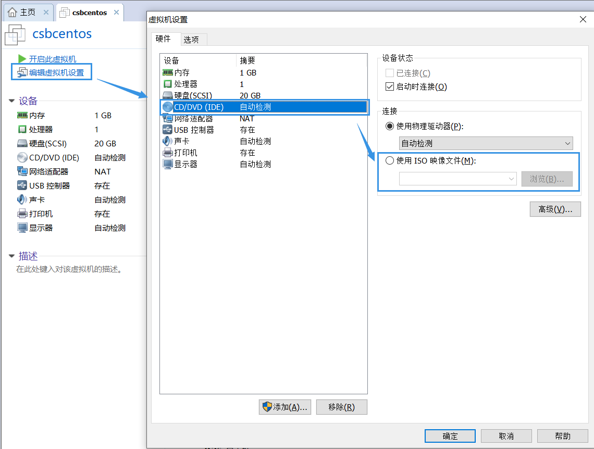
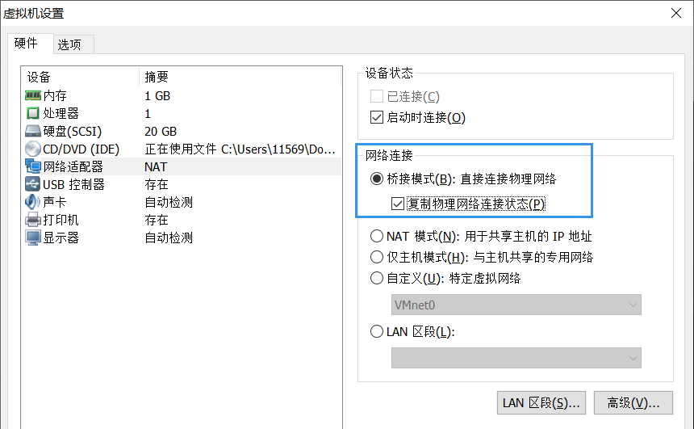
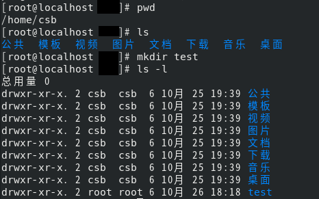
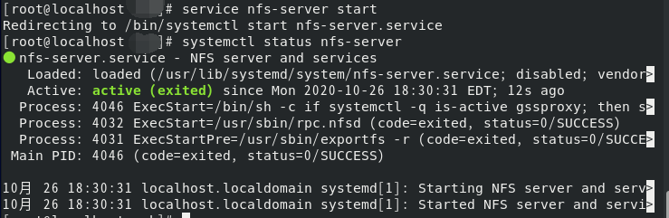
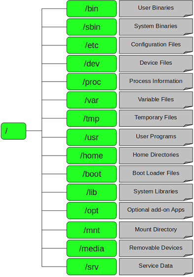
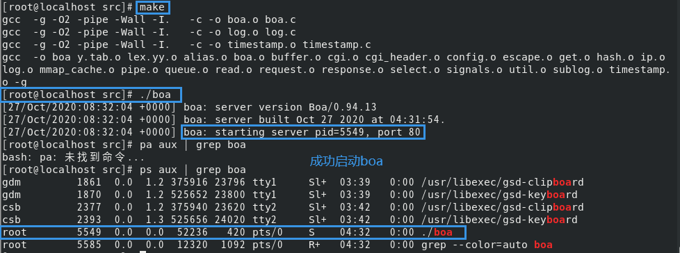
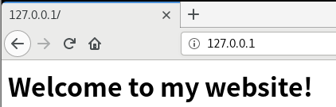
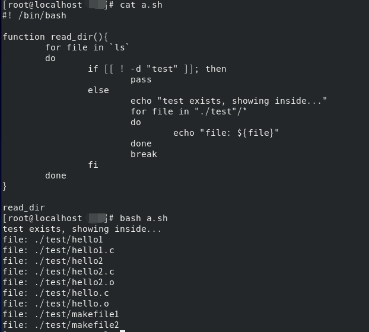

# csb-嵌入式计算机系统实验自救手册

## Step 1

- [x] **在C:盘下新建以自己名字字母简写为名称的虚拟机并安装以自己名字字母简写+centos为名称的centos系统**

### Environment

- vmware version 未知
- centos 8

### Request

- 老师提供centos 8图形化界面的镜像iso文件

### Experiment

#### 1 - 新建虚拟机

**【典型】的方法 - 推荐** :rainbow_flag:

1. 文件 > 新建虚拟机 > 典型 > 下一步 > **稍后安装操作系统** 
2. 客户机操作系统选择<u>Linux</u>，版本选择centos7(由于学生机器只有centos7可供选择)
3. 虚拟机名称改为以自己名字字母简写+centos
4. 处理器配置、此虚拟机的内存、网络类型、选择磁盘、指定磁盘容量、指定磁盘文件目前无需修改，可稍后再调整

**【自定义】的方法**

1. 文件 > 新建虚拟机 > 自定义(高级) > 下一步 > **稍后安装操作系统** 
2. 客户机操作系统选择<u>Linux</u>，版本选择centos7(由于学生机器只有centos7可供选择)
3. 虚拟机名称改为以自己名字字母简写+centos
4. 处理器配置、此虚拟机的内存、网络类型、选择I/O控制器类型、选择磁盘类型、选择磁盘、指定磁盘容量、指定磁盘文件目前无需修改，可稍后再调整

#### 2 - 修改配置

- 编辑虚拟机设置，选择CD/DVD，使用ISO映像文件
    
    

- :star:网络适配器：NAT 模式 和 桥接模式都可，亲测NAT在学生机上可能无法成功，桥接可，两者灵活切换
  
    

- 内存可灵活调大

#### 3 - 安装系统

- 选install centos linux 8(第一个)，不选test
    - 若出现`end Kernel panic - not syncing:Fatal exception Vmware`，则在虚拟机设置中<u>移除打印机</u>:bug:
- 软件选择
    - 文件及存储服务器(包含nfs)
    - FTP服务器
    - 基本网页服务器
    - 开发工具
    - RPM开发工具
- 安装目的地：点击选择**本地标准磁盘**，要连续确认**两次**才可成功
- 开始安装ing...  2020.10.25 23:05 - 2020.10.25 23:31 历时26分钟
- 此时可以进行Root密码的创建：123456789 & 也可创建用户(不创建的话，就是Root用户登录)
- 安装后重启，需要**接受许可证**才能成功开机
- ps：如果看着不习惯，则查看 > 自动调整大小 > 自动适应客户机

## Step 2

- [x] **在新建的centos系统中新建/test文件夹，配置并开启nfs服务，把自己的/test文件夹挂载到/var/www文件夹下**

- 点击左上角的“活动”，选择**终端**，切换到Root用户

    ```shell
    su root
    ```

- 测试网络连通性

    ```shell
    # 查看网络状态
    ifconfig 

    # 配置本机ipv4地址
    # 在自己windows本机的ipv4地址上+100
    # ens33是ifconfig查看的网卡名称，除了lo和virbr0之外
    ifconfig ens33:1 192.168.1.104
    ```

- 新建/test文件夹

    ```shell
    # pwd 显示当前路径
    /home/csb

    ls 
    # 出现 桌面 音乐 下载

    # 新建test共享文件夹
    mkdir test

    # 修改权限 - 不知道用于啥
    chmod -R 777 /home/csb/test
    ```
    
    

- 配置并开启nfs服务

    ```shell
    service nfs-server start
    # https://blog.csdn.net/qq_33559992/article/details/51866043
    # 查看状态
    systemctl status nfs-server 

    systemctl status rpcbind
    ```
    
    

- 把自己的/test文件夹挂载到/var/www文件夹下【待确认】

    ```shell
    mount --bind /home/csb/test /var/www
    # 同：mount -o bind /home/csb/test/ /var/www/
    # 同：mount -B /home/csb/test/ /var/www/
    
    # 取消挂载
    unmount /home/csb/test/
    
    # 查看帮助文档
    mount -h
    ```

    Linux中挂载详解
      
    

  - Linux中的根目录以外的文件要想被访问，需要将其“关联”到根目录下的某个目录来实现，这种关联操作就是“挂载”，根目录下的某个目录就是“挂载点”。解除关联关系的过程称“卸载”

  - “挂载点”要求

    - 挂载点目录不可被其他进程使用
    - 挂载点下原有文件将被隐藏

    <details>
        <summary>linux nfs远程挂载文件目录 - 大概了解过程 / 具体没实践</summary>

    1. https://www.cnblogs.com/fooller/p/11511380.html
    2. https://www.cnblogs.com/merely/p/10793877.html
    3. https://www.cnblogs.com/ylnic/p/10044271.html

    </details>

## Step 3

- [x] **编写hello.c程序，打印输出自己的姓名拼音及学号**

    ```shell
    # 进入test文件夹
    cd ./test/
    # 新建
    vi hello.c
    ```

	写入如下内容(首先按insert，才可编辑)

    ```c
    #include<stdio.h>

    int main(){
        printf("chensibo201710513054\n");
        return 0;
    }
    ```

	按esc退出后，`:wq`保存

## Step 4【delete】

- [x] **下载解压交叉编译工具到/test文件夹下，添加系统路径**

个人理解思路：

1. 首先安装Linux的交叉编译工具链，下载后解压(tar命令)
   	- https://blog.csdn.net/baidu_37973494/article/details/82949963
2. 将该工具链导出到环境变量，使得终端可以直接使用命令
   	- https://blog.csdn.net/zy_heu/article/details/80062806
      	- https://blog.csdn.net/lhh_qrsly/article/details/109193284

## Step 5

- [x] **编写makefile文件，通过make实现hello.c交叉编译**

1. 编写makefile文件，在命令行下`gedit makefile1`，写入如下内容：

    ```makefile
    all:
        gcc hello.c -o hello
    clean:
        rm -rf hello hello.o
    ```

    或者

    ```makefile
    hello:hello.o
        gcc hello.o -o hello
    hello.o:hello.c
        gcc -c hello.c
    clean:
        rm -rf hello.o hello
    ```

2. 通过make将源文件hello.c编译生成可执行文件

    ```shell
    # 在命令行下输入
    make -f makefile1
    ```

    - 出现遗漏分隔符报错：https://blog.csdn.net/yiranant/article/details/46582059

3. 运行

    ```shell
    # 终端 - ls - 绿色
    ./hello
    ```

Reference：

- https://blog.csdn.net/songshuai0223/article/details/88207566

## Step 6

- [x] **在主机端编译boa**

### Request

- 老师提供boa
- 或者【连网】 http://www.boa.org/boa-0.94.13.tar.gz

### Experiment

- 安装boa

    ```shell
    # 安装开发工具及库
    yum install flex bison 

    # 解压
    tar -xzvf boa-0.94.13.tar.gz

    cd boa-0.94.13/src

    # 检测环境，生产makefile
    ./configure
    ```

- 修改boa相关文件

  	- Boa需要在/etc目录下建立一个boa目录，里面放入Boa的主要配置文件boa.conf

        ```shell
        # 新建目录
        mkdir /etc/boa
        # 复制 boa.conf位于解压的压缩包下
        cp boa.conf /etc/boa

        # 修改/etc/boa/boa.conf
        gedit /etc/boa/boa.conf 
        # 1.User 0
        # 2.Group 0
        # 3.ScriptAlias /cgi-bin/ /var/www/cgi-bin/
        # 4.ServerName www.your.org.here 去掉#
        # 5.注释掉AccessLog命令 # AccessLog /var/log/boa/access_log
        ```

  	- 修改src/compat.h

        ```shell
        # 修改 define TIMEZONE_OFFSET(foo) foo##->tm_gmtoff 为 
        #define TIMEZONE_OFFSET(foo) foo->tm_gmtoff
        ```

  	- 修改 src/log.c

        ```shell
        if (dup2(error_log, STDERR_FILENO) == -1) {
            DIE("unable to dup2 the error log");
        }

        修改为

        /*if (dup2(error_log, STDERR_FILENO) == -1) {
            DIE("unable to dup2 the error log");
        }*/
        ```

  	- 修改src/boa.c

        ```shell
        if (setuid(0) != -1) {
          DIE(”icky Linux kernel bug!”);
        }

        修改为

        #if 0

        if (setuid(0) != -1) {
            DIE(”icky Linux kernel bug!”);
        }

        #endif
        ```

- 创建log目录

    ```shell
    mkdir /var/log/boa
    mkdir /var/log/boa/error_log
    mkdir /var/log/boa/access_log
    # 修改权限
    chmod -R 777 /var/log/boa 
    # 修改权限
    chmod -R 777 /var/log/boa/error_log 
    # 修改权限
    chmod -R 777 /var/log/boa/access_log
    ```

- 创建CGI目录

    ```shell
    # 创建cgi文件存放目录，已经有了可以不建
    mkdir /var/www/cgi-bin 
    # 修改权限
    chmod -R 777 /var/www/cgi-bin 
    ```

- 在src目录下编译

    ```shell
    # 编译
    make 
    ```

- 在src目录下运行boa

    ```shell
    ./boa
    ```
    
    

Reference：

- 首推教程-https://blog.csdn.net/wangjingnbamvp/article/details/8701257
- https://zhuanlan.zhihu.com/p/115112314?from_voters_page=true
- [vmware共享文件夹](https://blog.csdn.net/nesxiaogu/article/details/85274626)

## Step 7

- [x] **编写网页文件，通过浏览器访问boa服务器网页 **

- 在boa已启动的前提下，在/var/www/html目录下，新建index.html

- 在firefox输入 127.0.0.1，即可显示自己编写的网页

    ```html
    <html>
        <body>
            <h1>
                Welcome to xxx's Website!
            </h1>
        </body>
    </html>
    ```

- 在firefox输入 127.0.0.1，即可显示自己编写的网页

    

---

上述Step6和Step7的boa换成apache【boa跑不起来用apache】

```shell
# 启动apache
systemctl start httpd

# 停止apache start -> stop
```

其余访问步骤同上

## Step 8

- [x] **编写shell程序，检测/test文件夹是否存在，如果存在显示里边**

- 首先出/test目录，新建shell脚本

    ```bash
    vi a.sh
    ```

- 内容如下【垃圾代码，建议自行百度】:robot::secret::gun:

    ```shell
    #! /bin/bash

    function read_dir(){
    for file in `ls` #注意此处这是两个反引号，表示运行系统命令
    do
    # 判断文件夹是否存在 -d
    if [[ ! -d "$1" ]]; then
    pass
    else
    echo "/test exists, showing inside..."
    for file in "./test"/*
    do
        echo "file: ${file}"
    done
    break
    fi
    done
    } 

    read_dir 
    ```

- 执行shell

    ```bash
    bash ./a.sh
    ```
    
    

