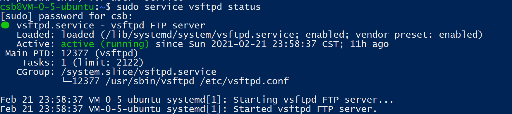
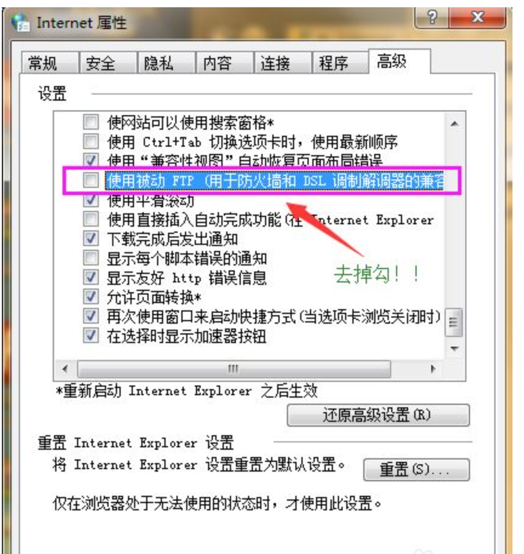
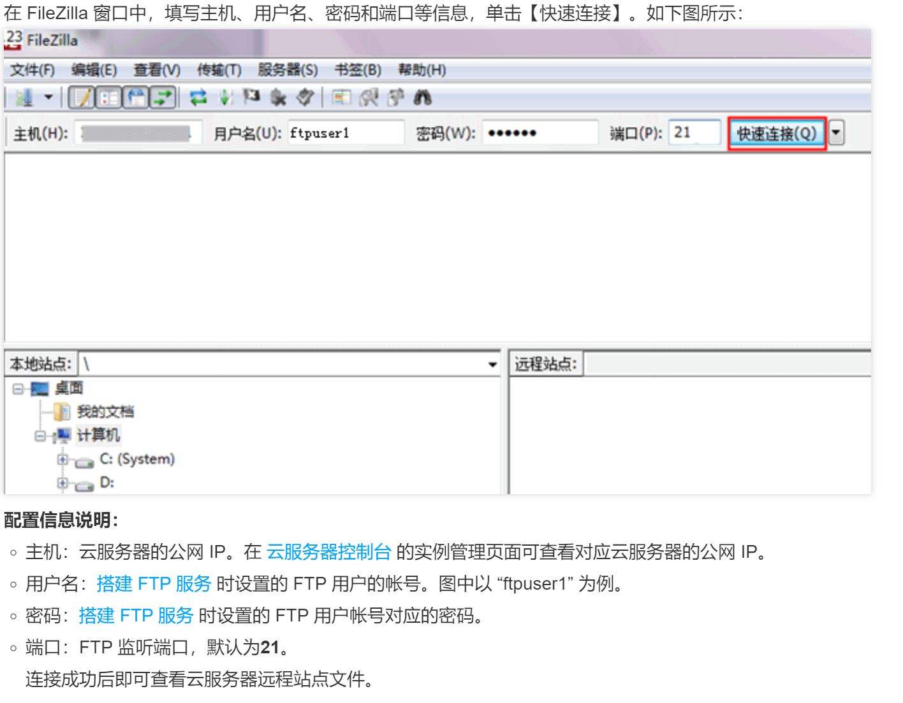
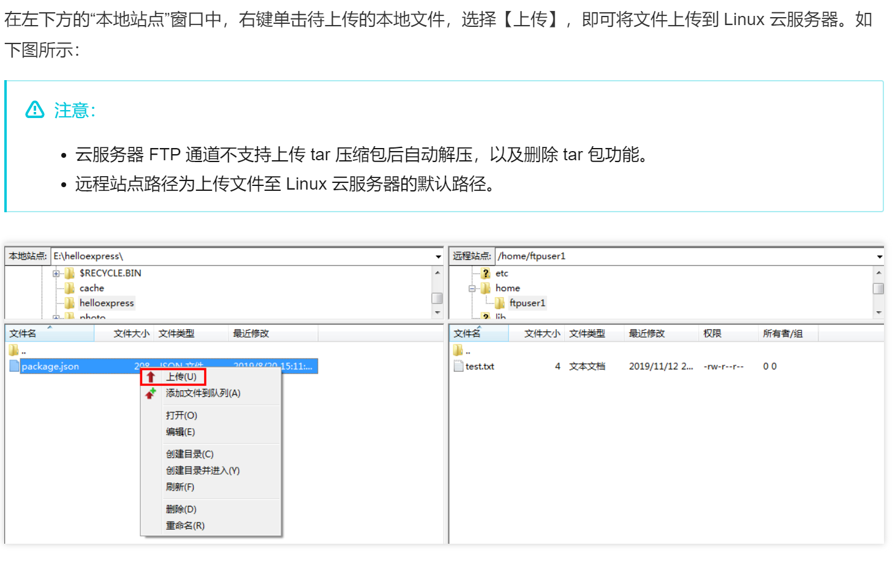
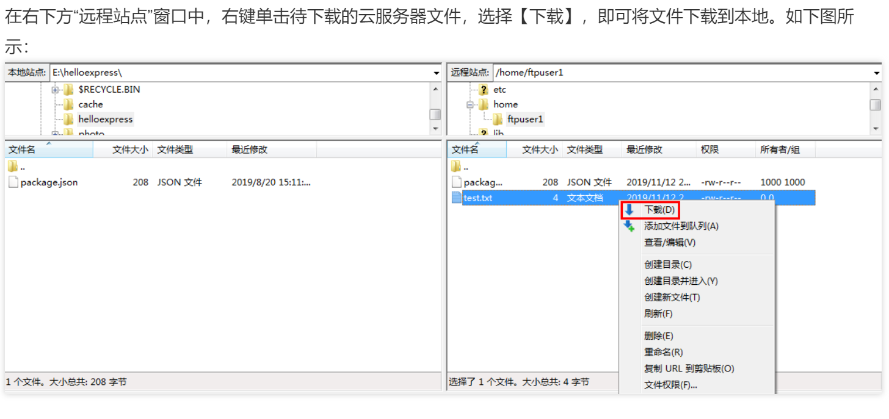

## 云主机 Linux 与 Windows 的文件交互

> 环境： 
> 本机： win10
> 云主机： 腾讯云主机 ubuntu 18.04.4 LTS

### 1 连接云主机

> 打开 `windows powershell`
> 用 ssh 进行远程连接： `ssh ID@Public_IP` ,输入密码

> 切换 user : su - username , 输入密码

### 2 采用 ftp 服务器进行文件交互

#### 2.1 云主机搭建 ftp 服务器

* 不同的 Linux 系统采用的搭建方式有所差异，可根据对应的相关教程，本文以 unbuntu 为例


更新： `sudo apt-get update`

安装： `sudo apt-get install vsftpd`

启动： `sudo service vsftpd start`

查看状态： `sudo service vsftpd status`



关闭: `sudo service vsftpd stop`

#### 2.2 配置服务文件

配置文件： `sudo vim /etc/vsftpd.conf`

追加（ GG 可以定位到最后一行）：
```
userlist_deny=NO 
userlist_enable=YES 
userlist_file=/etc/allow_users 
seccomp_sandbox=NO 
local_enable=YES
```

> 若后面出现了 550 Peimission Denied 的错误
> 需要在 conf 文件反注释掉以下这行：
> write_enable=YES
> （在 vim 中可以通过 /wri 等命令匹配定位）

新建文件： `sudo vim /etc/allow_users`，加入自己的 username

检查文件： `sudo vim /etc/ftpushers` ,这里记录的是不能访问 ftp 服务器的名单，若有自己的用户名则删掉

#### 2.3 验证服务器是否搭建成功

(1)  在 cmd 输入 `ftp Public_IP`

(2)  在`windows 资源管理器`的地址栏输入 `ftp://Public_IP`

若出现需要输入用户名和密码的界面，则搭建成功

==踩坑记录==：

若出现权限不够的情况，打开：

控制面板 -> Internet 选项 -> 高级 -> 去掉“使用被动 ftp ”的勾 -> 重启 ftp 服务器



#### 2.4 windows 本地端使用 ftp 进行通信

在 windows 本地端中，可以下载并使用工具 FileZilla 即可



上传文件：



下载文件：



### 3 采用 scp 进行文件交互

scp 命令一般是用在 linux 传 linux 的情况下

若是 windows ，只需要在 powershell 中使用即可,路径尽可能用桌面 `desktop/` ,用其他的可能会报错

上传文件：

`scp 本地文件地址 云服务器帐号@云服务器实例公网 IP/域名:云服务器文件地址`

例如，您需要将本地文件 /home/lnmp0.4.tar.gz 上传至 IP 地址为 129.20.0.2 的云服务器对应目录下，则执行的命令如下：

`scp /home/Inmp0.4.tar.gz root@129.20.0.2:/home/Inmp0.4.tar.gz`

下载文件

`scp 云服务器帐号@云服务器实例公网 IP/域名:云服务器文件地址 本地文件地址`

例如，您需要将 IP 地址为 129.20.0.2 的云服务器文件 /home/lnmp0.4.tar.gz 下载至本地对应目录下，则执行的命令如下：

`scp root@129.20.0.2:/home/Inmp0.4.tar.gz /home/Inmp0.4.tar.gz`


