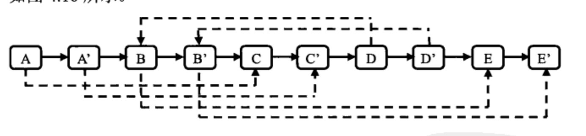

## 常用思维

### 1 顺局逆全

如连续数据的插入操作，顺着做会导致重复移动较多

若知道插入是全局性的，可以通过反着操作进行更快速的原地操作

#### 1.1 url 中的字符串替换

input:
> we are happy.

output:
> we%20are%20happy.

requrements:
> 原地操作，不能用新数组

code：

```c++
void ReplaceBlank(char str[],int len)
{
    if(str == NULL || len <= 0)  // 防空
    {
        return;
    }
    int num = 0;
    for(int i = 0; str[i] != '\0'; i++)
    {
        if(str[i] == ' ')
        {
            num++;
        }
    }  // 优化：可用变量在循环计算长度，而减少strlen的次数
    int p = strlen(str) + num * 2 , q = strlen(str);
    if(p > len) // 防溢
    {
        return;
    }
    while(q >= 0 && p > q)  // 优化：pq重合即可提早循环结束
    {
        if(str[q] == ' ')
        {
            str[p--] = '0';
            str[p--] = '2';
            str[p--] = '%';
        }
        else
        {
            str[p--] = str[q];
        }
        q--;
    }
}
```

#### 1.2 一个有序数组插入另一个有序数组的原地操作同理

```c++
void InsertArray(int a[], int lena, int b[],int lenb,int total)   //把有序的b数组插入有序的a数组中
{
    if(a == NULL || b == NULL || !lena || !lenb || !total)
    {
        return;
    }
    
    if (lena + lenb > total)
    {
        return;
    }
    int p = lena + lenb -1, q = lena - 1, r = lenb - 1; 
    while(p >= 0 && p > q)
    {
        if(a[q] > b[r])
        {
            a[p--] = a[q--];
        }
        else
        {
            a[p--] = b[r--];
        }
    }
}
```

### 2 查找

#### 2.1 二分查找

二分查找解决的对象位位有序数列，流程为
```c++
while(l <= r)
{
    mid = (l + r)>>1;
    if()
    {
        update(ans);
        l = mid; or  l = mid - 1;
    }
    if()
    {
        update(ans);
        r = mid; or r = mid + 1;
    }
}
```

* 二分的左右针需视情况决定逼近方式和跳出方式
* 初始定针尽可能缩短头尾长度(-inf ~ inf)

#### 2.2 快慢针查找（可参考链表的查找倒数第 k 个、判环）

##### 2.2.1 丑数

>  把只包含质因子2、3和5的数称作丑数（Ugly Number）。例如6、8都是丑数，但14不是，因为它包含质因子7。 习惯上我们把1当做是第一个丑数。求按从小到大的顺序的第N个丑数。

> input:
> 7

> output:
> 8

通过三个移针保证最小的丑数能够加入
```c++
int GetUglyNumber_Solution(int index) {
        if(index <= 0)
            return 0;
        int *ugly = new int[index];
        ugly[0] = 1;
        int i = 1;
        int *p2 = ugly;
        int *p3 = ugly;
        int *p5 = ugly;
        while(i < index)
        {
            int tmp = min((*p2)*2,min((*p3)*3,(*p5)*5));
            ugly[i] = tmp;
            while((*p2)*2 <= tmp)
            {
                p2++;
            }
            while((*p3)*3 <= tmp)
            {
                p3++;
            }
            while((*p5)*5 <= tmp)
            {
                p5++;
            }
            i++;
        }
        return ugly[index - 1];
    }
```

#### 2.3 链表查找

##### 2.3.1 链表环的入口节点

```c++
class Solution {
public:
    ListNode* EntryNodeOfLoop(ListNode* pHead) {
       ListNode *p = pHead,*q = pHead;
       if(!pHead)
       {
           return NULL;
       }
       while(q && q->next)
       {
           p = p->next;
           q = q->next->next;
           if(p == q)
           {
               break;
           }
       }
       if(!p || !p->next)
           return NULL;
       q = pHead;
       while(p != q)
       {
           p = p->next;
           q = q->next;
       }
       return q;
    }
};
```

#### 2.4 环查找

##### 2.4.1 约瑟夫环

N 人成环，隔 m 杀人，最后幸存
递推公式：$f(n,m) = (f(n-1,m) + m) \% n$

```c++
int LastRemaining(int n,int m)
{
    if(n < 1 || m < 1)
    {
        return -1;
    }
    int last = 0;
    for(int i = 2; i <= n; i++)
    {
        last = (last + m) % i;
    }
    return last;
}
```

#### 2.5 深度优先搜索查找(dfs)

##### 2.5.1 矩阵搜索

> 请设计一个函数，用来判断在一个矩阵中是否存在一条包含某字符串所有字符的路径。路径可以从矩阵中的任意一个格子开始，每一步可以在矩阵中向左，向右，向上，向下移动一个格子。如果一条路径经过了矩阵中的某一个格子，则该路径不能再进入该格子。 矩阵中包含一条字符串"bcced"的路径，但是矩阵中不包含"abcb"路径，因为字符串的第一个字符b占据了矩阵中的第一行第二个格子之后，路径不能再次进入该格子。
  
> input:
> \[[a,b,c,e],[s,f,c,s],[a,d,e,e]],"abcced"

> output:
> true

```c++
class Solution {
public:
    /**
     * 代码中的类名、方法名、参数名已经指定，请勿修改，直接返回方法规定的值即可
     *
     * 
     * @param matrix char字符型vector<vector<>> 
     * @param word string字符串 
     * @return bool布尔型
     */
    int ans = false;
    int vis[205][205] = {0};
    int dir[4][2] = {{0,1},{1,0},{-1,0},{0,-1}};
    void dfs(vector<vector<char>>& m,int r,int c,string w,int index)
    {
        int rnum = m.size();
        int cnum = m[0].size();
        if(w[index] == '\0')
        {
            ans = true;
        }
        for(int i = 0; i < 4; i++)
        {
            int nxtr = r + dir[i][0];
            int nxtc = c + dir[i][1];
            if(nxtr>=0 && nxtr<rnum && nxtc>=0 && nxtc<cnum)
            {
                if(m[nxtr][nxtc] == w[index] && vis[nxtr][nxtc] == 0)
                {
                    vis[nxtr][nxtc] = 1;
                    dfs(m,nxtr,nxtc,w,index+1);
                    vis[nxtr][nxtc] = 0;
                }
            }
        }
    }
    
    bool hasPath(vector<vector<char> >& matrix, string word) {
        int rnum = matrix.size();
        int cnum = matrix[0].size();
        if(word.length() == 0  || rnum <= 0 || cnum <= 0)
        {
            return false;
        }
        int index = 0;
        for(int i = 0; i < rnum; i++)
        {
            for(int j = 0; j < cnum; j++)
            {
                if(matrix[i][j] == word[index] && vis[i][j] == 0)
                {
                    vis[i][j] = 1;
                    dfs(matrix,i,j,word,index+1);
                    vis[i][j] = 0;
                }
            }
        }
        return ans;
    }
};


```
### 3 数学技巧

#### 3.1 快速幂取模
底倍指衰，指单乘底
```c++
int pow_mod(int a,int n,int p)
{
    int ans = 1;
    int base = a % p;
    while(n)
    {
        if(n&1)
        {
            ans = (ans * base) % p;
        }
        base = (base * base) % p;
        n >>= 1;
    }
    return ans;
}
```

### 4 位运算技巧

#### 4.1 计算一个数二进制中 1 的个数

```c++
int  NumberOf1(int n) {
    int ans = 0;
    while(n)
    {
        n &= n-1;
        ans++;
    }
    return ans;
}
```

### 5 花式打印

#### 5.1 顺时针从外到内打印矩阵

> input:
> \[[1,2],[3,4]]
> output:
> [1,2,4,3]

```c++
vector<int> printMatrix(vector<vector<int> > matrix) 
{
    int row = matrix.size(),col = matrix[0].size();
    vector<int> ans;
    int start = 0;  // 每一圈的起点(1,1)(2,2)……
    while(col > 2 * start && row > 2 * start)  // 循环跳出条件
    {
        int endX = col - 1 -start;
        int endY = row - 1 -start;
        for(int i = start; i <= endX; i++)
        {
            ans.push_back(matrix[start][i]);
        }
        if(endY > start)
        {
            for(int i = start + 1;i <= endY; i++)
            {
                ans.push_back(matrix[i][endX]);
            }
        }
        if(start < endX && endY > start)
        {
            for(int i = endX - 1; i >= start; i--)
            {
                ans.push_back(matrix[endY][i]);
            }
        }
        if(start < endX && start < endY - 1)
        {
            for(int i = endY - 1; i >= start + 1; i--)
            {
                ans.push_back(matrix[i][start]);
            }
        }
        start++;
    }
    return ans;
}
```

#### 5.2 “之”字打印二叉树

> 请实现一个函数按照之字形打印二叉树，即第一行按照从左到右的顺序打印，第二层按照从右至左的顺序打印，第三行按照从左到右的顺序打印，其他行以此类推

> input:
> {8,6,10,5,7,9,11}

> output:
> \[[8],[10,6],[5,7,9,11]]

```c++
/*
struct TreeNode {
    int val;
    struct TreeNode *left;
    struct TreeNode *right;
    TreeNode(int x) :
            val(x), left(NULL), right(NULL) {
    }
};
*/
class Solution {
public:
    vector<vector<int> > Print(TreeNode* pRoot) {
        vector<vector<int>> ans;
        if(pRoot == NULL)
        {
            return ans;
        }
        vector<int> tmp;
        queue<TreeNode*> q[2];
        stack<int> s;
        int flag = 0,layer = 0;
        q[0].push(pRoot);
        while(!q[0].empty() || !q[1].empty())
        {
            tmp.clear();
            if(q[flag].empty())
                flag = 1-flag;
            while(!q[flag].empty())
            {
                TreeNode *p = q[flag].front();
                q[flag].pop();
                if(!(layer&1))
                {
                    tmp.push_back(p->val);
                }
                else
                {
                    s.push(p->val);
                }
                if(p->left)
                {
                    q[1-flag].push(p->left);
                }
                if(p->right)
                {
                    q[1-flag].push(p->right);
                }                
            }

            while(!s.empty())
            {
               int k = s.top();
               s.pop();
               tmp.push_back(k);
            }
            ans.push_back(tmp);
            layer = 1 - layer;
        }
        return ans;
    }
    
};
```

### 6.辅助空间

简单辅助：`当边界处理情况过多时，考虑能否通过增加节点来保证代码通用`
样例参考 `不保留重复值删除链表的重复节点（增加新头）`

#### 6.1 辅助栈

##### 6.1.1 栈中最小元素

当要 O(1) 查找栈中最小元素，用一个辅助栈维护即可(防止最小元素弹出找不到)

```c++
stack<int> s,m;
    void push(int value) {
        s.push(value);
        if(m.empty())
        {
            m.push(value);
        }
        else
        {
            if(value < m.top())
            {
                m.push(value);
            }
            else
            {
                m.push(m.top());
            }
        }
    }
    void pop() {
        s.pop();
        m.pop();
    }
    int top() {
        return s.top();
    }
    int min() {
        return m.top();
    }
```

##### 6.1.2 栈的压入和弹出序列

> 输入两个整数序列，第一个序列表示栈的压入顺序，请判断第二个序列是否可能为该栈的弹出顺序。假设压入栈的所有数字均不相等。例如序列1,2,3,4,5是某栈的压入顺序，序列4,5,3,2,1是该压栈序列对应的一个弹出序列，但4,3,5,1,2就不可能是该压栈序列的弹出序列。（注意：这两个序列的长度是相等的）
> input:
> [1,2,3,4,5],[4,3,5,1,2]
> output:
> false

```c++
bool IsPopOrder(vector<int> pushV,vector<int> popV) {
        if(!pushV.empty() && !popV.empty())
        {
            stack<int> spop;
            int len = pushV.size(),index = 0, i = 0;
            for(i = 0; i < len; i++)
            {
                while(spop.empty() || spop.top() != popV[i])
                {
                    if(index == len)
                    {
                        return false;
                    }
                    spop.push(pushV[index++]);
                }
                
                spop.pop();
            }
            if(i == len)
            {
                return true;
            }
        }
        return false;
    }
```

#### 6.2 哈希表(map)

##### 6.2.1 复杂链表的深拷贝

>输入一个复杂链表（每个节点中有节点值，以及两个指针，一个指向下一个节点，另一个特殊指针random指向一个随机节点），请对此链表进行深拷贝，并返回拷贝后的头结点。

```c++
struct RandomListNode {
    int label;
    struct RandomListNode *next, *random;
    RandomListNode(int x) :
            label(x), next(NULL), random(NULL) {
    }
};

map<RandomListNode*,RandomListNode*> mp;
RandomListNode* Clone(RandomListNode* pHead) {
        RandomListNode *ans = NULL,*p = NULL,*q = NULL,*pre = NULL;
        q = pHead;
        while(q)
        {
            p = (RandomListNode*)malloc(sizeof(RandomListNode));
            p->label = q->label;
            p->next = q->next;
            p->random = NULL;
            if(q == pHead)
            {
                ans = p;
            }
            mp[q] = p;
            q = q->next;
            if(pre)
            {
                pre->next = p;
            }
            pre = p;
            p = NULL;
        }
        q = pHead;
        p = ans;
        while(q)
        {
            p->random = mp[q->random];
            q = q->next;
            p = p->next;
        }
        return ans;
}
```

采用哈希表的方式是用空间换时间，复杂度为 O(n)

若不采用额外空间，思路为：
> 根据原始链表的每个结点 N 创建对应的 N' 
> 把 N' 连接到对应的 N 后面
> 设置复制出来的结点的 random ， 即 N 的指向 S,则 N' 的指向 S'
> 把该长链表重新拆分成两个链表，偶数位置节点拼接起来即为答案



#### 6.3 红黑树和堆

> c++语言中，multiset 是 <set> 库中一个非常有用的类型，它可以看成一个序列，插入一个数，删除一个数都能够在 O(logn) 的时间内完成，而且他能时刻保证序列中的数是有序的，而且序列中可以存在重复的数。

>给定一个数组，找出其中最小的K个数。例如数组元素是4,5,1,6,2,7,3,8这8个数字，则最小的4个数字是1,2,3,4。如果K>数组的长度，那么返回一个空的数组

> input:
> [4,5,1,6,2,7,3,8],4

> output:
> [1,2,3,4]

采用红黑树维护可以减少排序带来的时间复杂度
```c++
multiset<int> ms;
vector<int> GetLeastNumbers_Solution(vector<int> input, int k) 
{
        ms.clear();
        vector<int> ans;
        if(k < 1 || input.empty() || k > input.size())
        {
            return ans;
        }
        auto iter = input.begin();
        for(;iter != input.end(); iter++)
        {
            if(ms.size() < k)
            {
                ms.insert(*iter);
            }
            else
            {
                auto ms_iter = ms.begin();
                if(*iter < *ms_iter)
                {
                    ms.erase(ms_iter);
                    ms.insert(*iter);
                }
            }
        }
        auto ms_iter = ms.begin();
        for(;ms_iter != ms.end();iter++)
        {
            ans.push_back(*ms_iter);
        }
        reverse(ans.begin(), ans.end());
        return ans;
    }  
```

优先队列则为另一种基于堆的数据结构(heap)

数据流中的中位数

```c++
class Solution {
public:
    #define SCD static_cast<double>
    priority_queue<int> min_q; // 大顶推
    priority_queue<int, vector<int>, greater<int>> max_q; // 小顶堆

    void Insert(int num)
    {

        min_q.push(num); // 试图加入到大顶推

        // 平衡一个两个堆
        max_q.push(min_q.top()); 
        min_q.pop();

        if (min_q.size() < max_q.si***_q.push(max_q.top());
            max_q.pop();
        }

    }

    double GetMedian()
    { 
        return min_q.size() > max_q.size() ? SCD(min_q.top()) : SCD(min_q.top() + max_q.top()) / 2;
    }

};
```

#### 6.4 双端队列

双端队列是对头和尾都能操作，适合于窗口滑动问题

> 给定一个数组和滑动窗口的大小，找出所有滑动窗口里数值的最大值。例如，如果输入数组{2,3,4,2,6,2,5,1}及滑动窗口的大小3，那么一共存在6个滑动窗口，他们的最大值分别为{4,4,6,6,6,5}； 针对数组{2,3,4,2,6,2,5,1}的滑动窗口有以下6个： {[2,3,4],2,6,2,5,1}， {2,[3,4,2],6,2,5,1}， {2,3,[4,2,6],2,5,1}， {2,3,4,[2,6,2],5,1}， {2,3,4,2,[6,2,5],1}， {2,3,4,2,6,[2,5,1]}。
窗口大于数组长度的时候，返回空

> input:
> [2,3,4,2,6,2,5,1],3

> output:
> [4,4,6,6,6,5]

```c++
class Solution {
public:
    vector<int> maxInWindows(const vector<int>& num, unsigned int size) {
         vector<int> ans;
         int len = num.size();
         if(num.size() == 0 || size < 1 || size > num.size())
         {
             return ans;
         }
         deque<int> dq;
         for(int i = 0; i < len; i++)
         {
             while(!dq.empty() && num[i] > num[dq.back()])
             {
                 dq.pop_back();
             }
             dq.push_back(i);
             if(dq.front() + size <= i)
             {
                 dq.pop_front();
             }
             if(i + 1 >= size)
             {
                 ans.push_back(num[dq.front()]);
             }
         }
        return ans;
    }
};
```

### 7.深度优先搜索

#### 7.1 求字符的全排列

> 输入一个字符串,长度不超过9(可能有字符重复),字符只包括大小写字母

> input:
> "ab"

> output:
> ["ab","ba"]

```c++
vector<string> ans;
    bool vis[10] = {false};
    string rel = {};
    vector<string> Permutation(string str) {
        int len = str.length();
        if(rel.length() == len)
        {
           ans.push_back(rel);
           return ans;
         }
        for(int i = 0; i < len; i++)
        {
            if(!vis[i])
            {
                vis[i] = true;
                rel.push_back(str[i]);
                Permutation(str);
                rel.pop_back();
                vis[i] = false;
            }
        }
        sort(ans.begin(),ans.end());
        ans.erase(unique(ans.begin(), ans.end()),ans.end());
        return ans;
    }
```

==拓展：== 求字符串的所有组合

> input:
> "abc"

> output:
> ["a","b","c","ab","ac","bc","abc"]

思路：
把 n 个字符分成两部分
* 如果组合里包含第一个字符，则下一步求剩余的 n-1 个字符中长度为 m-1 的组合
* 如果组合里不包含第一个字符，则下一步求剩余的 n-1 个字符中长度为 m 的组合

```java
   public static void stringCombination(String s){
        List<String> list = new ArrayList<>();
        //求每一种长度的组合
        for(int i = 1; i <= s.length(); i++){
            stringCombination(s, 0, i, list);
        }
    }

    public static void stringCombination(String s, int index, int num, List<String> result){
        //组合长度为0，递归结束，输出当前结果
        if(num == 0){
            for (String s1 : result) {
                System.out.print(s1);
            }
            System.out.println();
            return;
        }

        //需要求的字符串为空，递归结束
        if(index == s.length()) return;

        //1.1 选择当前下标的字符
        result.add(s.charAt(index) + "");
        //1.2 在后面字符串中选择num - 1个字符
        stringCombination(s, index + 1, num - 1, result);
        //1.3 清除缓存
        result.remove(result.size() - 1);

        //2 不选择当前下标的字符，在后面字符中选择num个字符
        stringCombination(s, index + 1, num, result);

    }

```

#### 7.2 八皇后问题

```c++
int x[8],tot = 0;

bool B(int x[],int k)
{
    int i;
    for(i = 0; i < k; i++)
    {
        if(x[i] == x[k] || x[i] - x[k] == i - k)
        {
            return false;
        }
    }
    return true;
}

int queen(int i)
{
    if(i >= 8)
    {
        tot++;
        for(i = 0; i < 8; i++)
        {
            cout<<x[i]<<" ";
        }
        cout<<endl;
    }
    for(int k = 0; k < 8; k++)
    {
        x[i] = k;
        if(B(x.i))
        {
            queen(i+1);
        }
    }
}
```

### 8 计数问题

#### 8.1 1 的次数

> 求出1\~13的整数中1出现的次数,并算出100~1300的整数中1出现的次数？为此他特别数了一下1\~13中包含1的数字有1、10、11、12、13因此共出现6次,但是对于后面问题他就没辙了。ACMer希望你们帮帮他,并把问题更加普遍化,可以很快的求出任意非负整数区间中1出现的次数（从1 到 n 中1出现的次数）。

> input:
> 13

> output:
> 6

思路：判断每一位为 1 出现的次数，均为 `a * b + c` 的形式，其中 a 为高位的计数， b 为低位各取 0-9 ，c 为特殊处理的尾巴

```c++
int NumberOf1Between1AndN_Solution(int n) {
        int x = 10;
        int now = n,dnum = 0,ans = 0;
        while(now)
        {
            dnum++;
            now /= 10;
        }
        for(int i = 0; i < dnum; i++)
        {
            int highcnt = n / x;
            now = n % x;
            int currentdigit = now * 10 / x;
            if(currentdigit == 0)
            {
                ans += highcnt * x / 10;
            }
            else if(currentdigit > 1)
            {
                ans += (highcnt + 1) * x / 10;
            }
            else
            {
                ans += highcnt * x / 10 + now % (x / 10) + 1;
            }
            x *= 10;
        }
        return ans;
    }
```