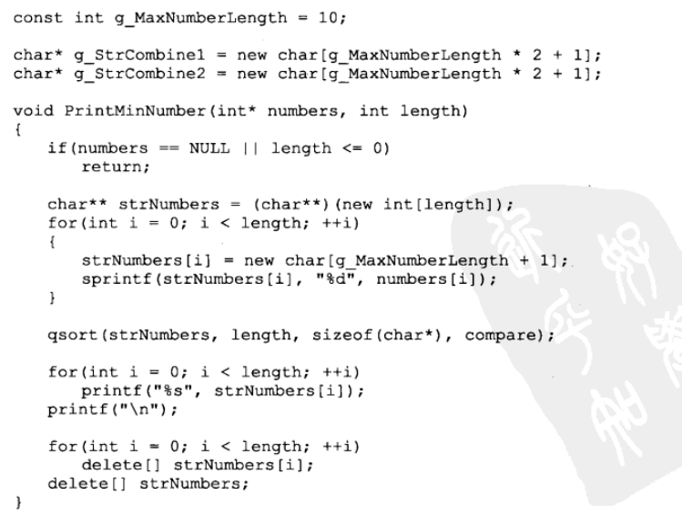
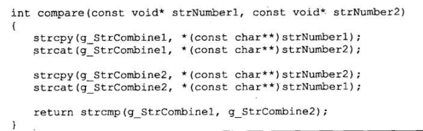

## 字符串

### 1 STD::string

string 常用成员函数

```c++
string str;

str.length(); // 长度
str.push_back('.');  // 追加字符 
str += str2;  // 追加字符串
str.substr(1);  // 从 1 开始的子串
str.find(str1);
str.find_first_of(',');  // 找到第一个为 ',' 的下标

//  字符串和数字

str = to_string(num);

num = atoi(s.c_str());  // 先转常字符串再转数字
```


#### 1.1 二叉树的序列化和反序列化

层次遍历：
```c++
/*
struct TreeNode {
    int val;
    struct TreeNode *left;
    struct TreeNode *right;
    TreeNode(int x) :
            val(x), left(NULL), right(NULL) {
    }
};
*/
class Solution {
public:
    char* Serialize(TreeNode *root) {    
        string s;
        queue<TreeNode*> qt;
        qt.push(root);
 
    while (!qt.empty())
    {
        TreeNode *node = qt.front();
        qt.pop();
        if (node == nullptr)
        {
            s.push_back('#');
            s.push_back(',');
            continue;
        }
        // process not null node
        s += to_string(node->val);
        s.push_back(',');
        // push operator
        qt.push(node->left);
        qt.push(node->right);
 
    }
 
    char *ret = new char[s.length() + 1];
    strcpy(ret, s.c_str());
 
    return ret;
    }
    
    TreeNode* Deserialize(char *str) {
        if (str == nullptr) 
        {
            return nullptr;
        }
    // 可用string成员函数
    string s(str);
    if (str[0] == '#') {
        return nullptr;
    }
 
    // 构造头结点
    queue<TreeNode*> nodes;
    TreeNode *ret = new TreeNode(atoi(s.c_str()));
    s = s.substr(s.find_first_of(',') + 1);
    nodes.push(ret);
    // 根据序列化字符串再层次遍历一遍，来构造树
    while (!nodes.empty() && !s.empty())
    {
        TreeNode *node = nodes.front();
        nodes.pop();
        if (s[0] == '#')
        {
            node->left = nullptr;
            s = s.substr(2);
        }
        else
        {
            node->left = new TreeNode(atoi(s.c_str()));
            nodes.push(node->left);
            s = s.substr(s.find_first_of(',') + 1);
        }
 
        if (s[0] == '#')
        {
            node->right = nullptr;
            s = s.substr(2);
        }
        else
        {
            node->right = new TreeNode(atoi(s.c_str()));
            nodes.push(node->right);
            s = s.substr(s.find_first_of(',') + 1);
        }
    }
    return ret;
    }
};
```

### 2 kmp 算法

核心： 通过模式串的公共前后缀生成 nxt 数组减少匹配移动次数
`负同则增`
```c++
int nxt[];

void GetNxtVal(char *p,int nxt[])
{
    int pLen = strlen(p);
    nxt[0] = -1;
    int k = -1, j = 0;  // 回溯针与先锋针
    while(j < len)
    {
        if(k == -1 || p[j] == p[k])
        {
            j++;
            k++;
            if(p[j] != p[k])
            {
                nxt[j] = k;
            }
            else
            {
                nxt[j] = nxt[k];
            }
        }
        else
        {
            k = nxt[k];
        }
    }
}

int KMPSearch(char *s,char *p)
{
    int pLen = strlen(p), sLen = strlen(s);
    int i = 0, j = 0;
    while(i < sLen && j < pLen)
    {
        if(j == -1 || s[i] == p[j])
        {
            i++;
            j++;
        }
        else
        {
            j = nxt[j];
        }
    }
    if(j == pLen)
    {
        return i - j;
    }
    else
    {
        return -1;
    }
}
```

### 3 字符串排序问题

#### 3.1 把数组排成最小的数

> 输入一个正整数数组，把数组里所有数字拼接起来排成一个数，打印能拼接出的所有数字中最小的一个。例如输入数组{3，32，321}，则打印出这三个数字能排成的最小数字为321323。

> input:
> [3,32,321]

> output:
> "321323"

思路：数字转字符串再自定义排序（ab和ba的大小）

```c++
    int cmp(string str1,string str2)
    {
        string s1 = str1 + str2;
        string s2 = str2 + str1;
        return s1 < s2;
    }
    string PrintMinNumber(vector<int> numbers) {
        int len = numbers.size();
        string ans;
        if(len <= 0)
        {
            return ans;
        }
        string s[105];
        for(int i = 0; i < len; i++)
        {
            s[i] = to_string(numbers[i]);
        }
        sort(s,s+len,cmp);
        for(int i = 0; i < len; i++)
        {
            ans += s[i];
        }
        return ans;
    }
```

char 型写法：




### 3 通过翻转函数实现字符串的左旋、倒置等功能

```c++
void Reverse(char *pBeigin,char *pEnd)
{
    if(pBegin == NULL || pEnd == NULL)
    {
        return;
    }
    while(pBegin < pEnd)
    {
        char temp = *pBegin;
        *pBegin = *pEnd;
        *pEnd = temp;
        pBegin++,pEnd--;
    }
}
```

字符串的左旋：
abcdefg 2 -> cdefgab
步骤： abcdefg -> ba gfedc -> cdefgab

### 4 字符串中的动态规划

字符串的动态规划常用于字符串的匹配问题

#### 4.1 正则表达式匹配

> 请实现一个函数用来匹配包括'.'和'*'的正则表达式。模式中的字符'.'表示任意一个字符，而'*'表示它前面的字符可以出现任意次（包含0次）。 在本题中，匹配是指字符串的所有字符匹配整个模式。例如，字符串"aaa"与模式"a.a"和"ab*ac*a"匹配，但是与"aa.a"和"ab*a"均不匹配

> input:
> "aaa","a*a"

> output:
> true

思路：主要是在出现 * 判断前面字符出现任意次的匹配情况

递归式写法（复杂度高）：
```c++
class Solution {
public:
    bool match(string str, string pattern) {
        bool ans = false;
        if(str.length() == 0 && pattern.length() == 0)
        {
            ans = true;
        }
        if(str[0] == '\0' && pattern[0] == '\0')
        {
            ans = true;
            return ans;
        }
        if(str[0] != '\0' && pattern[0] == '\0')
        {
            return ans;
        }
        if(pattern[1] == '*')
        {
            if(str[0] == pattern[0] || (str[0] != '\0' && pattern[0] == '.'))
            {
                if(match(str,pattern.substr(2)) || match(str.substr(1),pattern) || match(str.substr(1),pattern.substr(2)))
                {
                    ans = true;
                }
            }
            else
            {
                if(match(str,pattern.substr(2)))
                    ans = true;
            }
        }
        else
        {
            if(pattern[0] == str[0] || (pattern[0] == '.' && str[0] != '\0'))
            {
                if(match(str.substr(1),pattern.substr(1)))
                {
                    ans = true;
                }
            }
        }
        return ans;
    }
};
```

动态规划：
```c++
class Solution {
public:
    bool match(string str, string pattern) {
        int s = str.length();
        int p = pattern.length();
        bool dp[s+1][p+1];//00 用于存放两个空字符串的结果 dp[i][j] 表示模式串前j个是否与字符串前i个匹配
        memset(dp,0,sizeof(dp));
        for(int i = 0;i<=s;i++){//实际上模式串和字符串的起点为1(所以后面的下标都是i-1 j-1)
            for(int j =0;j<=p;j++){
                if(j==0){
                    dp[i][j]=(i==0);//只有字符串和模式串都为空的时候才匹配，当模式串为空，字符串不为空则返回false
                }else{
                    if(pattern[j-1]!='*'){//如果第j-1个字符不是*
                        if(i>0&&(str[i-1]==pattern[j-1]||pattern[j-1]=='.')){
                            //正常匹配
                            dp[i][j] = dp[i-1][j-1];
                        }
                     }else{//如果第j个是* 那么分两种情况，有一种成立即可
                        //case 1 可以直接忽略*前模式的那个元素（*代表出现0次 比如a* 这两个元素做空字符串）
//                         那么dp[i][j]==true 只需满足 dp[i][j-2]==true即可
                        if(j>=2){  
                        dp[i][j] = dp[i][j-2];
                        }
                        //case 2 如果dp[i][j-2]不等于true那么要满足第j-1个字符(这个字符也可以为‘.’)与第i个字符匹配即可
                        //下标多减1是因为dp是从1开始记录的
                        if(i>0 && j>=2 &&(str[i-1]==pattern[j-2]||pattern[j-2]=='.')){
                            dp[i][j] |= dp[i-1][j];//使用或等于 两种情况有一种符合就行
                        }
                    }
                  }
            }
        }
        return dp[str.length()][pattern.length()];
        
   }
};
```

当 j 为 * 时的第二种情况，即 dp[i-1][j] 的意义是 j-1 对应的字符可以重复无限次，故只要匹配 i-1 和 j-1 ，则 i 和  j-1 相等时便可匹配，
而 dp[i-1][j-1] 的结果包含在 dp[i-1][j] 中

#### 4.2 最长回文子串

> 对于一个字符串，请设计一个高效算法，计算其中最长回文子串的长度。给定字符串A以及它的长度n，请返回最长回文子串的长度。

> input:
> "abc1234321ab",12

> ouput:
> 7

```c++
class Solution {
public:
    int getLongestPalindrome(string A, int n) {
        int ans = 0;
        bool dp[n][n];
        memset(dp,0,sizeof(dp));
        for(int l = 0; l < n; l++)
        {
            for(int i =0 ; i + l < n; i++)
            {
                int j = i + l;
                if(!l)
                {
                    dp[i][j] = 1;
                }
                else if(l == 1)
                {
                    dp[i][j] = (A[i] == A[j]);
                }
                else
                {
                    dp[i][j] = (A[i] == A[j] && dp[i+1][j-1]) ? 1 : 0;
                }
                if(dp[i][j])
                {
                    ans = max(ans,l + 1);
                }
            }
        }
        return ans;
    }
};
```