## Socket编程

### 0 TCP 原理（三次握手与四次挥手）

#### 0.1 TCP 报文格式

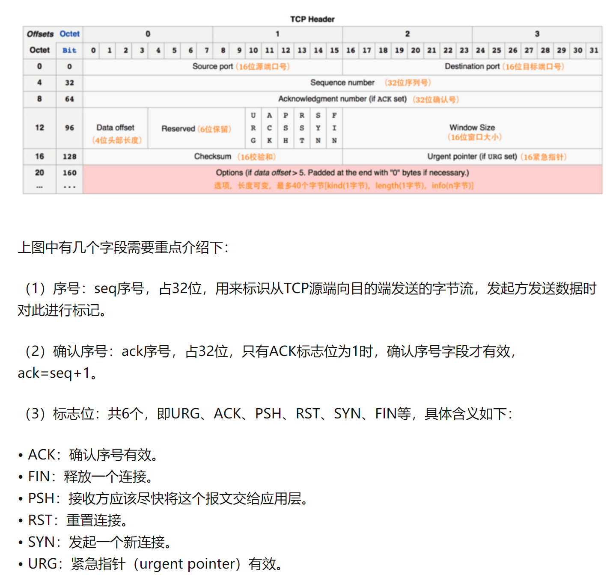

#### 0.2 三次握手建立连接

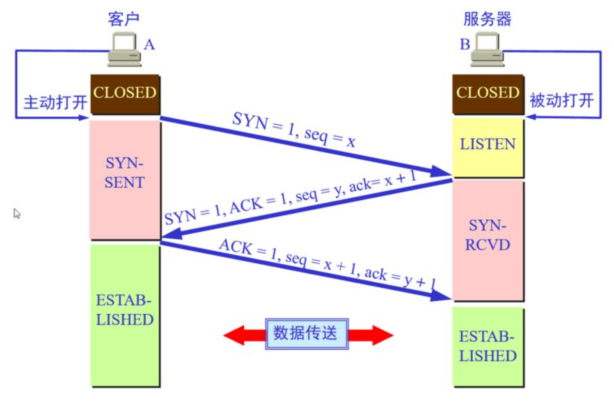

* 第一次握手：客户端要向服务端发起连接请求，首先客户端随机生成一个起始序列号ISN(比如是100)，那客户端向服务端发送的报文段包含SYN标志位(也就是SYN=1)，序列号seq=100。
* 第二次握手：服务端收到客户端发过来的报文后，发现SYN=1，知道这是一个连接请求，于是将客户端的起始序列号100存起来，并且随机生成一个服务端的起始序列号(比如是300)。然后给客户端回复一段报文，回复报文包含SYN和ACK标志(也就是SYN=1,ACK=1)、序列号seq=300、确认号ack=101(客户端发过来的序列号+1)。
* 第三次握手：客户端收到服务端的回复后发现ACK=1并且ack=101,于是知道服务端已经收到了序列号为100的那段报文；同时发现SYN=1，知道了服务端同意了这次连接，于是就将服务端的序列号300给存下来。然后客户端再回复一段报文给服务端，报文包含ACK标志位(ACK=1)、ack=301(服务端序列号+1)、seq=101(第一次握手时发送报文是占据一个序列号的，所以这次seq就从101开始，需要注意的是不携带数据的ACK报文是不占据序列号的，所以后面第一次正式发送数据时seq还是101)。当服务端收到报文后发现ACK=1并且ack=301，就知道客户端收到序列号为300的报文了，就这样客户端和服务端通过TCP建立了连接。

#### 0.3 四次挥手关闭连接：

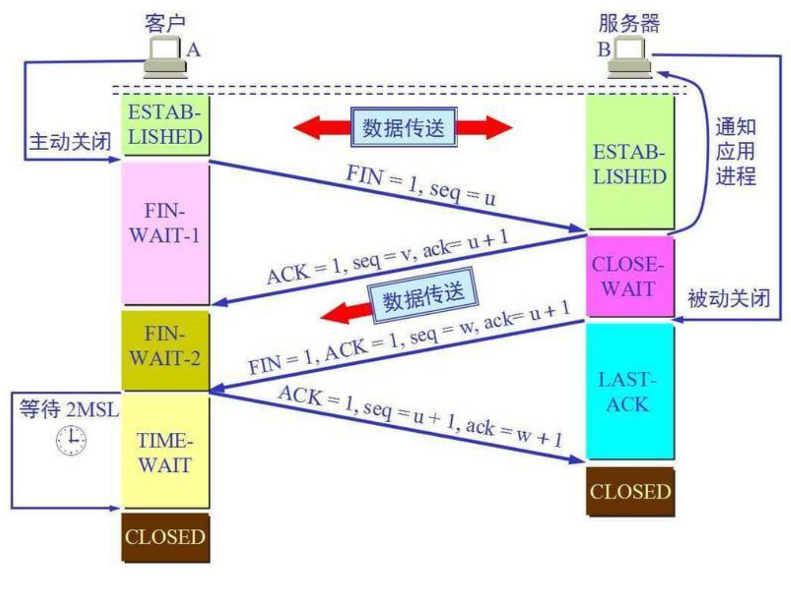

* 第一次挥手：当客户端的数据都传输完成后，客户端向服务端发出连接释放报文(当然数据没发完时也可以发送连接释放报文并停止发送数据)，释放连接报文包含FIN标志位(FIN=1)、序列号seq=1101(100+1+1000，其中的1是建立连接时占的一个序列号)。需要注意的是客户端发出FIN报文段后只是不能发数据了，但是还可以正常收数据；另外FIN报文段即使不携带数据也要占据一个序列号。
* 第二次挥手：服务端收到客户端发的FIN报文后给客户端回复确认报文，确认报文包含ACK标志位(ACK=1)、确认号ack=1102(客户端FIN报文序列号1101+1)、序列号seq=2300(300+2000)。此时服务端处于关闭等待状态，而不是立马给客户端发FIN报文，这个状态还要持续一段时间，因为服务端可能还有数据没发完。
* 第三次挥手：服务端将最后数据(比如50个字节)发送完毕后就向客户端发出连接释放报文，报文包含FIN和ACK标志位(FIN=1,ACK=1)、确认号和第二次挥手一样ack=1102、序列号seq=2350(2300+50)。
* 第四次挥手：客户端收到服务端发的FIN报文后，向服务端发出确认报文，确认报文包含ACK标志位(ACK=1)、确认号ack=2351、序列号seq=1102。注意客户端发出确认报文后不是立马释放TCP连接，而是要经过2MSL(最长报文段寿命的2倍时长)后才释放TCP连接。而服务端一旦收到客户端发出的确认报文就会立马释放TCP连接，所以服务端结束TCP连接的时间要比客户端早一些。


### 1 工作流程

#### 1.1 基本流程

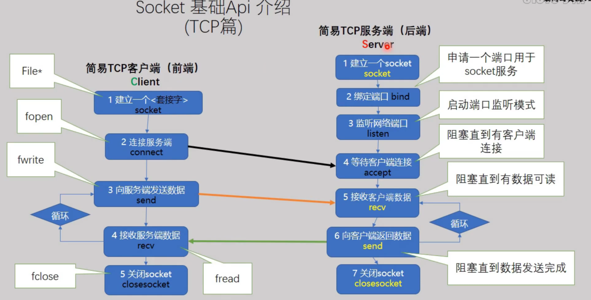

持续阻塞：

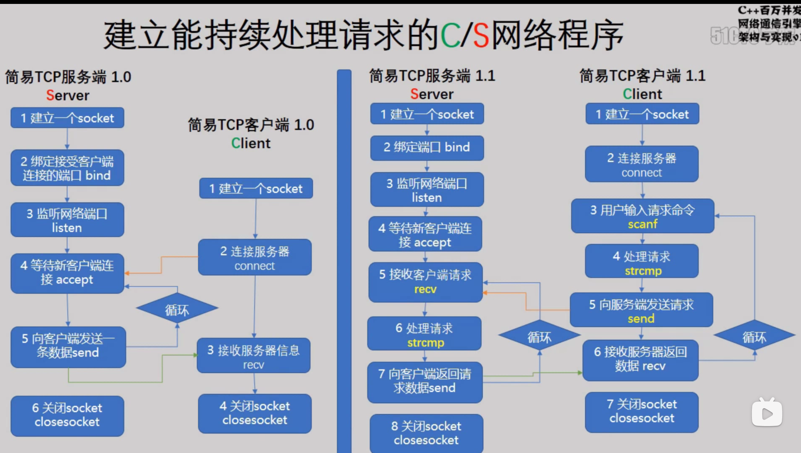

while 循环是阻塞式通信，不能处理其他业务

解决方案为 
> * 加入 select
> * 加入 epoll
> * 加入多线程

#### 1.2 单进程多端口模型

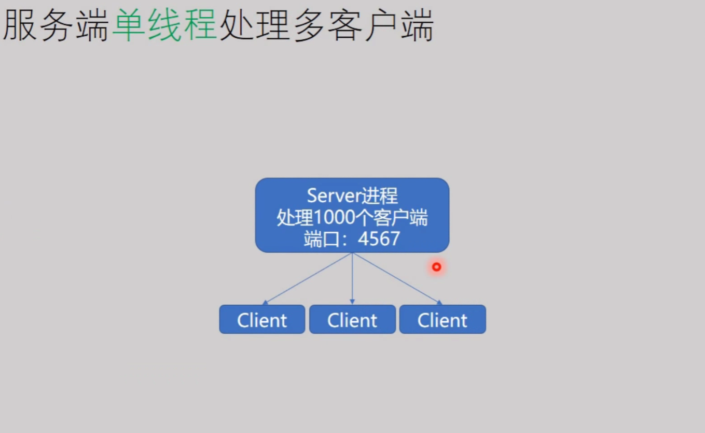

#### 1.3 多进程多端口模型

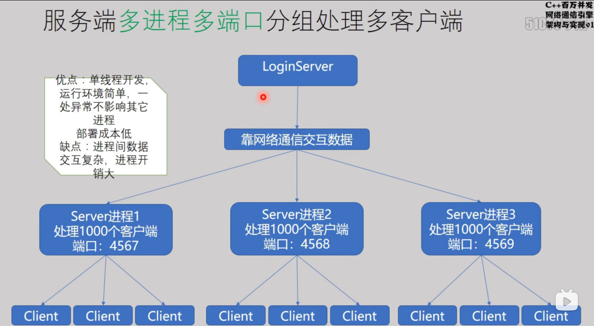

#### 1.4 多线程单端口模型

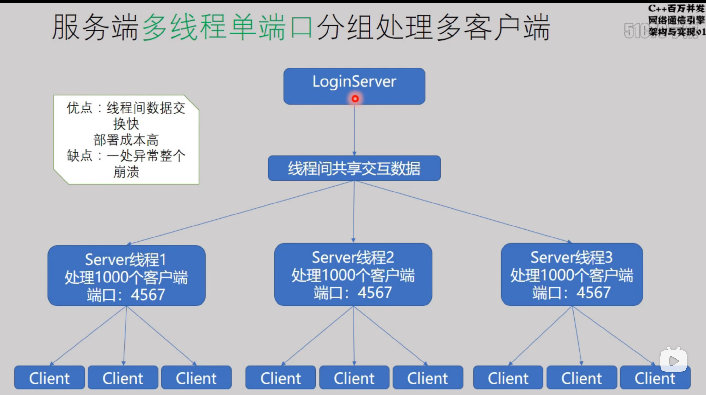

#### 1.5 多进程多线程多端口模型

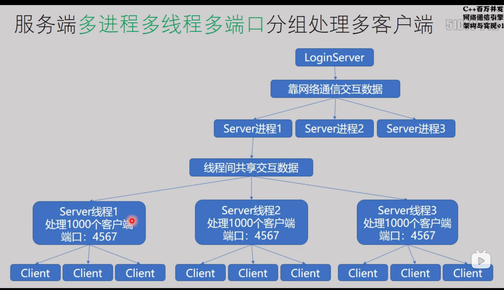

### 2 定义消息结构(MessageHeader.hpp)

#### 2.1 定义枚举消息：如登录、登录返回、登出、登出返回、新用户加入、错误等
```c++
enum CMD
{
	CMD_LOGIN,
	CMD_LOGIN_RESULT,
	CMD_LOGOUT,
	CMD_LOGOUT_RESULT,
	CMD_NEW_USER_JOIN,
	CMD_ERROR
};
```

#### 2.2 定义消息头/报文头（可包含命令和数据长度）

```c++
struct DataHeader
{
	short dataLength;  // 数据长度
	short cmd;  // 命令
};
```

#### 2.3 继承消息头定义各种消息体

在构造函数种便初始化消息头的命令和长度
```c++
struct Login : public DataHeader
{
	Login()
	{
		dataLength = sizeof(Login);
		cmd = CMD_LOGIN;
	}
	char userName[32];
	char password[32];
};


struct LoginResult : public DataHeader
{
	LoginResult()
	{
		dataLength = sizeof(LoginResult);
		cmd = CMD_LOGIN_RESULT;
	}
	int result = 0;
};

struct LogOut : public DataHeader
{
	LogOut()
	{
		dataLength = sizeof(LogOut);
		cmd = CMD_LOGOUT;
	}
	char userName[32];
};

struct LogOutResult : public DataHeader
{
	LogOutResult()
	{
		dataLength = sizeof(LogOutResult);
		cmd = CMD_LOGOUT_RESULT;
	}
	int result = 0;
};

struct NewUserJoin : public DataHeader
{
	NewUserJoin()
	{
		dataLength = sizeof(NewUserJoin);
		cmd = CMD_NEW_USER_JOIN;
	}
	int nsock = 0;
};
```


### 3 客户端

```c++
#ifndef _EasyTcpClient_hpp_
#define _EasyTcpClient_hpp_

#define _WINSOCK_DEPRECATED_NO_WARNINGS
#ifdef _WIN32
#define WIN32_LEAN_AND_MEAN
#include<windows.h>
#include<WinSock2.h>
#pragma comment(lib,"ws2_32.lib")   // 指定动态链接库
#else
#include<unistd.h>  //  unix std
#include<arpa/inet.h>
#include<string.h>

#define SOCKET int  // Linux下没有包装SOCKET,需要从windows查看重新进行宏定义
#define INVALID_SOCKET  (SOCKET)(~0)
#define SOCKET_ERROR            (-1)
#endif

#include<cstdio>
#include"MessageHeader.hpp"

...

#endif
```

#### 3.1 class 定义(EasyTcpClient.hpp)

##### 3.1.1 成员变量

```c++
class EasyTcpClient
{
    SOCKET _sock;

public:
    EasyTcpClient()
    {
        _sock = INVALID_SOCKET;
    }

    // 虚析构函数
    virtual ~EasyTcpClient()
    {
        Close();
    }

    // 以下皆为此类的成员函数
}
```

虚析构函数的作用：防止内存泄露

> 如果父类的析构函数不加 virtual 关键字
> 当父类的析构函数不声明成虚析构函数的时候，当子类继承父类，父类的指针指向子类时， delete 掉父类的指针，只调动父类的析构函数，而不调动子类的析构函数。
> 如果父类的析构函数加 virtual 关键字
> 当父类的析构函数声明成虚析构函数的时候，当子类继承父类，父类的指针指向子类时， delete 掉父类的指针，==先调动子类的析构函数，再调动父类的析构函数。==


##### 3.1.2 初始化 socket

```c++
void InitSocket()
{
    // 启动 WinSock 2.x环境
#ifdef _WIN32
    WORD ver = MAKEWORD(2, 2);  // 版本号
    WSADATA dat;  // 接收winsows socket实现细节的结构体
    WSAStartup(ver, &dat);  // 绑定socket库,初始化链接库
#endif
    // 建立一个socket
    if (_sock != INVALID_SOCKET)
    {
        printf("<socket = %d>关闭旧连接\n",_sock);
        Close();
    }
    _sock = socket(AF_INET, SOCK_STREAM, IPPROTO_TCP);  // 同服务端不同，这里不用指明TCP协议
    if (INVALID_SOCKET == _sock)
    {
        printf("创建socket失败\n");
    }
    else
    {
        printf("创建socket成功\n");
    }
}
```

##### 3.1.3 连接服务器 connect

传入连接的 ip 地址和端口号

```c++
int Connect(const char* ip, unsigned short port)
{
    if (INVALID_SOCKET == _sock)
    {
        InitSocket();
    }
    sockaddr_in _sin = {};
    _sin.sin_family = AF_INET;
    _sin.sin_port = htons(port);
    #ifdef _WIN32
        _sin.sin_addr.S_un.S_addr = inet_addr(ip);  // 这里替换相应的ip地址
    #else
        _sin.sin_addr.s_addr = inet_addr(ip);
    #endif
        int ret = connect(_sock, (sockaddr*)&_sin, sizeof(sockaddr_in));
        if (SOCKET_ERROR == ret)
        {
            printf("连接服务器失败\n");
        }
        else
        {
            printf("连接服务器成功\n");
        }
        return ret;
}
```

##### 3.1.4 发送数据

c++ 的多态性：

> 「派生类的指针」可以赋给「基类指针」；
> 通过基类指针调用基类和派生类中的同名「虚函数」时:
> * 若该指针指向一个基类的对象，那么被调用是 基类的虚函数；
> * 若该指针指向一个派生类的对象，那么被调用 的是派生类的虚函数。

> 派生类的对象可以赋给基类「引用」
> 通过基类引用调用基类和派生类中的同名「虚函数」时:
> * 若该引用引用的是一个基类的对象，那么被调 用是基类的虚函数；
> * 若该引用引用的是一个派生类的对象，那么被 调用的是派生类的虚函数。

header 为基类指针,其他消息为其派生类

==派生类指针可以赋予基类指针，如发送数据的 `int SendData(DataHeadr *header)`==

==基类指针赋予派生类指针要强制转换，如下面接收数据的 `Login* login = (Login*)header;`==

* 1，直接用基类指针引用基类对象
* 2，直接用派生类指针引用派生类对象
* 3，用基类指针引用一个派生类对象，由于派生类对象也是基类的对象，所以这种引用是安全的，
但是只能引用基类成员。若试图通过基类指针引用那些只在派生类中才有的成员，编译器会报告语法错误。（解决该问题的答案是虚函数和多态性）
* 4，用派生类指针引用基类的对象。这种引用方式会导致语法错误。派生类指针必须先强制转换为基类指针，这种方法是不安全的。

传入参数为消息头指针，其中子指针也可以传入，强制转换为常字符指针即可

```c++
int SendData(DataHeader *header)
{
    if (isRun() && header)
    {
        return send(_sock, (const char*)header, header->dataLength, 0);
    }	
    return SOCKET_ERROR;
}
```

##### 3.1.5 接收数据

先接收消息头，再接收消息体，字符数组指针与消息头指针可转换，消息头指针可赋予子指针

```c++
int Recv()
{
    // 缓冲区
    char szRecv[1024] = {};
    int nlen = recv(_sock, szRecv, sizeof(DataHeader), 0);
    DataHeader* header = (DataHeader*)szRecv;
    if (nlen <= 0)
    {
        printf("服务器关闭\n");
        return -1;
    }
    recv(_sock, szRecv + sizeof(DataHeader), header->dataLength - sizeof(DataHeader), 0);
    OnNetMsg(header);
    return 0;
}
```
 
##### 3.1.6 响应数据(主要更改模块)

当命令不同只需更改此模块即可，定义成 vitual 即可使得其子类修改此模块

```c++
virtual void OnNetMsg(DataHeader* header)
{
    switch (header->cmd)
    {
        case CMD_LOGIN_RESULT:
        {
            LoginResult* loginret = (LoginResult*)header;
            printf("收到服务器命令：%d,数据长度：%d , 应答： %d\n", loginret->cmd, loginret->dataLength, loginret->result);
        }
        break;

        case CMD_LOGOUT_RESULT:
        {
            LogOutResult* logoutret = (LogOutResult*)header;
            printf("收到服务器命令：%d,数据长度：%d , 应答： %d\n", logoutret->cmd, logoutret->dataLength, logoutret->result);
        }
        break;

        case CMD_NEW_USER_JOIN:
        {
            NewUserJoin* userjoin = (NewUserJoin*)header;
            printf("收到服务器命令：%d,数据长度：%d , 应答： 客户端%d已加入\n", userjoin->cmd, userjoin->dataLength, userjoin->nsock);
        }
        break;

        default:
            DataHeader header = { 0,CMD_ERROR };
            send(_sock, (const char*)&header, sizeof(header), 0);
            break;
    }
}
```

##### 3.1.7 探询网络消息(select 模型)

在 select 模型下，当前的 socket 加入文件描述符集合`fdRead`中

当 `time == NULL` ， 则为阻塞式等待，当 `fdRead` 有可读操作(即收到服务端消息)时才会返回函数

当 `time` 如下设置时，则超时即返回，不会阻塞客户端处理其他业务

```c++
bool OnRun()
{
    if (isRun())
    {
        fd_set fdRead;
        FD_ZERO(&fdRead);
        FD_SET(_sock, &fdRead);
        timeval t = { 1,0 };
        int ret = select(_sock + 1, &fdRead, 0, 0, &t);
        if (ret == -1)
        {
            printf("<socket = %d>select失败\n", _sock);
            return false;
        }
        if (FD_ISSET(_sock, &fdRead))
        {
            FD_CLR(_sock, &fdRead);
            if (-1 == Recv())
            {
                printf("<socket = %d>任务结束\n", _sock);
                return false;
            }
        }
        return true;
        //printf("空闲时间处理其他业务\n");
    }
    return false;
}
```

##### 3.1.8 判断是否工作

```c++
bool isRun()
{
    return _sock != INVALID_SOCKET;
}
```

##### 3.1.9 关闭 socket

```c++
void Close()
{
    if (_sock != INVALID_SOCKET)
    {
    #ifdef _WIN32
        closesocket(_sock);
        WSACleanup();
    #else
        close(_sock);
    #endif
        _sock = INVALID_SOCKET;
    }
}
```

#### 3.2 主函数(Client.cpp)

为了保证用户可以手动输入命令，加入了一个输入发送线程，主线程则负责接受服务器数据

##### 3.2.1 线程函数

```c++
#include"EasyTcpClient.hpp"
#include<thread>
using namespace std;
void cmdThread(EasyTcpClient *client)
{
    while (true)
    {
        char cmdBuf[128] = {};
        scanf("%s", cmdBuf);
        if (0 == strcmp(cmdBuf, "Exit"))
        {
            client->Close();
            break;
        }
        else if(0 == strcmp(cmdBuf,"login"))
        {
            Login login;
            strcpy(login.userName, "zizi");
            strcpy(login.password, "zizi19991203");
            client->SendData(&login);
        }
        else if (0 == strcmp(cmdBuf, "logout"))
        {
            LogOut logout;
            strcpy(logout.userName, "zizi");
            client->SendData(&logout);
        }
        else
        {
            printf("不支持该命令,请重新输入\n");
        }
    }
}
```
##### 3.2.2 main 函数流程

`t.detach` 是线程分离函数,使得子线程在后台运行
`t.join` 是等待子线程运行结束才能继续主线程

```c++
int main()
{
    EasyTcpClient client;
    client.InitSocket();
    client.Connect("127.0.0.1", 4567);
    thread t1(cmdThread, &client);
    t1.detach();
    循环发送命令和接收服务器信息
    while (client.isRun())
    {
        client.OnRun();
    }
    client.Close();
    //getchar();
    return 0;
}
```

### 4 服务端

```c++
#ifndef _EasyTcpServer_hpp_
#define _EasyTcpServer_hpp_

#define _WINSOCK_DEPRECATED_NO_WARNINGS
#ifdef _WIN32
#define WIN32_LEAN_AND_MEAN
#include<windows.h>
#include<WinSock2.h>
#pragma comment(lib,"ws2_32.lib")   // 指定动态链接库
#else
#include<unistd.h>  //  unix std
#include<arpa/inet.h>
#include<string.h>

#define SOCKET int  // Linux下没有包装SOCKET,需要从windows查看重新进行宏定义
#define INVALID_SOCKET  (SOCKET)(~0)
#define SOCKET_ERROR            (-1)
#endif

#include<cstdio>
#include<vector>
#include"MesaageHeader.hpp"

using namespace std;

...

#endif
```

#### 4.1 class 定义(EasyTcpServer.hpp)

##### 4.1.1 成员变量

```c++
class EasyTcpServer
{
    SOCKET _sock;
    vector<SOCKET> g_clients;
public:

    EasyTcpServer()
    {
        _sock = INVALID_SOCKET;
        g_clients.clear();
    }

    virtual ~EasyTcpServer()
    {
        Close();
    }

    // 以下皆为此类的成员函数
}
```

##### 4.1.2 建立 socket

```c++
SOCKET InitSocket()
{
    // 启动 WinSock 2.x环境
#ifdef _WIN32
    WORD ver = MAKEWORD(2, 2);  // 版本号
    WSADATA dat;  // 接收winsows socket实现细节的结构体
    WSAStartup(ver, &dat);  // 绑定socket库,初始化链接库
#endif
    if (_sock != INVALID_SOCKET)
    {
        printf("<socket = %d>关闭旧连接\n", _sock);
        Close();
    }
    _sock = socket(AF_INET, SOCK_STREAM, IPPROTO_TCP);  // 同服务端不同，这里不用指明TCP协议
    if (INVALID_SOCKET == _sock)
    {
        printf("服务器创建socket失败\n");
    }
    else
    {
        printf("服务器创建socket成功\n");
    }
        return _sock;
}
```

##### 4.1.3 绑定端口和 ip 地址

IP 地址可手动输入也可自动选择任意

```c++
int Bind(const char* ip, unsigned short port)
{
    sockaddr_in _sin = {};  // 不直接用sockaddr类型是因为sockaddr_in类型更适合填写
    _sin.sin_family = AF_INET;
    _sin.sin_port = htons(port);  // host to net unsigned short主机类型和网络类型的short类型不同
    //_sin.sin_addr.S_un.S_addr = INADDR_ANY;  // inet_addr("127.0.0.1"),任意ip地址
#ifdef _WIN32
    if (ip)
    {
        _sin.sin_addr.S_un.S_addr = inet_addr(ip);  // 这里替换相应的ip地址
    }
    else
    {
        _sin.sin_addr.S_un.S_addr = INADDR_ANY;
    }
#else
    if (ip)
    {
        _sin.sin_addr.s_addr = inet_addr(ip);
    }
    else
    {
        _sin.sin_addr.s_addr = INADDR_ANY;
    }
#endif
    int ret = bind(_sock, (sockaddr*)&_sin, sizeof(_sin));
    if (ret == SOCKET_ERROR)
    {
        printf("服务器绑定端口<%d>失败\n",port);
    }
    else
    {
        printf("服务器绑定端口<%d>成功\n",port);
    }
    return ret;
}
```

##### 4.1.4 端口监听 listen

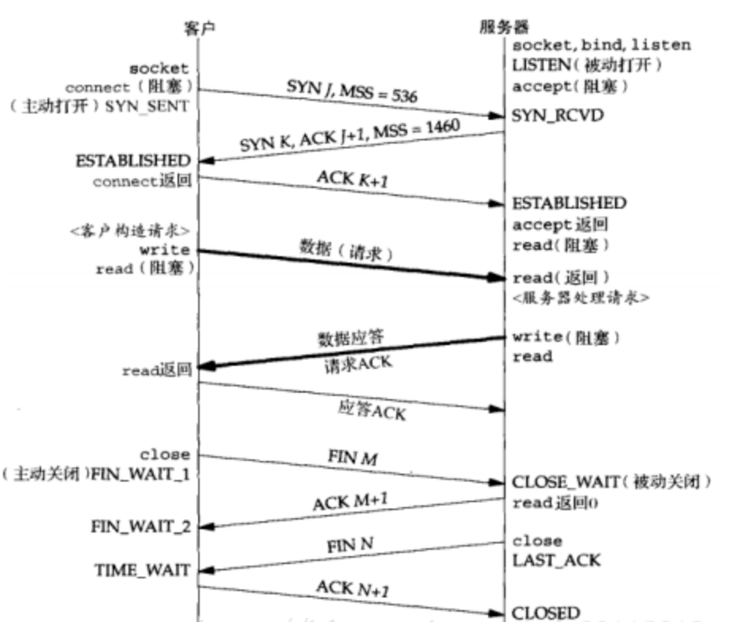

> 对于`listen(int fd,int backlog)`函数，内核会为一个监听套接字维护两个队列
> 当有 TCP 请求到来时,即 3 次握手中的 syn 分节发送来时,会在`未完成队列`中增加一项
> 3 次握手完成时,`未完成队列`中的项就移动到`已完成队列`里,accept() 函数会从`已连接队列`里取走已完成连接.
> backlog 参数就是控制`已连接队列`里等待 accept() 取走的连接的最大数目
> 注意一点，backlog 与这个已排队连接的最大数目未必是完全相等的,不同的系统的实现可能不同，比如 backlog = 1，系统允许的实际一排队数目可能为 2

```c++
int Listen(int n)
{
    int ret = listen(_sock, n);
    if (SOCKET_ERROR == ret)  // 最多需要等待多少人进行连接
    {
        printf("<socket = %d>服务器监听失败\n",_sock);
    }
    else
    {
        printf("<socket = %d>服务器监听成功\n",_sock);
    }
    return ret;
}
```

##### 4.1.5 发送数据

###### 4.1.5.1 单发

```c++
int SendData(DataHeader *header,SOCKET cSock)
{
    if (isRun() && header)
    {
        return send(cSock, (const char*)header, header->dataLength, 0);
    }
    return SOCKET_ERROR;
}
```

###### 4.1.5.2 群发

```c++
void SendDataToAll(DataHeader* header)
{
    if (isRun() && header)
    {
        for (int n = g_clients.size() - 1; n >= 0; n--)
        {
            SendData(header, g_clients[n]);
        }
    }
}
```

##### 4.1.6 接受新客户端加入 accept

```c++
SOCKET Accept()
{
    sockaddr_in clientAddr = {};
    int nAddrlen = sizeof(clientAddr);
    SOCKET cSock = INVALID_SOCKET;
    cSock = accept(_sock, (sockaddr*)&clientAddr, &nAddrlen);
    if (INVALID_SOCKET == cSock)
    {
        printf("服务器<socket = %d>接受到无效客户端...\n",_sock);
    }
    else
    {
        printf("服务器<socket = %d>收到新客户端:",_sock);
        printf("客户端IP = %s,socket = %d\n", inet_ntoa(clientAddr.sin_addr), (int)cSock);
        /*for (int n = g_clients.size() - 1; n >= 0; n--)
        {
            NewUserJoin userjoin;
            userjoin.nsock = (int)cSock;
            SendData(&userjoin, g_clients[n]);
        }*/
        NewUserJoin userjoin;
        userjoin.nsock = (int)cSock;
        SendDataToAll(&userjoin);
        g_clients.push_back(cSock);
    }
        return cSock;
}
```

##### 4.1.7 接收数据

```c++
int Recv(SOCKET cSock)
{
    // 缓冲区
    char szRecv[1024] = {};
    int nlen = recv(cSock, szRecv, sizeof(DataHeader), 0);
    DataHeader* header = (DataHeader*)szRecv;
    if (nlen <= 0)
    {
        printf("客户端%d退出\n", (int)cSock);
        return -1;
    }
    recv(cSock, szRecv + sizeof(DataHeader), header->dataLength - sizeof(DataHeader), 0);
    OnNetMsg(header, cSock);
    return 0;
}
```
 
##### 4.1.8 响应数据(主要更改模块)

```c++
virtual void OnNetMsg(DataHeader *header,SOCKET cSock)
{
    switch (header->cmd)
    {
        case CMD_LOGIN:
        {
            Login* login = (Login*)header;
            printf("收到客户端%d命令：%d,数据长度：%d , username = %s userpsw = %s\n", (int)cSock, login->cmd, login->dataLength, login->userName, login->password);

            // 数据库查看密码是否正确
            LoginResult ret;
            SendData(&ret, cSock);
        }
        break;

        case CMD_LOGOUT:
        {
            LogOut* logout = (LogOut*)header;
            printf("收到客户端%d命令：%d,数据长度：%d , username = %s\n", (int)cSock,logout->cmd, logout->dataLength, logout->userName);

            // 数据库查看密码是否正确
            LogOutResult ret;
            SendData(&ret, cSock);
        }
        break;

        default:
            DataHeader header = { 0,CMD_ERROR };
            SendData(&header, cSock);
            break;
    }
}
```

##### 4.1.9 探询网络消息(select 模型)

```c++
bool OnRun()
{
    if (isRun())
    {
        // 伯克利套接字 BSD socket描述符
        fd_set fdRead;  // 描述符集合
        fd_set fdWrite;
        fd_set fdExp;

        FD_ZERO(&fdRead);
        FD_ZERO(&fdWrite);
        FD_ZERO(&fdExp);

        FD_SET(_sock, &fdRead);
        FD_SET(_sock, &fdWrite);
        FD_SET(_sock, &fdExp);

        for (int n = g_clients.size() - 1; n >= 0; n--)
        {
            FD_SET(g_clients[n], &fdRead);
        }

        timeval t = { 1,0 };
        // nfds是一个整数值，指一个fd_set集合所有描述符(socket)的范围而非数量（所有描述符最大值+1）
        // 当 time == NULL时，则select会阻塞查询直到有数据可以操作,否则超时立即返回
        int ret = select(_sock + 1, &fdRead, &fdWrite, &fdExp, &t);
        if (ret < 0)
        {
            printf("服务端<socket = %d>select任务失败\n",_sock);
            Close();
            return false;
        }
        if (FD_ISSET(_sock, &fdRead))
        {
            FD_CLR(_sock, &fdRead);
            Accept();
        }
        for (int n = 0; n < fdRead.fd_count; n++)
        {
            if (-1 == Recv(fdRead.fd_array[n]))
            {
                auto iter = find(g_clients.begin(), g_clients.end(), fdRead.fd_array[n]);  // std::vector<SOCKET>::iterator
                if (iter != g_clients.end())
                {
                    g_clients.erase(iter);
                }
            }
        }
        return true;
    }
    return false;
}
```

##### 4.1.10 判断是否工作

```c++
bool isRun()
{
    return _sock != INVALID_SOCKET;
}
```

##### 4.1.11 关闭 socket

```c++
void Close()
{
    if (_sock != INVALID_SOCKET)
    {
#ifdef _WIN32
        closesocket(_sock);
        for (int n = g_clients.size() - 1; n >= 0; n--)
        {
            closesocket(g_clients[n]);
        }
        WSACleanup();
#else
        close(_sock);
        for (int n = g_clients.size() - 1; n >= 0; n--)
        {
            close(g_clients[n]);
        }
#endif
        _sock = INVALID_SOCKET;
    }
};
```

#### 4.2 主函数(server.cpp)

```c++
#include"EasyTcpServer.hpp"

int main()
{
    EasyTcpServer server;
    server.InitSocket();
    server.Bind(NULL, 4567);
    server.Listen(5);
    while (server.isRun())
    {
        server.OnRun();
        //printf("空闲时间处理其他任务\n");
    }
    server.Close();
    return 0;
}
```


可以改进的地方：

双缓冲:定义接受缓冲区、消息缓冲区（第二缓冲区）以解决网络拥塞造成的针对长连接多结构的粘包、少包问题

多线程：thread(线程),mutex(锁),atomic(原语操作)

手动上锁解锁不如自解锁：`lock_guard<mutex> lg(m)`
通过构造函数上锁和析构函数解锁，比较安全

生产者消费者模型

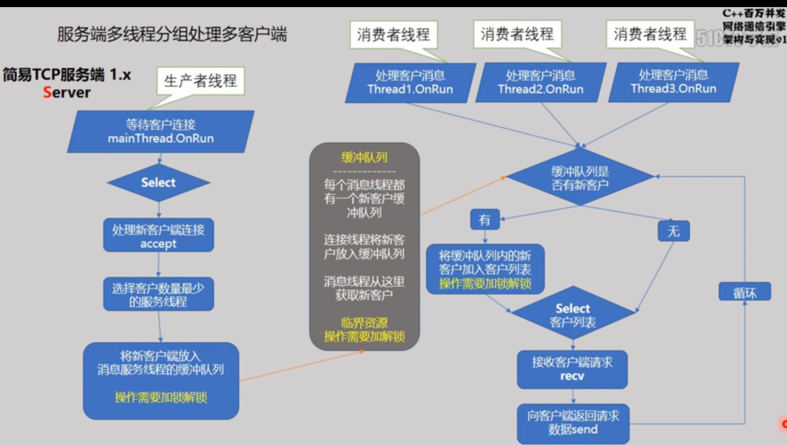

### 5 跨平台配置

#### 5.1 windows的配置

* 头文件包含需要防宏重定义
* 在 windows 平台下需要增加绑定动态链接库、绑定 socket 库的额外代码：
  
```c++
#define WIN32_LEAN_AND_MEAN
#define _WINSOCK_DEPRECATED_NO_WARNINGS
#include<windows.h>
#include<WinSock2.h>
#pragma comment(lib,"ws2_32.lib")   // 指定动态链接库

int main()
{
#ifdef _WIN32
	WORD ver = MAKEWORD(2, 2);  // 版本号
	WSADATA dat;  // 接收winsows socket实现细节的结构体
	WSAStartup(ver, &dat);  // 绑定socket库,初始化链接库
#endif
    ///
	在此处编写通用的socket编程代码
    ///
#ifdef _WIN32	
    WSACleanup();  // 对应 startup
#endif
	return 0;
}
```

#### 5.1 Linux

```
g++ client.cpp -std=c++11 -pthread -o client
```

跨平台使用主要用到预定义条件宏：

头文件

```c++
#ifdef _WIN32
    #include<window.h>
    #include<WinSock2.h>
    #pragma comment(lib,"ws2_32.lib")   // 指定动态链接库
    #define WIN32_LEAN_AND_MEAN
    #define _WINSOCK_DEPRECATED_NO_WARNINGS
#else
    #include<unistd.h>  //  unix std
    #include<arpa/inet.h>
    #include<string.h>

    #define SOCKET int  // Linux下没有包装SOCKET,需要从windows查看重新进行宏定义
    #define INVALID_SOCKET  (SOCKET)(~0)
    #define SOCKET_ERROR            (-1)
#endif
```


查看ip地址并更换

Windows:`ipconfig`
Linux/Mac:`ifconfig`

```c++
// 2.连接服务器connect
	sockaddr_in _sin = {};
	_sin.sin_family = AF_INET;
	_sin.sin_port = htons(4567);
#ifdef _WIN32
    _sin.sin_addr.S_un.S_addr = inet_addr("127.0.0.1");  // 这里替换相应的ip地址
#else
    _sin.sin_addr.s_addr = inet_addr("127.0.0.1");
#endif
```

关闭套接字：
```c++
#ifdef _WIN32
    closesocket(_sock);
#else
    close(_sock);
#endif
```

#### 5.2 Mac OS(Xcode)

*  相应的 windows 模块同样处理
* 所有函数必须有返回值（有一些 g++ 可以自动完成的步骤在 Mac 需要手动添加代码）
*  对于报错的函数调用查看函数的定义，观察其在不同操作系统的数据类型，根据相应的需求进行数据强制转换或重写函数

例如：

在 Mac 中，`fd_set` 没有 `fd_count` ,则代码可做如下修改

oringinal code:
```c++
for (int n = 0; n < fdRead.fd_count ; n++)
{
    if (-1 == proccesor(fdRead.fd_array[n]))
    {
        auto iter = find(g_clients.begin(), g_clients.end(), fdRead.fd_array[n]);  // std::vector<SOCKET>::iterator
        if (iter != g_clients.end())
        {
            g_clients.erase(iter);
        }
    }
}
```

modified code:
```c++
for(int n = (int)g_clients.size() - 1; n >= 0; n--)
{
    if(FD_ISSET(g_clients[n],&fdRead))
    {
        if(-1 == processor(g_clients[n]))
        {
            auto iter = g_clients.begin() + n;
            if(iter != g_clients.end())
            {
                g.clients.erase(iter);
            }
        }
    }
}
```


==注意==：

select 函数在不同操作系统的实现方式不同，主要针对于第一个参数的修改

windows 下会自动修正，但 Linux 和 Mac 需要手动输入正确值:文件描述符最大值 + 1 , 所以统一用如下代码：

client.cpp:
```c++
select(_sock + 1, &fdRead, &fdWrite, &fdExp, &t);
```

server.cpp:
```c++
SOCKET maxSock = _sock;
for (int n = g_clients.size() - 1; n >= 0; n--)
{
    FD_SET(g_clients[n], &fdRead);
    if(maxSock < g_clients[n])
    {
        maxSock = g_clients[n];
    }
}

select(maxSock + 1,&fdRead, &fdWrite, &fdExp, &t);
```


